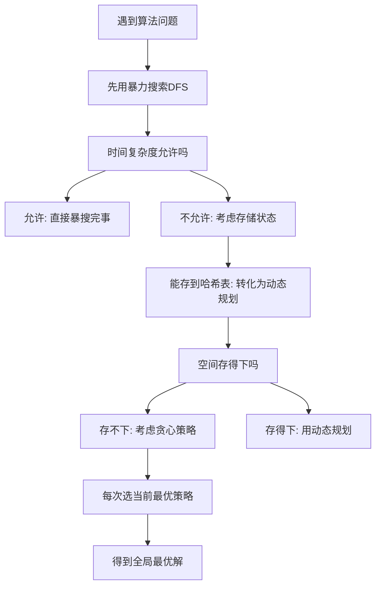

## 本节概述：贪心算法

贪心算法是一种没有固定模板的算法，它按照某种策略一步一步去选择，每次都选择当前最优策略，不从整体最优去考虑。如果每次找局部最优解能够得到全局最优解，那么这个问题就能用贪心来求解。

---

### 核心概念

**贪心与搜索、动态规划的关系**：

- **搜索**：从当前状态开始，把所有策略全部枚举完，找到最优解。搜索是一棵树。
- **动态规划**：在搜索的基础上进行优化，把枚举过的状态存储下来，减少冗余计算。动态规划是一个有向无环图。
- **贪心**：每次的选择都是当前开始状态下的最优策略，不枚举所有策略，只选一条路走。贪心是一个线性表。

**贪心的判断条件**：如果遇到一个问题，每次找局部最优解并且能够得到全局最优解，那么这个问题就是能够用贪心来求解的。

**贪心的学习建议**：贪心算法是为数不多的不用刻意去学的算法，最好的方法就是不要刻意去学。随着课程深入学习搜索和动态规划后，再来通过贪心问题加深理解。

### 算法步骤

**面对难的贪心问题的策略**：

1. 先用暴力搜索（深度优先搜索）把问题搜出来
2. 如果时间复杂度允许，直接暴搜
3. 如果搜索过程中状态能存储到哈希表，转化为动态规划（空间换时间）
4. 如果空间存不下，再考虑是否有贪心策略

### 复杂度分析

贪心问题可以很难也可以很简单，简单的贪心问题基本上一眼就能看出来。贪心算法本身没有统一的时间复杂度，取决于具体问题的策略选择。

> [!TIP]
> 贪心算法为数不多的不用刻意去学的算法。课程中的三道贪心题还是比较容易想的，可以尝试自己先去想，实在想不出来再来看题解。做完后再去看更复杂的题目，通过一个个贪心问题对贪心进行更加深入的理解。

## 本章小结

- 贪心算法没有固定模板，每次选择当前最优策略，不从整体考虑
- 搜索是一棵树，动态规划是一个有向无环图，贪心是一个线性表
- 判断能否用贪心：每次局部最优能得全局最优则可用贪心
- 学习策略：先暴搜，再考虑动态规划，空间存不下时再考虑贪心
