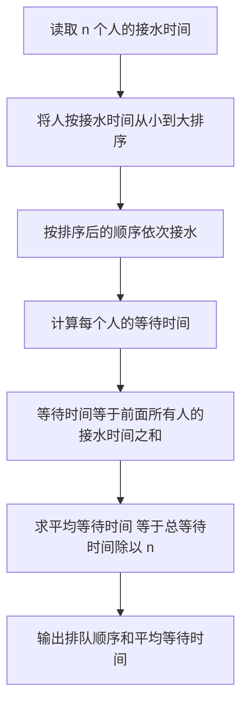

## 本节概述：贪心算法 实战

本节选用洛谷 P1223「排队接水」——这是贪心算法最经典的入门题，通过「让接水时间短的人先接水」这一直观策略，完美诠释了贪心的核心思想。

---

### 题目描述

**排队接水** | 洛谷 P1223 | 难度：普及-

有 n 个人在一个水龙头前排队接水，假如每个人接水的时间为 Ti，请编程找出这 n 个人排队的一种顺序，使得 n 个人的平均等待时间最小。

一个人的等待时间不包括他的接水时间。如果两个人接水的时间相同，编号更小的人应当排在前面。

**输入格式**：第一行为一个整数 n。第二行 n 个整数，第 i 个整数 Ti 表示第 i 个人的接水时间。

**输出格式**：第一行为一种平均时间最短的排队顺序（输出编号，以空格分隔）；第二行为这种排列方案下的平均等待时间（精确到小数点后两位）。

**数据范围**：1 <= n <= 1000，1 <= ti <= 10^6，不保证 ti 不重复。

**示例**：
输入：
```
10 
56 12 1 99 1000 234 33 55 99 812
```
输出：
```
3 2 7 8 1 4 9 6 10 5
291.90
```

### 解题思路

**核心思想**：让接水时间短的人排在前面，这样后面等待的人等待的总时间最短。

为什么这样贪心是正确的？考虑任意两个人 i 和 j，如果 Ti > Tj 但 i 排在 j 前面：
- j 的等待时间中包含了 Ti（因为 j 在 i 后面等 i 接完水）
- 如果交换顺序让 j 先接水，j 的等待时间减少了 Ti，i 的等待时间增加了 Tj
- 因为 Ti > Tj，总等待时间减少了 Ti - Tj > 0

所以任何「时间长的人排在时间短的人前面」的情况都可以通过交换来优化，最优解一定是按接水时间从小到大排列。



### 代码实现

```cpp
#include <iostream>
#include <algorithm>
#include <iomanip>
using namespace std;

// 定义结构体：编号和接水时间
struct Person {
    int id;      // 编号
    int time;    // 接水时间
};

// 排序比较函数：按接水时间升序，时间相同则编号小的在前
bool cmp(const Person& a, const Person& b) {
    if (a.time != b.time) return a.time < b.time;
    return a.id < b.id;
}

int main() {
    int n;
    cin >> n;
    
    // 读取每个人的接水时间
    vector<Person> persons(n);
    for (int i = 0; i < n; i++) {
        cin >> persons[i].time;
        persons[i].id = i + 1;  // 编号从 1 开始
    }
    
    // 按接水时间从小到大排序
    sort(persons.begin(), persons.end(), cmp);
    
    // 输出排队顺序
    for (int i =  0; i < n; i++) {
        cout << persons[i].id;
        if (i < n - 1) cout << " ";
    }
    cout << endl;
    
    // 计算总等待时间
    // 第 i 个人（0-indexed）的等待时间 = 前 i 个人的接水时间之和
    long long totalWait = 0;       // 总等待时间
    long long currentWait = 0;     // 当前累积的接水时间
    
    for (int i = 0; i < n; i++) {
        totalWait += currentWait;  // 第 i 个人的等待时间 = 前面所有人的接水时间之和
        currentWait += persons[i].time;  // 累加当前人的接水时间
    }
    
    // 计算并输出平均等待时间，保留两位小数
    double avg = (double)totalWait / n;
    cout << fixed << setprecision(2) << avg << endl;
    
    return 0;
}
```

### 代码解析

1. **结构体 `Person`**：存储每个人的编号和接水时间，方便排序后仍能输出原始编号

2. **`cmp` 比较函数**：先按接水时间升序排序，时间相同则编号小的在前。这满足题目「如果两个人接水的时间相同，编号更小的人应当排在前面」的要求

3. **等待时间计算**：第 i 个人（0-indexed）的等待时间是前 i 个人的接水时间之和。用 `currentWait` 累积前面所有人的接水时间，每次先加上当前人的等待时间再累加当前人的接水时间

4. **`long long` 类型**：接水时间最大 10^6，人数最大 1000，总等待时间可达 10^9 级别，需要用 `long long` 防止溢出

### 复杂度分析

- 时间复杂度：O(n log n)，排序是主要开销
- 空间复杂度：O(n)，存储每个人的信息

> [!TIP]
> 贪心策略的正确性证明是关键：交换相邻两个逆序对可以使总等待时间减少，因此最优解一定是有序的。这是一种经典的「交换论证」方法。

## 本章小结

- 贪心算法的核心是每一步做出局部最优选择，最终得到全局最优解
- 「排队接水」是贪心最经典的模型：让耗时短的任务先执行，减少总等待时间
- 贪心正确性的证明常用「交换论证法」：证明任何非贪心解都可以通过交换变得更优
- 注意数据范围，总等待时间可能超出 `int` 范围，需用 `long long`
