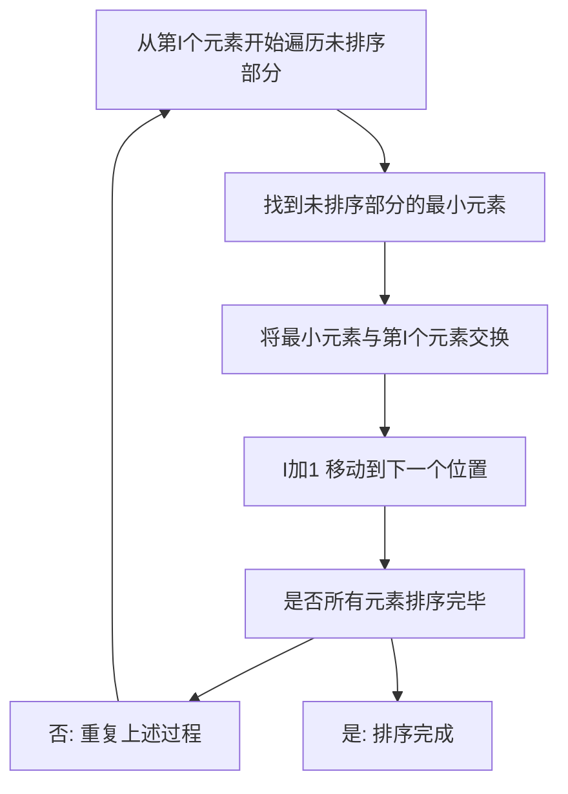

## 本节概述：选择排序

选择排序是一种最简单直观的排序算法。它的过程是：在未排序序列中找到一个最小值，放到排序序列的起始位置，再从剩余元素中继续找最小值放到已排序序列的末尾，以此类推直到所有元素排序完毕。每次都是从序列中选择出一个最小值，所以叫选择排序。

---

### 核心概念

**算法思想**（以递增排序为例，每次找最小值）：
1. 在未排序序列中找到最小元素，存放在排序序列的起始位置
2. 再从剩余未排序的元素中寻找最小元素，放到已排序序列的末尾，重复第二步
3. 直到所有元素都排序完毕

**执行过程**（以数组 85643712 为例）：
- 第一步：定义一个最小值的下标，从第一个元素开始往后遍历，每次找到更小的值就更新，遍历完毕后找到最小值 2，将 2 和 8 进行交换
- 第二步：从 5 开始继续往后找，找到最小值 3，将 3 和 5 交换
- 第三步：从 6 开始，最小值是 4，6 和 4 交换
- 继续重复，直到所有元素排序完毕

**总结**：从第 I 个元素到最后一个元素中选择一个最小的元素和第 I 个元素进行交换，最后一定可以保证所有元素都是升序排列的。

### 算法步骤

### 复杂度分析

**时间复杂度**：选择排序中有两个嵌套的循环。当有 N 个元素时，外循环循环 N 减 1 次迭代，内部循环会越来越短。当 I 等于 0 时内部循环 N 减 1 次比较操作，I 等于 1 时 N 减 2 次，以此类推直到 1。这是一个公差为负 1 的等差数列，求和为首项加尾项乘项数除以 2，即 N 乘 N 减 1 除 2。根据时间复杂度计算原则，N 相对于 N 方是高阶无穷小，总时间复杂度为**大 O N 方**。

**空间复杂度**：选择排序没有用额外的空间进行存储和交换操作，不依赖于数组本身的大小，空间复杂度为**大 O 1**。

**算法优点**：
- 简单易懂，非常直观，很容易实现
- 原地排序，不需要额外的存储空间
- 适合小型数组（元素个数小于 1000 个为小型数组）

**算法缺点**：
- 时间复杂度高，处理大规模数据效率低
- 不稳定排序：相同元素排序后位置可能会改变

> [!TIP]
> 选择排序适合元素个数小于 1000 的小型数组。如果 1 万个元素就不行了，需要用快速排序、堆排序或归并排序等效率更高的算法。选择排序的优化可通过线段树将内循环时间复杂度优化为 log N，总复杂度变为 N log N，常见优化是采用堆排序。

## 本章小结

- 选择排序每次从未排序部分选出最小值与起始位置交换，简单直观
- 时间复杂度为大 O N 方，空间复杂度为大 O 1
- 适合小型数组（小于 1000 个元素），是不稳定排序
- 可通过线段树或堆排序优化，将内循环从 O(N) 优化为 O(log N)
