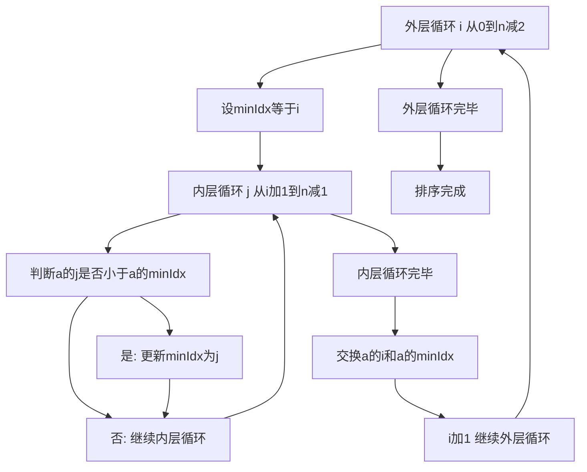

## 本节概述：选择排序 实战

本节选用洛谷 P1177"排序模板"，这是洛谷上最经典的排序题目。通过用选择排序解决这道题，读者可以彻底理解选择排序的核心思想——每轮从未排序部分选出最小值，放到已排序部分的末尾。

---

### 题目描述

**题目名称**：排序模板

**来源平台**：洛谷

**题目编号**：P1177

将读入的 N 个数从小到大排序后输出。

**输入格式**：第一行为一个正整数 N。第二行包含 N 个空格隔开的正整数 a 中每个元素，为你需要进行排序的数。

**输出格式**：将给定的 N 个数从小到大输出，数之间空格隔开，行末换行且无空格。

**数据范围**：对于 100% 的数据，1 <= N <= 10 的 5 次方，1 <= 每个元素 <= 10 的 9 次方。

**示例**：
输入：
5
4 2 4 5 1

输出：
1 2 4 4 5

### 解题思路

选择排序的思路非常直观：每一轮从未排序的部分中找到最小元素，与未排序部分的第一个位置交换，使得最小元素被放到正确的位置。

具体过程：
1. 第 0 轮：从下标 0 到 n 减 1 中找最小值，与下标 0 交换
2. 第 1 轮：从下标 1 到 n 减 1 中找最小值，与下标 1 交换
3. 以此类推，共进行 n 减 1 轮，所有元素排序完毕

每一轮结束后，前 i 个元素已经有序，后面 n 减 i 个元素还未排序。



### 代码实现

```cpp
#include <iostream>
using namespace std;

int a[100005];

// 选择排序函数
void selectionSort(int a[], int n) {
    for (int i = 0; i < n - 1; i++) {
        int minIdx = i;  // 记录未排序部分最小值的下标
        // 在未排序部分查找最小值
        for (int j = i + 1; j < n; j++) {
            if (a[j] < a[minIdx]) {
                minIdx = j;  // 更新最小值下标
            }
        }
        // 将最小值与第 i 个位置交换
        if (minIdx != i) {
            swap(a[i], a[minIdx]);
        }
    }
}

int main() {
    ios::sync_with_stdio(false);
    cin.tie(0);
    
    int n;
    cin >> n;
    for (int i = 0; i < n; i++) {
        cin >> a[i];
    }
    
    selectionSort(a, n);
    
    for (int i = 0; i < n; i++) {
        if (i > 0) cout << " ";
        cout << a[i];
    }
    cout << endl;
    return 0;
}
```

### 代码解析

**外层循环**：变量 i 从 0 遍历到 n 减 2，表示当前要确定的位置。每一轮结束后，下标 i 的位置放置了正确的最小值。

**查找最小值**：内层循环从 i 加 1 遍历到 n 减 1，记录未排序部分中最小元素的下标 minIdx。初始时 minIdx 设为 i，如果找到更小的元素就更新 minIdx。

**交换操作**：每轮结束后，将 a 的 i 和 a 的 minIdx 交换。如果 minIdx 等于 i（即 i 位置本身就是最小值），则不需要交换。

**注意**：选择排序的时间复杂度是大 O N 方，对于 P1177 的完整数据范围（N 最大 10 的 5 次方），选择排序可能超时。这道题用选择排序主要用于理解算法，实际通过需要用快速排序等大 O N 乘 log N 的算法。

### 复杂度分析

- 时间复杂度：大 O N 方。外层循环 n 减 1 次，内层循环次数递减，总共约 N 乘 N 减 1 除以 2 次比较。
- 空间复杂度：大 O 1。原地排序，只使用了常数个临时变量。

> [!TIP]
> 选择排序的核心是"每轮选最小值放到正确位置"。代码简单直观，但时间复杂度是大 O N 方，适合小型数组。对于 P1177 的完整数据范围，需要更高效的排序算法。选择排序是不稳定排序——相同元素排序后相对顺序可能改变。

## 本章小结

- 选择排序每轮从未排序部分选出最小值，与未排序部分起始位置交换
- 外层循环确定位置，内层循环查找最小值下标
- 时间复杂度为大 O N 方，空间复杂度为大 O 1
- 选择排序是不稳定排序，适合小型数组，大规模数据需用更高效的算法
