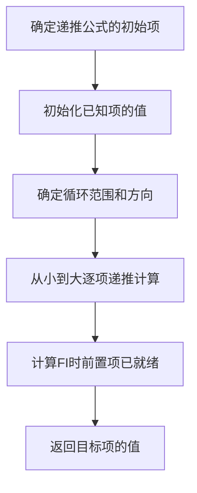
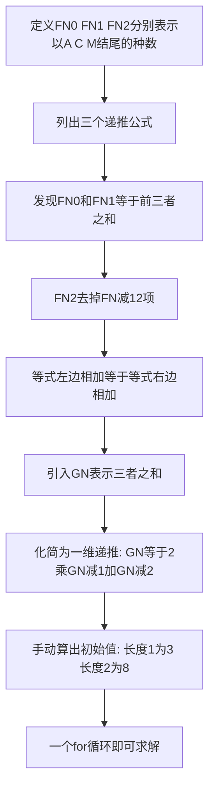

## 本节概述：递推

递推是一个非常重要的概念，它是动态规划的基础。递推最通俗的理解就是数列递推和数列的关系，好比算法和数据结构的关系。递推本质上是数学问题，也是属于线性枚举的一种。

---

### 核心概念

**递推与数列的关系**：数列有点像数据结构中的线性表（顺序表或链表，一般情况是顺序表），而递推就是一个循环或者一个迭代的枚举过程。

**一维递推——斐波那契数列**：第零项是 0，第一项是 1，其后的每一项都是前两项之和。数列为 1 2 3 5 8 13 21 34 55...... 数据范围最多不超过 30，因为增长速度是指数级别的，N 很大时会超过 32 位整形的范围。

```cpp
// 斐波那契数列递推
int f[31];
f[0] = 0;
f[1] = 1;
for (int i = 2; i <= N; i++) {
    f[i] = f[i-1] + f[i-2];  // 核心递推公式
}
return f[N];
```

核心代码就是 for 循环：I 从 2 开始到 N 进行自增，逐级计算 FI 的值。当计算 FI 的时候，FI 减 1 和 FI 减 2 必然已经计算出来了，因为我们是从小到大计算的。

**泰波那契数列**：第零项为 0，第一项为 1，第二项为 1，其后的每个元素等于前三项的和，即 TN 等于 TN 减 1 加 TN 减 2 加 TN 减 3。同样先初始化前三个元素，然后逐项递推。

**爬楼梯问题**：给定 N 阶楼梯，FI 表示从第零阶爬到第 I 阶的方案数。每次可以爬 1 到 2 个台阶。对于第 I 阶，要么是从 I 减 1 爬过来的，要么是从 I 减 2 爬过来的，因此递推公式为 FI 等于 FI 减 1 加 FI 减 2。这个递推公式也叫状态转移方程，FI 就是状态的概念，从一个状态到另一个状态就叫状态转移。

**二维递推问题**：对于长度为 N 只包含 A、C、M 三种字符的字符串，且禁止出现 M 相邻的情况，求这样的串有多少种。

定义 FN0 为以 A 结尾的串的种数，FN1 为以 C 结尾的种数，FN2 为以 M 结尾的种数。答案就是三者之和。递推如下：
- 如果第 N 个字符是 A 或 C，第 N 减 1 个字符可以是任意字符：FN0 等于 FN 减 1 的三者之和，FN1 同理
- 如果第 N 个字符是 M，第 N 减 1 个字符只能是 A 或 C：FN2 等于 FN 减 10 加 FN 减 11（去掉 FN 减 12）

通过数学化简，可引入 GN 等于 FNI 的三者之和，将二维递推化简为一维递推：GN 等于 2 乘以 GN 减 1 加 GN 减 2。长度为 1 的方案数为 3，长度为 2 的方案数为 8（3 乘 3 减去 MM 这一种情况）。

### 算法步骤



二维递推的化简过程：



### 复杂度分析

递推的时间复杂度取决于循环的次数。一维递推的时间复杂度为大 O N，需要遍历 N 项。空间复杂度取决于数组大小，斐波那契数列需要大小为 N 加 1 的数组。

> [!TIP]
> 递推公式也叫状态转移方程，FI 就是状态的概念，从一个状态到另一个状态就叫状态转移。这是动态规划里面一个非常重要的概念。把递推学好了，理解动态规划时会相对比较轻松。

## 本章小结

- 递推是动态规划的基础，本质上是数学问题，也是线性枚举的一种
- 一维递推如斐波那契数列：FI 等于 FI 减 1 加 FI 减 2，从小到大逐项计算
- 爬楼梯问题的递推公式与斐波那契数列相同，也称为状态转移方程
- 二维递推问题可以通过数学化简降为一维递推，减小计算复杂度
