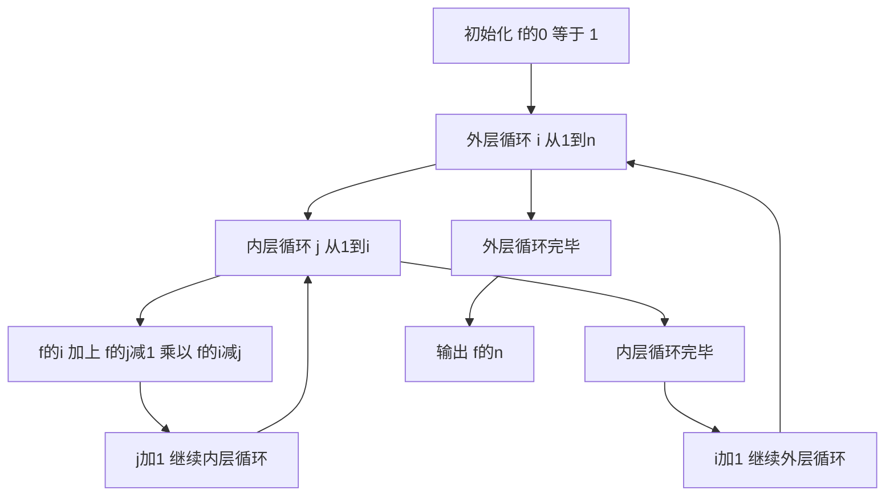

## 本节概述：递推 实战

本节选用洛谷 P1044"栈"（NOIP 2003 普及组），这是递推算法最经典的题目。这道题的核心是卡特兰数递推，通过分析栈的入栈出栈操作，建立递推公式，让读者深刻理解递推思想——从已知的基础情况出发，逐步推导出更大规模问题的答案。

---

### 题目描述

**题目名称**：栈

**来源平台**：洛谷

**题目编号**：P1044

宁宁考虑的是这样一个问题：一个操作数序列，1 到 n（图示为 1 到 3 的情况），栈 A 的深度大于 n。

现在可以进行两种操作：
1. 将一个数从操作数序列的头端移到栈的头端（对应数据结构中的入栈操作）
2. 将一个数从栈的头端移到输出序列的尾端（对应数据结构中的出栈操作）

使用这两种操作，由一个操作数序列就可以得到一系列的输出序列。求对于 n 个数，共有多少种不同的输出序列。

**输入格式**：输入文件只含一个整数 n。

**输出格式**：输出文件只有一行，即可能的输出序列的总数。

**数据范围**：1 <= n <= 18。

**示例**：
输入：3
输出：5

解释：对于 1 到 3 的序列，共有 5 种合法的出栈序列。

### 解题思路

这道题要求计算 n 个数按顺序入栈、可随时出栈时，共有多少种不同的出栈序列。这实际上是经典的卡特兰数问题。

**递推分析**：考虑数字 1 是第 k 个出栈的（k 从 1 到 n），那么：
- 在 1 出栈之前，2 到 k 这些数必须先入栈再出栈，共有 f 的 k 减 1 种方案
- 在 1 出栈之后，k 加 1 到 n 这些数入栈出栈，共有 f 的 n 减 k 种方案
- 两者是独立的，所以当 1 是第 k 个出栈时，方案数为 f 的 k 减 1 乘以 f 的 n 减 k

对 k 从 1 到 n 求和，得到递推公式：f 等于 n 的值等于 f 从 0 乘以 f 的 n 减 1 加上 f 的 1 乘以 f 的 n 减 2，一直加到 f 的 n 减 1 乘以 f 的 0。这就是卡特兰数的递推关系。

**基础情况**：f 的 0 等于 1（空序列只有一种方案），f 的 1 等于 1（只有一个数，只有一种出栈方式）。



### 代码实现

```cpp
#include <iostream>
using namespace std;

int main() {
    int n;
    cin >> n;
    
    // f[i] 表示 i 个数入栈出栈的合法序列数
    long long f[20] = {0};
    f[0] = 1;  // 空序列只有一种方案
    
    // 递推计算卡特兰数
    for (int i = 1; i <= n; i++) {
        for (int j = 1; j <= i; j++) {
            // 数字1是第j个出栈，左边有j-1个数，右边有i-j个数
            f[i] += f[j - 1] * f[i - j];
        }
    }
    
    cout << f[n] << endl;
    return 0;
}
```

### 代码解析

**初始化**：f 的 0 等于 1，表示没有数入栈时只有一种方案（空序列）。这是递推的基础。

**双重循环**：外层循环变量 i 从 1 遍历到 n，表示计算 i 个数的出栈序列数。内层循环变量 j 从 1 遍历到 i，表示数字 1 是第 j 个出栈的情况。

**递推公式**：当 1 是第 j 个出栈时，比 1 先出栈的数有 j 减 1 个（即 2 到 j），它们出栈的方案数为 f 的 j 减 1。比 1 后出栈的数有 i 减 j 个（即 j 加 1 到 i），它们出栈的方案数为 f 的 i 减 j。两者独立，方案数相乘，累加到 f 的 i 上。

**数据类型**：由于 n 最大为 18，卡特兰数第 18 项为 477638700，在 int 范围内，但使用 long long 更安全。

### 复杂度分析

- 时间复杂度：大 O N 方。双重循环，外层 n 次，内层最多 n 次。
- 空间复杂度：大 O N。使用一个大小为 n 加 1 的数组存储递推结果。

> [!TIP]
> 栈问题是卡特兰数的经典应用。递推的关键是找好"分界点"——数字 1 是第 j 个出栈，将问题分解为左右两个独立的子问题。递推公式就是卡特兰数公式，f 的 i 等于 f 的 j 减 1 乘以 f 的 i 减 j 对 j 从 1 到 i 求和。

## 本章小结

- 栈问题是递推算法最经典的题目，本质是卡特兰数递推
- 递推公式：f 的 i 等于 f 的 j 减 1 乘以 f 的 i 减 j 对 j 从 1 到 i 求和
- 递推基础：f 的 0 等于 1（空序列只有一种方案）
- 时间复杂度为大 O N 方，空间复杂度为大 O N
