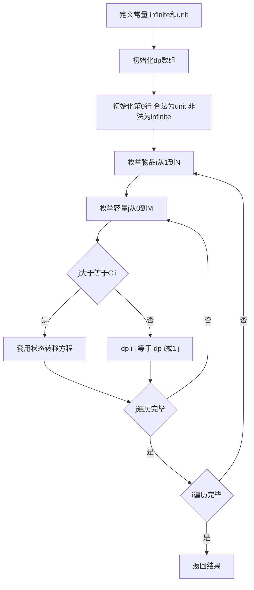

## 本节概述：01 背包

01背包是经典的动态规划问题，属于线性DP，状态转移方程固定，时间复杂度为O(N*M)。之所以叫01背包，是因为每种物品只有一个，0代表不放，1代表放。动态规划的问题编码很简单，但状态设计可能要想半天，一旦想出来就有醍醐灌顶的感觉。

---

### 核心概念

**问题描述**

有N个物品和一个容量为M的背包（N小于等于100，M小于等于1万）。第i个物品的容量是 `C[i]`，价值是 `W[i]`。选择一些物品放入背包，总容量不能超过背包容量，求能够达到的物品最大总价值。

**朴素方法**

每个物品有取和不取两种情况，可以用深度优先搜索枚举所有情况，时间复杂度O(2^N)，N最大100，2的100次方不可接受。

**状态设计**

`dp[i][j]` 表示前i个物品恰好放入容量为j的背包所得到的最大价值。

- `i` 范围 0 到 N，0代表什么物品都没有，1到N代表前1个、前2个......前N个物品
- `j` 范围 0 到 M，代表容量为0、1、2......M的情况
- 二维数组 `dp[N][M]` 实际上承担了哈希表的功能（利用下标快速获取值）

**状态转移方程**

两种情况取最大值：

1. **不放第i个物品**：问题转化为前i-1个物品放入容量为j的背包，即 `dp[i-1][j]`
2. **放第i个物品**：问题转化为前i-1个物品放入容量为 `j - C[i]` 的背包，再加上第i个物品的价值 `W[i]`，即 `dp[i-1][j-C[i]] + W[i]`

```cpp
dp[i][j] = max(dp[i-1][j], dp[i-1][j-C[i]] + W[i]);
```

**初始状态与非法状态**

- **初始状态**：`dp[0][0] = 0`（前0个物品放入容量0的背包，最大价值为0）
- **非法状态**：`dp[0][j]`（j > 0）代表前0个物品放入容量为j的背包，这种情况不存在（0个物品容量为0），值为 `infinite`
- `infinite` 在程序实现时设为非常小的数（如-1或-INF），保证无论如何状态转移都不能成为最优解

**常量定义**

- `infinite`：非法状态值，求最大值时必须比 `unit` 小
- `unit`：初始状态值

**OPT函数**

用于处理非法状态：如果A是非法状态值则返回B，如果B是非法状态值则返回A，两个都合法才比较返回大者（求最小值则返回小者）。

### 算法步骤



**核心代码逻辑**

1. 定义常量 `infinite` 和 `unit`
2. 初始化 `dp` 数组：第0行容量0为合法（值为unit），容量大于0为非法（值为infinite）
3. i从1到N遍历每个物品
4. j从0到M遍历容量
5. 如果 `j >= C[i]`，套用状态转移方程
6. 如果 `j < C[i]`，第i个物品放不进去，`dp[i][j] = dp[i-1][j]`

**参数说明**

- N：物品数量
- M：背包容量
- C：容量数组，下标1到N（C[0]冗余不使用）
- W：价值数组，下标1到N（W[0]冗余不使用）
- dp：二维状态数组

### 复杂度分析

- **时间复杂度**：O(N * M)，状态数O(N*M)，状态转移消耗O(1)
- **空间复杂度**：O(N * M)，二维数组

> [!TIP]
> 物品下标从1开始，原因是 `dp[i]` 行的状态来自于 `dp[i-1]` 行，为了数组下标不越界，先初始化 `dp[0]` 行再从1开始计算。对于恰好装满M的问题，答案就是 `dp[N][M]`；对于不超过M的问题，答案是 `OPT(dp[N][i])`，其中i从0到M。外层遍历物品，内层遍历容量，顺序尽量不要颠倒（空间优化后不可颠倒）。容量必须映射到下标所以必须是整数，价值可以是整数、小数、布尔类型或枚举顺序。

## 本章小结

- 01背包是经典线性DP，每种物品只有取或不取两种选择
- 状态定义：dp[i][j] 表示前i个物品恰好放入容量j的背包的最大价值
- 状态转移方程：dp[i][j] = max(dp[i-1][j], dp[i-1][j-C[i]] + W[i])
- 时间复杂度O(N*M)，物品下标从1开始避免越界
- 经典案例：求最大值、求最小值（infinite设大数）、存在性问题（W设0、infinite设false）、方案数问题（OPT改为加和）
