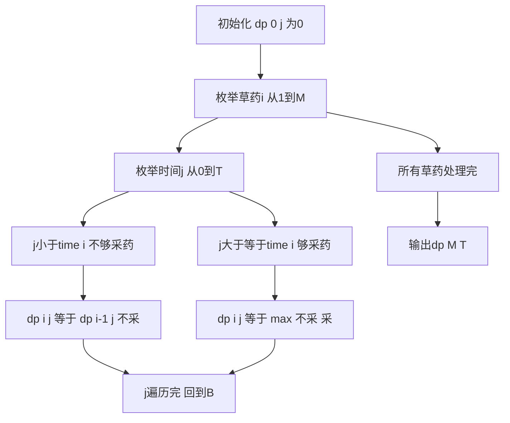

## 本节概述：01 背包 实战

本节选取洛谷 P1048 [NOIP2005 普及组] 采药，这是 01 背包最经典的入门模板题。通过这道题可以彻底理解"每个物品选或不选"的核心思想。

---

### 题目描述

**题目名称**：[NOIP2005 普及组] 采药
**来源平台**：洛谷
**题目编号**：P1048

辰辰是个天资聪颖的孩子，他的梦想是成为世界上最伟大的医师。为此，他想拜附近最有威望的医师为师。医师为了判断他的资质，给他出了一个难题。医师带他来到一处采药的山洞，山洞里有 M 种草药，采每一株草药需要一定时间，每一株草药也有自身价值。给你完成采药的总时间 T 和草药数目 M，问在规定时间内能采到的草药的最大总价值。

**输入格式**：第一行有 2 个整数 T（1 <= T <= 1000）和 M（1 <= M <= 100），用一个空格隔开，T 代表总共能够用来采药的时间，M 代表山洞里的草药的数目。接下来的 M 行每行包括两个在 1 到 100 之间（包括 1 和 100）的整数，分别表示采摘某株草药的时间和这株草药的价值。

**输出格式**：输出在规定的时间内可以采到的草药的最大总价值。

**数据范围**：1 <= T <= 1000，1 <= M <= 100，草药时间和价值均为 1 到 100 之间的正整数。

**示例**：
输入：
```
70 3
71 100
69 1
1 2
```
输出：
```
3
```

### 解题思路

这是最标准的 01 背包问题：每种草药只有一株，要么采（1）要么不采（0）。

状态设计：`dp[i][j]` 表示前 i 株草药在时间 j 内能采到的最大价值。

状态转移方程：
- 不采第 i 株：`dp[i][j] = dp[i-1][j]`
- 采第 i 株（前提 j >= time[i]）：`dp[i][j] = dp[i-1][j-time[i]] + value[i]`
- 取两者最大值：`dp[i][j] = max(dp[i-1][j], dp[i-1][j-time[i]] + value[i])`

初始状态：`dp[0][j] = 0`（0 株草药，任何时间下价值都是 0）。



### 代码实现

```cpp
#include <iostream>
#include <algorithm>
using namespace std;

const int MAXT = 1005;
const int MAXM = 105;

int T, M;
int t[MAXM], v[MAXM];        // t[i]: 采摘时间, v[i]: 草药价值
int dp[MAXM][MAXT];           // dp[i][j]: 前i株草药在时间j内的最大价值

int main() {
    cin >> T >> M;

    for (int i = 1; i <= M; i++) {
        cin >> t[i] >> v[i];
    }

    // 初始化：0株草药时，任何时间下价值都为0
    // dp[0][j] = 0（全局变量默认为0，无需额外初始化）

    // 01背包核心DP
    for (int i = 1; i <= M; i++) {
        for (int j = 0; j <= T; j++) {
            // 不采第i株草药
            dp[i][j] = dp[i - 1][j];
            // 采第i株草药（前提：时间够）
            if (j >= t[i]) {
                dp[i][j] = max(dp[i][j], dp[i - 1][j - t[i]] + v[i]);
            }
        }
    }

    cout << dp[M][T] << endl;

    return 0;
}
```

### 代码解析

- **二维 DP 表**：`dp[i][j]` 表示前 i 株草药在时间 j 内的最大价值。行表示草药（1 到 M），列表示时间（0 到 T）。
- **状态转移**：先继承不采的结果 `dp[i][j] = dp[i-1][j]`，再判断时间是否够采第 i 株，如果够则取 `max(dp[i-1][j], dp[i-1][j-t[i]] + v[i])`。
- **j 从小到大枚举**：在本题的二维实现中，j 的枚举方向不影响正确性，因为 `dp[i][j]` 依赖的是 `dp[i-1]` 的值，不会受到 `dp[i]` 中其他值的影响。
- **答案**：`dp[M][T]` 表示前 M 株草药在时间 T 内的最大价值。

### 复杂度分析

- 时间复杂度：O(M x T)，双重循环，M <= 100，T <= 1000，约 10^5 次运算。
- 空间复杂度：O(M x T)，二维 DP 表。

> [!TIP]
> 01 背包的核心决策只有两种：选或不选。状态转移方程 `dp[i][j] = max(dp[i-1][j], dp[i-1][j-w[i]] + v[i])` 是万能模板，务必牢记。注意 j >= t[i] 的判断不能少，否则会越界访问。示例中采第 3 株草药（时间 1，价值 2），在 70 分钟内采价值最大的组合是第 2 株（69 分 1 值）加第 3 株（1 分 2 值）= 3。

## 本章小结

- 01 背包是最基础的背包问题，每种物品只有一个，决策为"选或不选"。
- 二维 DP 表 `dp[i][j]` 表示前 i 个物品在容量 j 下的最大价值。
- 状态转移方程：`dp[i][j] = max(dp[i-1][j], dp[i-1][j-w[i]] + v[i])`。
- 采药问题是 NOIP 普及组经典题，数据范围小，适合入门理解。
