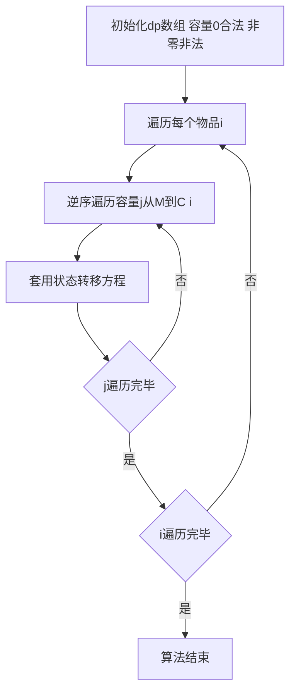

## 本节概述：01 背包空间优化

对01背包进行空间优化，将二维状态数组降为一维。核心思路是利用每行数据只取决于上一行的特点，去掉物品维度，并通过逆序遍历容量来保证每个物品只被使用一次。优化空间的同时还优化了常数时间，代码也更精简。

---

### 核心概念

**优化原理**

回顾01背包的状态转移方程，计算 `dp[i][j]` 就是在计算一个二维表格：第一维（物品i）代表行，第二维（容量j）代表列。每一行的数据只取决于上一行，所以计算当前行（第i行）时，第i-2行及之前的数据已经没有用了。

**空间浪费分析**

以 `dp[i][3]` 的计算为例，它的值取决于 `dp[i-1][1]` 和 `dp[i-1][3]`。因为每个物品的容量一定为正，所以计算 `dp[i][3]` 时，容量4和5的值实际上用不到（比3大的值都用不到），这部分空间就浪费了。

**优化方法**

重新定义状态，用一维数组 `dp[M+1]` 表示状态：

1. 去掉状态转移方程中的第一维（物品维度），`C[i]` 去不掉
2. 每加入一个物品，从后往前（逆序）计算容量

```cpp
// 优化前（二维）
dp[i][j] = max(dp[i-1][j], dp[i-1][j-C[i]] + W[i]);

// 优化后（一维）
dp[j] = max(dp[j], dp[j-C[i]] + W[i]);
```

**为什么必须逆序遍历**

由于从后往前计算，当计算到状态3的时候：

- 容量4和5已经变成第i行的值（浅绿色，已计算）
- 容量0、1、2、3还是第i-1行的值（深绿色，未计算）

计算 `dp[3]` 需要上一行的3和1，逆序保证了1还是上一行的值。如果顺序遍历，1已经变成当前行的值，会导致同一个物品被使用多次。逆序遍历容量保证每个物品只被使用一次。

### 算法步骤



**代码逻辑**

1. 初始化 `dp` 数组：容量0为合法状态，容量非零为非法状态
2. 遍历每个物品
3. 对每个物品逆序遍历容量，从M到 `C[i]`
4. 套用状态转移方程 `dp[j] = max(dp[j], dp[j-C[i]] + W[i])`

**额外优化**

当遍历到的容量已经小于本物品的容量时，物品无法被选中，原先需要将 `dp[i-1][j]` 复制给 `dp[i][j]`，转换成一维后这部分赋值没有必要（`dp[j]` 复制给 `dp[j]` 没有意义），所以循环只需从M到 `C[i]`，还能节省一部分时间消耗。

### 复杂度分析

- **时间复杂度**：O(N * M)，但常数因子更优（省去了不必要的赋值）
- **空间复杂度**：O(M)，从二维降为一维

> [!TIP]
> 01背包空间优化的关键在于逆序遍历容量。逆序保证了计算当前状态时所需依赖的上一行数据尚未被覆盖，从而保证每个物品只被使用一次。一旦理解了这个原理，代码不仅空间和时间都优化了，还更精简，唯一增加的是理解成本。

## 本章小结

- 01背包空间优化将二维数组降为一维，去掉物品维度
- 核心关键：逆序遍历容量，保证每个物品只被使用一次
- 当容量小于物品容量时无需赋值，额外节省常数时间
- 空间复杂度从O(N*M)降为O(M)，时间常数也得到优化
- 优化后物品和容量的遍历顺序不可颠倒
