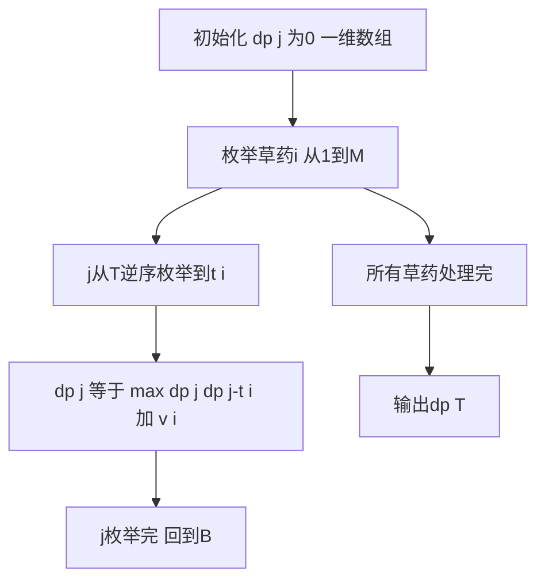

## 本节概述：01 背包空间优化 实战

本节同样选取洛谷 P1048 采药，但使用一维数组实现空间优化。通过对比二维和一维写法，彻底理解"逆序枚举"这一空间优化的关键技巧。

---

### 题目描述

**题目名称**：[NOIP2005 普及组] 采药
**来源平台**：洛谷
**题目编号**：P1048

辰辰是个天资聪颖的孩子，他的梦想是成为世界上最伟大的医师。医师带他来到一处采药的山洞，山洞里有 M 种草药，采每一株草药需要一定时间，每一株草药也有自身价值。给你完成采药的总时间 T 和草药数目 M，问在规定时间内能采到的草药的最大总价值。

**输入格式**：第一行有 2 个整数 T（1 <= T <= 1000）和 M（1 <= M <= 100），用一个空格隔开。接下来的 M 行每行包括两个在 1 到 100 之间的整数，分别表示采摘某株草药的时间和这株草药的价值。

**输出格式**：输出在规定的时间内可以采到的草药的最大总价值。

**数据范围**：1 <= T <= 1000，1 <= M <= 100，草药时间和价值均为 1 到 100 之间的正整数。

**示例**：
输入：
```
70 3
71 100
69 1
1 2
```
输出：
```
3
```

### 解题思路

二维 01 背包的状态转移方程：`dp[i][j] = max(dp[i-1][j], dp[i-1][j-t[i]] + v[i])`。

观察发现，`dp[i][j]` 只依赖 `dp[i-1]` 这一行的值（上一行），不依赖 `dp[i]` 自身。因此可以把二维数组压缩为一维，省去 i 维度。

**关键问题**：一维数组 `dp[j]` 中，j 必须逆序枚举（从 T 到 t[i]）。

原因：如果正序枚举，`dp[j-t[i]]` 可能已经被当前第 i 株草药更新过，相当于同一物品被"采了多次"，违反 01 背包"每件物品最多选一次"的规则。逆序枚举保证 `dp[j-t[i]]` 仍然是上一轮（第 i-1 株）的结果。



### 代码实现

```cpp
#include <iostream>
#include <algorithm>
using namespace std;

const int MAXT = 1005;

int T, M;
int t[105], v[105];
int dp[MAXT]; // 一维数组，空间优化

int main() {
    cin >> T >> M;

    for (int i = 1; i <= M; i++) {
        cin >> t[i] >> v[i];
    }

    // 初始化：dp[j] = 0（任何时间下，0株草药价值为0）

    // 01背包一维DP
    for (int i = 1; i <= M; i++) {
        // 关键：j必须逆序枚举，从T到t[i]
        for (int j = T; j >= t[i]; j--) {
            // dp[j-t[i]] 此时还是上一轮的值（第i-1株的结果）
            dp[j] = max(dp[j], dp[j - t[i]] + v[i]);
        }
    }

    cout << dp[T] << endl;

    return 0;
}
```

### 代码解析

- **一维数组**：`dp[j]` 表示在时间 j 内能获得的最大价值。省去了物品维度 i，节省了 O(M) 的空间。
- **逆序枚举**：`for (int j = T; j >= t[i]; j--)`。这是空间优化的核心。逆序保证 `dp[j - t[i]]` 在被使用时仍然是上一轮（第 i-1 株草药）的结果，没有被当前第 i 株更新过。
- **正序枚举的后果**：如果写成 `for (j = t[i]; j <= T; j++)`，当处理 j 时，`dp[j-t[i]]` 可能已经被当前第 i 株草药更新过，导致第 i 株草药被重复选取，变成完全背包。
- **j 的下界**：`j >= t[i]`，因为时间不够时无法采药，`dp[j]` 保持不变（等于上一轮的值）。
- **答案**：`dp[T]`，表示时间 T 内的最大价值。

### 复杂度分析

- 时间复杂度：O(M x T)，与二维版本相同，双重循环。
- 空间复杂度：O(T)，仅一维数组，从 O(M x T) 优化到 O(T)。

> [!TIP]
> 01 背包空间优化的核心口诀：逆序枚举。理解为什么逆序：一维数组中 dp[j-t[i]] 代表的是"上一轮的值"，如果正序枚举，dp[j-t[i]] 可能已被当前轮更新，导致同一物品被选多次。这是一个面试和竞赛中的高频考点，务必理解透彻而非死记。

## 本章小结

- 01 背包的二维 DP 可以压缩为一维，节省空间。
- 核心技巧：j 逆序枚举（从 T 到 t[i]），保证 dp[j-t[i]] 是上一轮的结果。
- 如果正序枚举，则变成完全背包（物品可重复选取），这是两者的本质区别。
- 空间从 O(M x T) 优化到 O(T)，竞赛中常用此写法。
