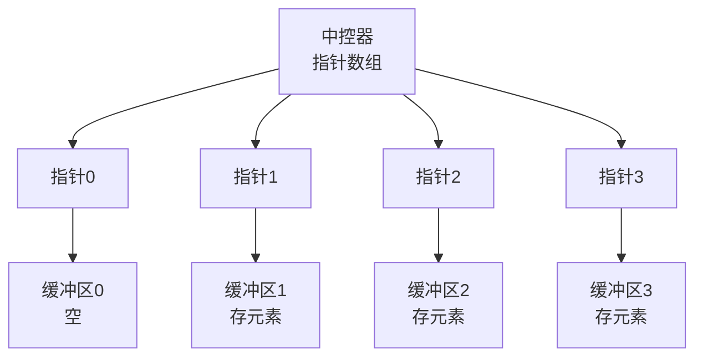
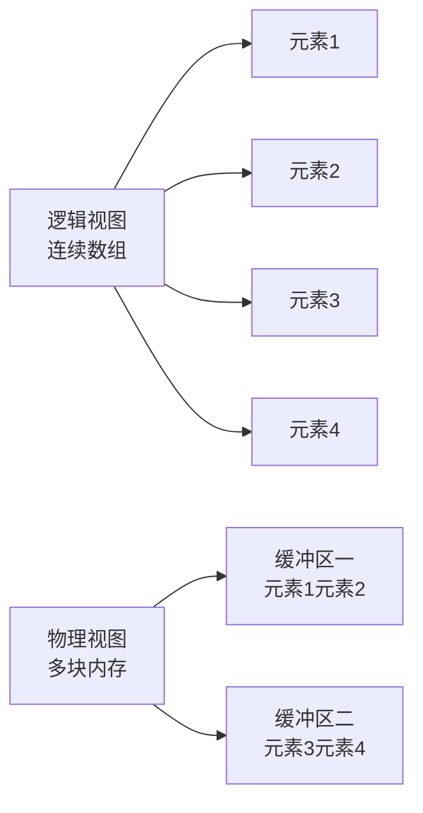

## 本节概述：deque 双端队列

deque（double-ended queue，双端队列）——头尾两端都能高效插入和删除的容器。核心结构是**指针数组 + 多块连续内存**，物理上不连续，逻辑上连续。

## 逻辑结构

deque 的逻辑结构跟 vector 很像：

- **front** — 头部元素
- **back** — 尾部元素
- **begin** — 指向头部的迭代器
- **end** — 指向尾部下一个元素的迭代器（左闭右开）

四个核心操作接口：

| 操作 | 头部 | 尾部 |
|---|---|---|
| 插入 | `push_front(x)` | `push_back(x)` |
| 删除 | `pop_front()` | `pop_back()` |

## 为什么需要 deque

vector 也支持头尾插入删除，但**头插效率极低**：

| 操作 | vector | deque |
|---|---|---|
| 尾插尾删 | O(1) 均摊 | O(1) 均摊 |
| 头插头删 | O(n)（所有元素往后挪） | O(1) 均摊 |

> [!WARNING]
> **vector 头插为什么慢？**
>
> vector 是一块连续内存，头部插入一个元素，后面所有元素都要往后挪一位。
> 元素越多越慢，时间复杂度 O(n)。
>
> deque 不需要挪动元素——因为它的物理结构不一样。

## 物理结构：中控器 + 缓冲区

deque 的核心是一块**指针数组**（叫 map / 中控器），每个指针指向一块连续内存（叫 buffer / block / 缓冲区）。



```
指针数组（中控器 map）：
┌─────┬─────┬─────┬─────┬─────┬─────┬─────┬─────┐
│  0  │  1  │  2  │  3  │  4  │  5  │  6  │  7  │
└──┼──┴──┼──┴──┼──┴──┼──┴──┼──┴──┼──┴──┼──┴──┼──┘
   │     │     │     │     │     │     │     │
   ↓     ↓     ↓     ↓     ↓     ↓     ↓     ↓
  ...   元素1 元素2 元素3  ...   ...   ...   ...
        元素4 元素5 元素6
        ...   ...   ...
        buffer buffer buffer
```

> [!NOTE]
> **两层结构**：
> 1. **上层** — 指针数组（中控器），每个元素是一个指针，占 8 字节（64 位）
> 2. **下层** — 每块指针指向一块连续内存（buffer / block），存真正的数据
>
> **物理上不连续，逻辑上连续**——从用户角度看，deque 就像一个连续数组，支持随机访问。

### 逻辑连续 vs 物理不连续



## block_size：每个缓冲区多大

每个 buffer 能放多少个元素，跟元素大小有关：

| 类型 | 字节数 | block_size（每个 buffer 的元素个数） |
|---|---|---|
| char | 1 | 16 |
| short | 2 | 8 |
| int | 4 | 4 |
| long long / double | 8 | 2 |
| 更大的自定义类型 | > 8 | 1 |

> [!TIP]
> 规律：**元素大小 × block_size ≈ 16 字节**（小类型），大于 8 字节的类型 block_size 就是 1。
>
> 源码公式：`_S_buffer_size()` 返回 `sizeof(_Tp) < 256 ? size_t(256 / sizeof(_Tp)) : size_t(1)`

## 头插为什么快

往头部插入元素时，不需要挪动已有元素：

1. 如果当前第一个 buffer 前面还有空位 → 直接放进去
2. 如果第一个 buffer 满了 → 申请新的 buffer，在中控器前面加一个指针
3. 整个过程不需要挪动已有数据

```
头插前：指针数组从中间开始用
┌─────┬─────┬─────┬─────┐
│     │ [0] │ [1] │ ... │    ← 红色头在 0 号 buffer
└─────┴─────┴─────┴─────┘
         ↑
      start 起点

头插后：往前面借位
┌─────┬─────┬─────┬─────┐
│ [-1]│ [0] │ [1] │ ... │    ← 新元素插到前面的 buffer
└─────┴─────┴─────┴─────┘
   ↑
start 起点往前挪了
```

> [!NOTE]
> **中控器是循环使用的**：
> 前面有空位就往前插，后面有空位就往后插，指针数组本身是循环的。
> 逻辑上的第一个元素不一定在物理数组的第 0 个位置。

## 扩容机制

当中控器（指针数组）满了，就扩容：

1. 新中控器大小 ×2（8 → 16 → 32 ...）
2. 把原来的数据**整体挪到新中控器的中间位置**
3. 这样前后都有空间继续扩展

> [!TIP]
> 扩容时**数据本身不需要拷贝**——只需要拷贝指针数组里的指针（8 字节 × n 个），很快。
> 真正的 buffer 内存还是原来的，只是指针换了个地方存。

## vector vs deque 对比

| 对比项 | vector | deque |
|---|---|---|
| 物理结构 | 一块连续内存 | 指针数组 + 多块 buffer |
| 尾插尾删 | O(1) 均摊 | O(1) 均摊 |
| 头插头删 | O(n)（要挪元素） | O(1) 均摊 |
| 随机访问 | O(1)（直接算地址） | O(1)（稍慢，要算在哪块 buffer） |
| 扩容代价 | 高（所有元素都要拷贝） | 低（只拷贝指针数组） |
| 内存连续性 | 物理连续 | 逻辑连续，物理不连续 |
| 适用场景 | 只有尾插，随机访问多 | 头尾都插，两端操作多 |

> [!WARNING]
> **不是所有情况 deque 都更快**：
> - 数据量小的时候，vector 连续内存的缓存命中率更高，可能更快
> - 只有尾插没有头插，选 vector 就够了
> - 又有头插又有尾插，选 deque

## 基本使用

```cpp
#include <iostream>
#include <deque>
using namespace std;

int main() {
    deque<int> dq;

    // 尾插
    dq.push_back(10);
    dq.push_back(20);
    dq.push_back(30);

    // 头插
    dq.push_front(5);
    dq.push_front(1);

    // 遍历
    for (size_t i = 0; i < dq.size(); i++) {
        cout << dq[i] << " ";   // 支持随机访问
    }
    cout << endl;   // 1 5 10 20 30

    // 头删尾删
    dq.pop_front();
    dq.pop_back();

    cout << dq.front() << endl;   // 5
    cout << dq.back() << endl;    // 20

    return 0;
}
```

## 本章小结

**deque** — 双端队列，头尾都能 O(1) 插入删除，支持随机访问。

**物理结构** — 中控器（指针数组）+ 多块 buffer，物理不连续逻辑连续。

**block_size** — 每个 buffer 的元素数，小类型约 16 字节一块，int 就是 4 个。

**头插快的原因** — 不需要挪动元素，前面有空位直接放，满了就申请新 buffer。

**扩容代价低** — 只拷贝指针数组，不拷贝数据本身。

**选型建议** — 只有尾插选 vector，头尾都插选 deque。
