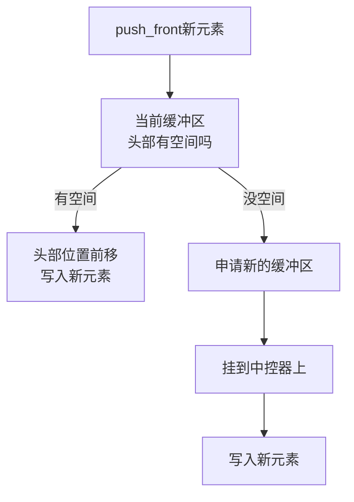

## 本节概述：deque 的数据插入

三种插入方式：头插 `push_front`、尾插 `push_back`、中间插 `insert`。头插尾插都很简单，insert 重载较多，功能最强。

## 三种插入方式总览

| 方式 | 语法 | 时间复杂度 | 是否需要迭代器 |
|---|---|---|---|
| 头插 | `dq.push_front(x)` | O(1) 均摊 | 不需要 |
| 尾插 | `dq.push_back(x)` | O(1) 均摊 | 不需要 |
| 中间插 | `dq.insert(pos, x)` | O(n) | 需要 |

> [!TIP]
> **为什么头插尾插不需要迭代器？**
>
> 位置是固定的——头插一定插在最前面，尾插一定插在最后面，所以直接传值就行。
> 只有 insert 插到中间，需要用迭代器告诉你插到哪里。

## push_front：头插

### 头插执行流程



```cpp
deque<int> d;

d.push_front(-1);   // -1
d.push_front(-2);   // -2 -1
d.push_front(-3);   // -3 -2 -1

printDeque(d);   // -3 -2 -1
```

> 每次都往头部插入，后面的元素"往后挤"。
> 但因为 deque 的物理结构是多块 buffer，头插不需要真的挪动数据，直接在前面的 buffer 里放就行——这就是 deque 头插比 vector 快的原因。

## push_back：尾插

```cpp
d.push_back(1);    // -3 -2 -1 1
d.push_back(2);    // -3 -2 -1 1 2
d.push_back(3);    // -3 -2 -1 1 2 3

printDeque(d);   // -3 -2 -1 1 2 3
```

> 尾插跟 vector 一样，往尾部追加元素。

## insert：中间插入

insert 有多个重载，介绍最常用的 3 种。

### 版本一：插入单个元素

```cpp
d.insert(d.begin() + 3, 0);
// 在第 4 个元素（下标 3）前面插入 0
// -3 -2 -1 0 1 2 3
```

> [!NOTE]
> **插入位置图解**（当前数据：-3 -2 -1 1 2 3）：
>
> | 迭代器位置 | 指向的元素 | 插入效果 |
> |---|---|---|
> | `begin()` | -3 | 插在 -3 前面 → 新元素变第一个 |
> | `begin() + 1` | -2 | 插在 -2 前面 → 新元素变第二个 |
> | `begin() + 3` | 1 | 插在 1 前面 → 新元素变第四个 |
> | `end()` | 末尾之后 | 插在最后面 → 跟 push_back 一样 |
>
> insert 永远插在迭代器指向元素的**前面**。

### 版本二：插入 count 个相同元素

```cpp
d.insert(d.end() - 1, 5, 8);
// 在最后一个元素前面插入 5 个 8
// -3 -2 -1 0 1 2 8 8 8 8 8 3
```

> 三个参数：
> - 第一个 = 插入位置迭代器
> - 第二个 = 插入个数（5 个）
> - 第三个 = 插入的值（8）

### 版本三：插入迭代器区间

```cpp
// 在 begin+1 位置，插入 begin+4 到 begin+6 的元素
d.insert(d.begin() + 1, d.begin() + 4, d.begin() + 6);
```

> [!TIP]
> **左闭右开区间** `[begin+4, begin+6)`：
> - `begin + 4` → 第 5 个元素
> - `begin + 6` → 第 7 个元素（不包含）
> - 所以插入的是第 5、6 两个元素
> - 插入个数 = 6 - 4 = 2 个
>
> 插入之后的结果：原来的前 1 个元素 + 新插入的 2 个元素 + 原来从第 2 个开始的所有元素。

## 完整代码示例

```cpp
#include <iostream>
#include <deque>
using namespace std;

void printDeque(const deque<int>& dq) {
    for (size_t i = 0; i < dq.size(); i++) {
        cout << dq[i] << " ";
    }
    cout << endl;
}

int main() {
    deque<int> d;

    // 1. 头插
    d.push_front(-1);
    d.push_front(-2);
    d.push_front(-3);
    cout << "头插后: "; printDeque(d);   // -3 -2 -1

    // 2. 尾插
    d.push_back(1);
    d.push_back(2);
    d.push_back(3);
    cout << "尾插后: "; printDeque(d);   // -3 -2 -1 1 2 3

    // 3. insert 单个元素
    d.insert(d.begin() + 3, 0);
    cout << "insert单个: "; printDeque(d);   // -3 -2 -1 0 1 2 3

    // 4. insert count 个相同元素
    d.insert(d.end() - 1, 5, 8);
    cout << "insert5个8: "; printDeque(d);   // -3 -2 -1 0 1 2 8 8 8 8 8 3

    // 5. insert 迭代器区间
    deque<int> d2 = {10, 20, 30, 40, 50};
    d2.insert(d2.begin() + 1, d2.begin() + 3, d2.begin() + 5);
    cout << "insert区间: "; printDeque(d2);  // 10 40 50 20 30 40 50

    return 0;
}
```

运行结果：

```
头插后: -3 -2 -1
尾插后: -3 -2 -1 1 2 3
insert单个: -3 -2 -1 0 1 2 3
insert5个8: -3 -2 -1 0 1 2 8 8 8 8 8 3
insert区间: 10 40 50 20 30 40 50
```

## 本章小结

**三种插入** — push_front 头插、push_back 尾插、insert 中间插。

**头插尾插最简单** — 直接传值，O(1) 均摊，这是 deque 的核心优势。

**insert 功能最强** — 三种常用重载：插单个、插 count 个相同值、插迭代器区间。

**insert 插在前面** — 迭代器指向哪个元素，就插在那个元素的前面。

**时间复杂度** — 头尾 O(1)，中间 O(n)（要挪元素）。
