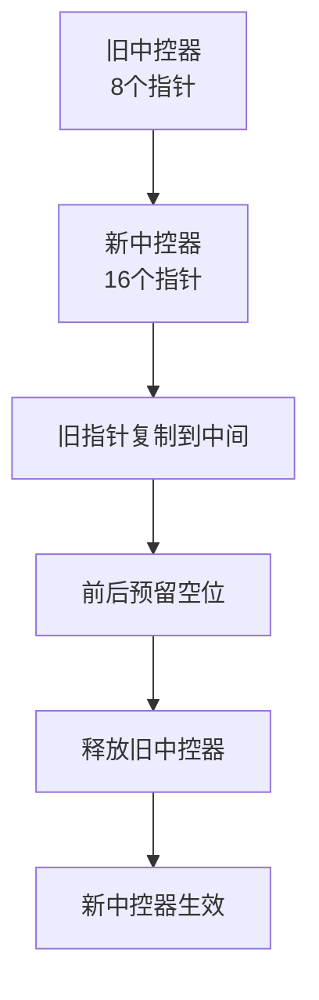

## 本节概述：deque 的扩容机制

deque 的底层是**中控器（指针数组）+ 多块 buffer** 的两层结构。扩容只扩中控器，数据 buffer 本身不需要移动——只需要把指针拷贝到新的中控器里。

## 底层成员变量

源码里（下划线开头的私有成员）：

| 成员变量 | 含义 |
|---|---|
| `_M_map` | 中控器（指针数组）的首地址 |
| `_M_map_size` | 中控器的大小（指针数组有多少个槽位） |
| `_M_start` | 第一个元素所在的迭代器（包含哪个 buffer + 哪个位置） |
| `_M_finish` | 最后一个元素的下一个位置的迭代器 |

> [!NOTE]
> 老师课上讲的变量名：
> - **map** → 指针数组首地址（`_M_map`）
> - **map_size** → 指针数组长度（`_M_map_size`）
> - **my_off** → 第一个元素相对于中控器起点的偏移
> - **my_size** → 元素总个数（size() 函数返回的就是它）

## block_size：每个 buffer 多大

每个 buffer（块）能放多少个元素，由元素大小决定：

| 类型 | sizeof | block_size（每块元素数） |
|---|---|---|
| char | 1 | 8（GCC）/ 16（MSVC） |
| int | 4 | 8 |
| long long / double | 8 | 8 |

> 公式大致是：每块固定 512 字节左右，元素越大块的个数越少。
> GCC 实现：`sizeof(T) < 256 ? 512 / sizeof(T) : 1`

## 初始状态（空 deque）

```cpp
deque<long long> dq;   // 空 deque
```

- `_M_map` = 空（初始不申请中控器）
- `_M_map_size` = 0
- `my_size` = 0

> 空的时候什么内存都不申请，用到的时候才分配。

## 第一次插入（push_back）

插入第一个元素时，中控器才初始化：

- `_M_map_size` = **8**（最小中控器大小，`_S_initial_map_size`）
- 只申请 **1 个 buffer**（只需要一块就能放下第一个元素）
- 其余 7 个指针位置都是空指针（NULL）
- `my_size` = 1

```
中控器 map（8个槽位）：
┌─────┬─────┬─────┬─────┬─────┬─────┬─────┬─────┐
│ [0] │ [1] │ [2] │ [3] │ [4] │ [5] │ [6] │ [7] │
│  ↓  │ NULL│ NULL│ NULL│ NULL│ NULL│ NULL│ NULL│
└──┼──┴─────┴─────┴─────┴─────┴─────┴─────┴─────┘
   ↓
 [数据0, 空]  ← 一个buffer放2个long long
```

> [!TIP]
> **为什么只申请 1 个 buffer？**
>
> 用多少申请多少，不浪费。其他 7 个槽位先留空，等需要的时候再申请对应的 buffer 内存。

## 持续尾插

继续 `push_back`：

1. 当前 buffer 还有空位 → 直接放下一个元素
2. 当前 buffer 满了 → 申请下一个 buffer，继续放
3. 每用满一块，就申请一块新的

```
插了4个元素后（long long，每块2个）：
┌─────┬─────┬─────┬─────┬─────┬─────┬─────┬─────┐
│ [0] │ [1] │ [2] │ [3] │ [4] │ [5] │ [6] │ [7] │
│  ↓  │  ↓  │ NULL│ NULL│ NULL│ NULL│ NULL│ NULL│
└──┼──┴──┼──┴─────┴─────┴─────┴─────┴─────┴─────┘
   ↓     ↓
 [0, 1] [2, 3]
```

## push_front：头插

头插的时候，前面没位置怎么办？

**中控器是循环使用的**——前面没位置就去最后面找：

```
push_front(9)，前面没位置了，去中控器尾部借：
┌─────┬─────┬─────┬─────┬─────┬─────┬─────┬─────┐
│ [0] │ [1] │ [2] │ ... │ ... │ ... │ ... │ [7] │
│  ↓  │  ↓  │     │     │     │     │     │  ↓  │
└──┼──┴──┼──┴─────┴─────┴─────┴─────┴─────┴──┼──┘
   ↓     ↓                                 ↓
 [0, 1] [2, 3] ...                     [9, 空]
```

> [!NOTE]
> **循环空间**：
> 逻辑上 9 在 0 的前面，但物理上 9 存在中控器的最后一个槽位 [7] 里。
> 整个中控器是循环的——下标 7 的下一个是下标 0，下标 0 的前一个是下标 7。

每 `push_front` 一次，`my_off` 减 1（偏移量减一）。

## 扩容触发条件

当中控器快满了（前面或后面没多余槽位了），就触发扩容。

触发扩容的条件大致是：
- 头插时 `_M_start._M_node == _M_map`（前面没位置了）
- 尾插时 `_M_finish._M_node == _M_map + _M_map_size - 1`（后面没位置了）

## 扩容过程



### 第一步：新中控器 ×2

`_M_map_size` 从 8 → 16，申请新的 16 个指针的数组。

### 第二步：数据迁移（只搬指针）

把旧中控器里的指针，**拷贝到新中控器的中间位置**：

```
旧中控器（8个槽位）：
[5][6][7][0][1][2][3][4]   ← 循环排列，0在中间位置
          ↑
      start起点

新中控器（16个槽位）：
[ ][ ][ ][ ][ ][ ][5][6][7][0][1][2][3][4][ ][ ]
                    ↑           ↑
                start起点    后面还能插5个
             ↑
          前面还能插6个
```

> [!TIP]
> **为什么放中间？**
>
> 放中间的话，前面和后面都有空余的槽位，继续头插尾插都有空间。
> 扩容一次之后，两边都有足够空间继续用很久。

### 第三步：释放旧中控器

旧的指针数组 delete 掉，`_M_map` 指向新数组。

> [!WARNING]
> **扩容只拷贝指针，不拷贝数据！**
>
> 真正的 buffer（数据块）内存完全不动，只是把指针从旧中控器拷贝到新中控器。
> 所以 deque 扩容的代价比 vector 小很多——vector 要把所有数据都拷贝一遍，deque 只拷指针数组。

## 扩容之后

扩容完成后：
- 前面有若干空槽位 → 可以继续 `push_front`
- 后面有若干空槽位 → 可以继续 `push_back`
- buffer 本身不需要动，数据都在原地

## vector vs deque 扩容对比

| 对比项 | vector | deque |
|---|---|---|
| 扩容对象 | 数据数组 | 中控器（指针数组） |
| 扩容倍数 | ×1.5 | ×2 |
| 数据移动 | 所有数据都要拷贝到新地址 | 数据不移动，只拷贝指针 |
| 迭代器失效 | 全部失效 | 全部失效（中控器换了） |
| 扩容代价 | O(n)，数据越大越慢 | O(map_size)，跟指针数成正比 |

> deque 扩容比 vector 快很多，因为只搬指针不搬数据。

## 本章小结

**中控器 + buffer** — 指针数组是中控器，每个指针指向一块 buffer，存真正的数据。

**block_size** — 每块 buffer 放多少元素，由元素大小决定，int 就是 8 个。

**中控器是循环的** — 头插没位置就去尾部借，尾插没位置就去头部借，逻辑上是环形的。

**扩容 ×2** — 中控器大小翻倍，旧指针拷贝到新中控器中间位置，前后都留空。

**扩容代价低** — 只拷贝指针不拷贝数据，比 vector 扩容快很多。
