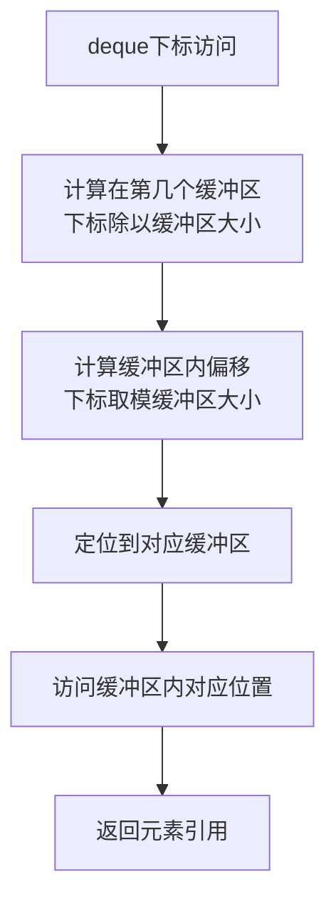

## 本节概述：deque 的随机访问

deque 支持 `[]` 和 `at` 两种下标访问，看起来跟数组一样，但底层是**二维寻址**——先找在哪块 buffer，再找 buffer 里的第几个。

## 两种访问方式

```cpp
deque<int> d {9, 8, 7, 6, 5};

cout << d[2] << endl;      // 7
cout << d.at(2) << endl;   // 7
```

> 下标从 0 开始：0 号是 9，1 号是 8，2 号是 7……

## [] vs at 对比

| 对比项 | `operator[]` | `at()` |
|---|---|---|
| 越界检查 | Debug 有，Release 没有 | 始终有 |
| 越界行为 | Release 未定义行为（返回垃圾值或崩溃） | 抛出 `out_of_range` 异常 |
| 函数标识 | `noexcept`（不抛异常） | 可能抛异常 |
| 性能 | 稍快（少一次判断） | 稍慢（多一次判断） |
| 安全性 | 低 | 高 |

> [!WARNING]
> **Release 模式下 `[]` 不检查越界！**
>
> 跟 vector 和 string 一样，`[]` 在发布版里完全不做边界检查，越界访问就是未定义行为。
> 不确定下标是否合法时，用 `at()` 更安全。

## 底层原理：二维寻址

### 下标访问计算流程



表面上是一个中括号 `d[i]`，底层其实做了两次索引：

```
第一步：找第几块 buffer
         offset = 起始偏移 + i
         block_index = offset / block_size   ← 在哪块
         然后 mod map_size （因为中控器是循环的）

第二步：找 block 里的第几个
         inner_index = offset % block_size  ← 块内第几个
```

### 举例

假设：
- `block_size = 2`（long long 类型，每块 2 个元素）
- `map_size = 8`（中控器 8 个槽位）
- 起始偏移 `my_off = 11`（第一个元素在中控器第 5 块的第 1 个位置）

访问第 0 个元素（逻辑上的第一个）：

```
offset = 11 + 0 = 11
block_index = 11 / 2 = 5  → 第 5 号 buffer
inner_index = 11 % 2 = 1  → buffer 里第 1 个元素

最终：_M_map[5][1]
```

### 图解

```
中控器 map（8个槽位，循环排列）：
┌─────┬─────┬─────┬─────┬─────┬─────┬─────┬─────┐
│ [0] │ [1] │ [2] │ [3] │ [4] │ [5] │ [6] │ [7] │
│     │     │     │     │     │  ↓  │     │  ↓  │
└─────┴─────┴─────┴─────┴─────┴──┼──┴─────┴──┼──┘
                                 ↓           ↓
                            [ , 0]     [14,15]
                              ↑
                         第0个元素在这里
                         （第5块的第1个位置）
```

> [!TIP]
> **可以理解成二维数组**：
>
> deque 底层虽然物理上不是连续的二维数组，但寻址方式很像二维数组——
> 第一维找 block，第二维找块内位置。只是第一维的下标计算多了一个偏移和取模（因为中控器是循环的）。

## front 和 back

除了下标随机访问，还有两个更简单的接口：

```cpp
cout << d.front() << endl;   // 9（第一个元素）
cout << d.back() << endl;    // 5（最后一个元素）
```

| 接口 | 作用 | 时间复杂度 |
|---|---|---|
| `front()` | 获取头部元素 | O(1) |
| `back()` | 获取尾部元素 | O(1) |

## vector vs deque 随机访问对比

| 对比项 | vector | deque |
|---|---|---|
| 访问方式 | 直接算地址（一次加法） | 二维寻址（除法+取模+两次索引） |
| 速度 | 更快 | 稍慢（多几次运算） |
| 物理连续 | 是 | 否（多块 buffer） |
| 缓存命中率 | 高 | 稍低（跨 block 时缓存不命中） |

> [!NOTE]
> **虽然 deque 也是随机访问迭代器，但比 vector 慢一点。**
>
> 大量下标访问的场景（比如排序、二分查找），vector 通常更快。
> 但如果有大量头插操作，deque 整体更划算——根据场景选择。

## 完整代码示例

```cpp
#include <iostream>
#include <deque>
using namespace std;

int main() {
    deque<int> d {9, 8, 7, 6, 5};

    // 1. [] 下标访问
    cout << "d[2] = " << d[2] << endl;      // 7

    // 2. at 下标访问
    cout << "d.at(2) = " << d.at(2) << endl; // 7

    // 3. front 和 back
    cout << "front = " << d.front() << endl; // 9
    cout << "back = " << d.back() << endl;   // 5

    // 4. 遍历
    for (size_t i = 0; i < d.size(); i++) {
        cout << d[i] << " ";
    }
    cout << endl;   // 9 8 7 6 5

    // 5. at 越界会抛异常
    try {
        cout << d.at(100) << endl;
    } catch (const out_of_range& e) {
        cout << "越界了: " << e.what() << endl;
    }

    return 0;
}
```

运行结果：

```
d[2] = 7
d.at(2) = 7
front = 9
back = 5
9 8 7 6 5
越界了: deque::_M_range_check: __n (which is 100) >= this->size() (which is 5)
```

## 本章小结

**两种下标访问** — `[]` 和 `at`，用法跟数组一样，都是 O(1)。

**`[]` vs `at`** — `[]` Release 不检查越界，`at` 永远检查并抛异常。

**底层是二维寻址** — 先通过 `offset / block_size` 找第几块 buffer，再通过 `offset % block_size` 找块内位置。

**front / back** — 直接取首尾元素，O(1)。

**比 vector 稍慢** — 多了几次寻址运算，跨 block 时缓存不命中，但也是 O(1) 级别的。
