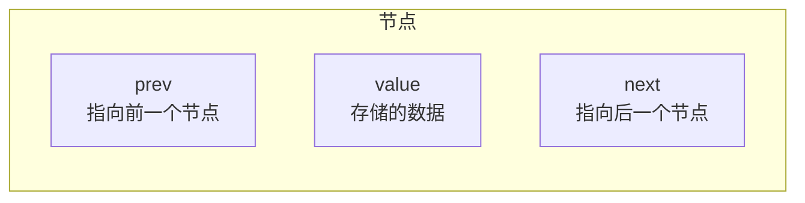
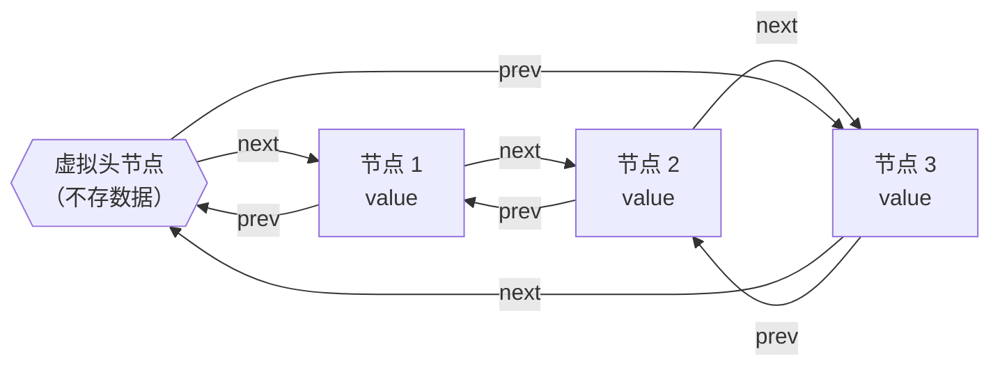
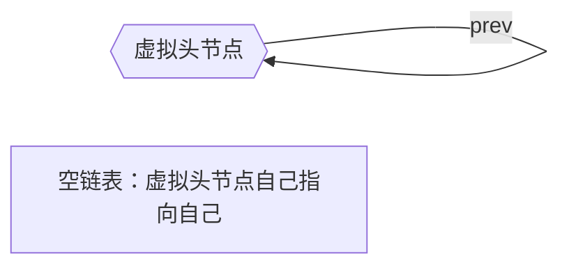

## 本节概述：list 是什么

list 是 STL 中的链表容器，底层结构是**双向循环链表**。学过数据结构里单向链表的话，理解 list 会非常轻松——只是每个节点多了一个指向前驱的指针。

## 逻辑结构：和 vector 很像

从逻辑层面看，list 和 vector、deque 一样，都是一个线性序列。常用的接口名字也高度统一：

| 接口 | 作用 |
|---|---|
| `front()` | 获取第一个元素 |
| `back()` | 获取最后一个元素 |
| `push_front(val)` | 头插 |
| `push_back(val)` | 尾插 |
| `pop_front()` | 头删 |
| `pop_back()` | 尾删 |
| `begin()` / `end()` | 迭代器 |

> 接口和 vector、deque 高度一致，STL 的设计就是这么统一。

## 物理结构：双向循环链表

list 的底层不是数组，而是一个个**节点**通过指针串起来的。

### 节点结构

每个节点有三个部分：



| 成员 | 类型 | 说明 |
|---|---|---|
| `value` | 元素类型（如 int） | 存数据 |
| `next` | 节点指针 | 指向**后继**（下一个节点） |
| `prev` | 节点指针 | 指向**前驱**（上一个节点） |

### 虚拟头节点

list 还有一个特殊的节点——**虚拟头节点**（也叫哨兵节点），它不存有效数据，只是用来简化边界处理。



> 所以 list 不单单是双向链表，而是一个**双向循环链表**：
> - 最后一个节点的 `next` 指回虚拟头节点
> - 虚拟头节点的 `prev` 指向最后一个节点
> - 每个节点都有 `next`（后继）和 `prev`（前驱）

### 为什么要有虚拟头节点？

有了虚拟头节点，空链表和非空链表的结构是统一的——都是一个环。



> 这样做的好处是：插入、删除操作不需要特殊处理"空链表"或"头尾节点"的边界情况，代码更简洁，不容易出错。

## 头文件与基本用法

```cpp
#include <iostream>
#include <list>    // list 的头文件
using namespace std;

int main() {
    list<int> L;   // 定义一个 int 类型的 list
    return 0;
}
```

> 头文件就是 `<list>`，类名就是 `list`，用尖括号指定元素类型。

## list 的成员变量

从源码层面看，list 类里面其实只有两个核心成员变量：

- **`head`** — 指向虚拟头节点的指针（`_List_node*` 类型）
- **`size`** — 记录当前元素个数

> size 单独存一个变量是为了让 `size()` 函数是 O(1) 的——不用每次去数，直接返回存好的值。

## 双向链表 vs 单向链表

| 特性 | 单向链表 | 双向链表（list） |
|---|---|---|
| 每个节点指针数 | 1 个（next） | 2 个（prev + next） |
| 反向遍历 | 不行（得从头找） | 可以（直接用 prev 走） |
| 删除节点 | 需要找到前驱 | 直接就能删 |
| 内存占用 | 少一点 | 多一个指针的空间 |

> list 用多一点内存换来了操作的便利性，这是典型的空间换时间。

## 本章小结

**list = 双向循环链表** — 每个节点有 prev 和 next 两个指针，首尾通过虚拟头节点连成环。

**虚拟头节点是关键** — 不存数据，用来统一空链表和非空链表的操作，简化边界处理。

**空链表也有一个节点** — 就是虚拟头节点自己，next 和 prev 都指向自己。

**逻辑结构是线性的** — 虽然物理上是链表，但用迭代器从 begin 走到 end，和 vector 的遍历体验一样。

**接口和 vector/deque 高度统一** — front、back、push_front、push_back、begin、end 这些名字都是一样的，STL 设计非常规整。

**两个核心成员** — head（虚拟头节点指针）和 size（元素个数）。
