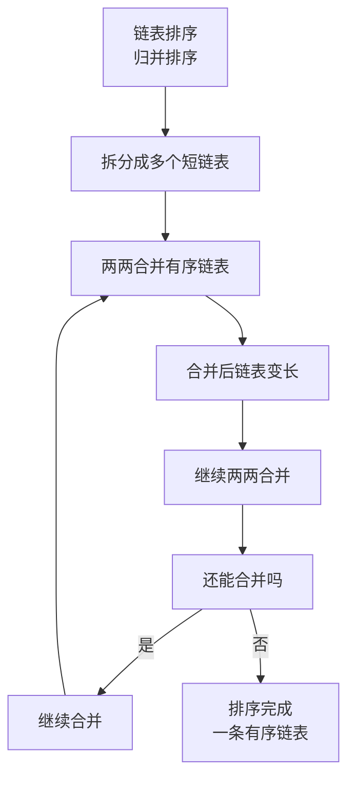

## 本节概述：链表排序

list 的排序用成员函数 **`sort()`**。vector 用的是标准库的 `sort` 算法，但 list 偏偏自己带了一个——这是为什么呢？这节课我们来搞清楚 list 是怎么排序的，以及怎么自定义排序规则。

## 为什么 list 自带 sort

标准库里有个 `std::sort`，vector、deque 都能用。但 list 用不了——因为 `std::sort` 要求**随机访问迭代器**，而 list 的迭代器只能 ++/--，不支持随机访问。

所以 list 不得不自己实现一个排序成员函数。

> list 的 sort 内部用的是**归并排序（Merge Sort）**。
> 时间复杂度 O(n log n)，而且是**稳定排序**。

## 归并排序原理（直观理解）



归并排序的思路可以用一句话概括：**先拆开，再合并**。

```
原始链表：      4 2 6 1 3 5

第一步 拆开：   4 2 6  |  1 3 5
                前半段    后半段

第二步 各自排序：2 4 6  |  1 3 5
                前半段有序  后半段有序

第三步 合并：   1 2 3 4 5 6
                整体有序
```

### 合并怎么做

两个有序链表，各拿一个指针从头开始比，每次取更小的那个放到结果里：

```
链表A： 2 4 6     指针A → 2
链表B： 1 3 5     指针B → 1

比较 2 vs 1 → 取 1   （结果：1）
比较 2 vs 3 → 取 2   （结果：1 2）
比较 4 vs 3 → 取 3   （结果：1 2 3）
比较 4 vs 5 → 取 4   （结果：1 2 3 4）
比较 6 vs 5 → 取 5   （结果：1 2 3 4 5）
只剩 6 → 取 6       （结果：1 2 3 4 5 6）
```

### 那前半段是怎么变有序的

你可能会问：4 2 6 怎么就变成 2 4 6 了？

答案：**递归**。对前半段再切两半、各自排序、再合并——跟整体的逻辑一模一样。

```
4 2 6
 ├─ 4 2 → 切两半 → 4 和 2 → 合并 → 2 4
 └─ 6   → 只有一个元素，天然有序
合并 2 4 和 6 → 2 4 6
```

一直切到每个小链表只有 0 个或 1 个元素（递归出口），然后一层一层合并上来，最终整条链表就有序了。

> 这就是**分治思想**：大问题拆成小问题，小问题解决了，大问题自然就解决了。

## 基本用法

```cpp
#include <iostream>
#include <list>
using namespace std;

void printList(const list<int>& L) {
    for (int x : L) cout << x << " ";
    cout << endl;
}

int main() {
    list<int> L = {4, 2, 6, 5, 3, 1};

    cout << "排序前："; printList(L);   // 4 2 6 5 3 1

    L.sort();   // 排序（默认升序）

    cout << "排序后："; printList(L);   // 1 2 3 4 5 6

    return 0;
}
```

运行结果：

```
排序前：4 2 6 5 3 1
排序后：1 2 3 4 5 6
```

## 自定义排序规则

默认是从小到大排序。想从大到小排？或者按别的规则排？给 `sort` 传一个**比较函数**（回调函数）就行。

```cpp
// 自定义比较函数：a > b 时返回 true → 降序排列
bool myCompare(int a, int b) {
    return a > b;
}

int main() {
    list<int> L = {4, 2, 6, 5, 3, 1};

    L.sort(myCompare);   // 用自定义规则排序

    printList(L);   // 6 5 4 3 2 1

    return 0;
}
```

运行结果：

```
6 5 4 3 2 1
```

### 比较函数的要求

比较函数（也叫谓词 predicate）需要满足：

1. 接收两个参数（两个元素）
2. 返回 `bool` 类型
3. 返回 `true` 表示第一个参数应该排在第二个参数前面

| 返回值 | 含义 |
|---|---|
| `true` | 第一个元素应该排在前面 |
| `false` | 第一个元素不应该排在前面 |

> 默认的比较规则是 `less<int>`（就是 `<`，小于）——所以小的排前面，结果是升序。
> 你传 `greater<int>`（就是 `>`，大于）——大的排前面，结果是降序。
>
> 也可以直接用标准库提供的：
> ```cpp
> L.sort(greater<int>());   // 降序
> ```

## 为什么不用 std::sort

再回到开头的问题：为什么 list 不用 `std::sort`？

因为 `std::sort` 内部依赖随机访问（要算中点、要交换元素等），时间复杂度 O(n log n) 是建立在随机访问 O(1) 的基础上的。

list 的迭代器只能 ++/--，如果强行用 `std::sort`，效率会暴跌。所以 list 自己实现了一个**针对链表优化的归并排序**——只改指针、不搬数据，依然是 O(n log n)。

> [!TIP]
> **归并排序的特点**
>
> - 时间复杂度：O(n log n)
> - 空间复杂度：链表版的归并排序只需要 O(1) 额外空间（只改指针）
> - 稳定性：稳定排序（相同元素的相对顺序保持不变）
> - 比快排更容易理解，比冒泡效率高得多

## 本章小结

**list 自带 sort** — 因为 list 迭代器不支持随机访问，用不了 std::sort，所以自己实现了一个。

**底层是归并排序** — 分治思想：先切成两半、各自排序、再合并。时间复杂度 O(n log n)。

**用法很简单** — `L.sort()` 默认升序，一行搞定。

**可以自定义规则** — 传一个比较函数（返回 bool，接收两个参数），返回 true 表示第一个排前面。

**默认是 less** — 也就是 `<`，小的排前面；传 `greater<int>()` 可以快速实现降序。

**归并排序稳定高效** — 链表版只改指针不搬数据，空间复杂度 O(1)，而且是稳定排序。
