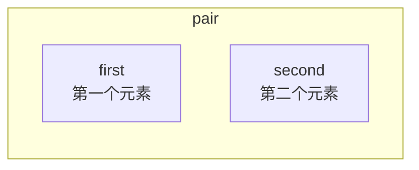
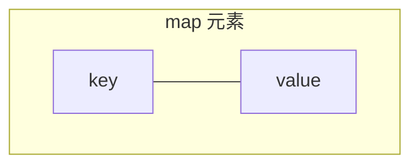
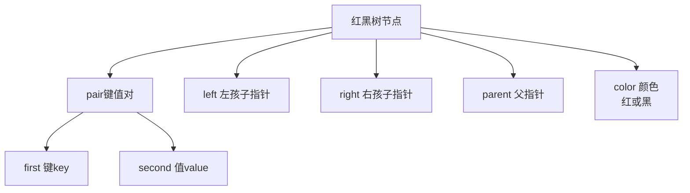
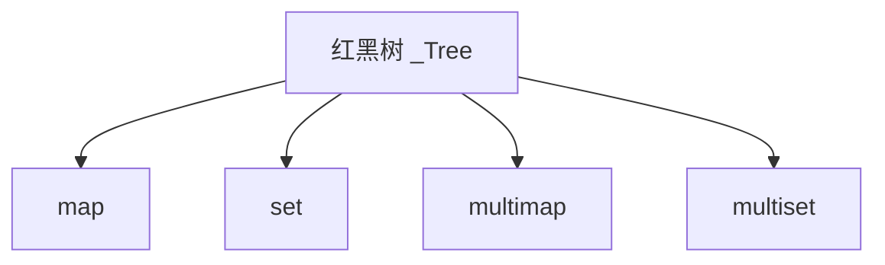

## 本节概述：map 是什么

map 是 STL 中非常重要的**映射容器**，重要性和使用频率仅次于 vector。它存储的是**键值对**（key-value），底层也是红黑树，按 key 自动排序，key 不重复。

学 map 之前，得先了解一个基础构件：**pair**。

## 一、pair 是什么

pair 是一个类模板，表示一个**二元组**——把两个值打包在一起。

### pair 的结构



pair 有两个公开成员：

| 成员 | 说明 |
|---|---|
| `first` | 第一个元素 |
| `second` | 第二个元素 |

两个成员的类型可以是任意的——int、double、string、自定义类型都行，甚至还可以继续嵌套 pair，组成三元组、四元组。

### pair 的三种创建方式

```cpp
#include <iostream>
#include <string>
#include <utility>   // pair 的头文件（map 头文件也会包含它）
using namespace std;

int main() {
    // 方式一：先定义，再分别赋值
    pair<int, int> p1;
    p1.first = 13;
    p1.second = 14;
    cout << p1.first << " " << p1.second << endl;   // 13 14

    // 方式二：构造函数直接传值
    pair<int, string> p2(2, "hello");
    cout << p2.first << " " << p2.second << endl;   // 2 hello

    // 方式三：make_pair 函数
    pair<char, int> p3 = make_pair('4', 0);
    cout << p3.first << " " << p3.second << endl;   // 4 0

    return 0;
}
```

> [!NOTE]
> **注意类型匹配**
>
> `make_pair('4', 0)` 中 `'4'` 是 char 类型，不是 int。
> char 类型的 '4' 对应的 ASCII 码是 52，输出时会显示字符 '4'，而不是数字 52。
>
> 用 make_pair 的时候要注意参数类型和 pair 声明的类型一致。

### pair 可以嵌套

```cpp
pair<int, pair<int, int>> p;   // 相当于一个三元组
p.first = 1;
p.second.first = 2;
p.second.second = 3;
```

> pair 套 pair 就是三元组，继续套就是四元组、五元组……理论上可以无限嵌套。

## 二、map 的核心概念

map 是一个容器，里面存的每一个元素都是一个 pair：

- **first = key（键）**
- **second = value（值）**

这就是我们常说的**键值对**。



### map 的三大特点

| 特点 | 说明 |
|---|---|
| **key 不重复** | 每个 key 只能出现一次，插入重复 key 会失败 |
| **按 key 排序** | 元素按照 key 的大小自动排序（底层红黑树） |
| **value 不参与排序** | value 只是和 key 绑定在一起，不影响排序 |

> [!NOTE]
> **还有一个 multimap**
>
> multimap 和 map 的区别就是：**key 可以重复**。
>
> 除了这一点，其他特性和接口基本一致，头文件也都是 `#include <map>`。

## 三、底层结构：红黑树

### 红黑树节点结构



map 和 set 的底层结构**一模一样**，都是红黑树（`_Tree` 类）。



区别只在于树节点存的内容：

- **set**：存一个值（排序依据就是这个值本身）
- **map**：存一个 pair（排序依据是 pair 的 first，也就是 key）

> 所以 set 和 map 很多接口的用法都高度相似，学会 set 之后学 map 会非常快。

### 逻辑结构是线性的

虽然物理结构是一棵树，但 map 同样提供了 `begin()` 和 `end()` 迭代器，你可以像遍历线性容器一样从头走到尾，而且 key 一定是按从小到大排好序的。

## 四、头文件与基本定义

```cpp
#include <map>     // map 和 multimap 都在这个头文件里
using namespace std;

int main() {
    map<int, int> m;           // key 是 int，value 也是 int
    map<int, string> m2;       // key 是 int，value 是 string
    multimap<int, int> mm;     // multimap，key 可重复
    return 0;
}
```

> map 需要两个模板参数：第一个是 key 的类型，第二个是 value 的类型。

## 本章小结

**pair 是二元组** — first 和 second 两个成员，类型可以任意，三种创建方式（分别赋值、构造函数、make_pair）。

**map = 键值对的集合** — 每个元素是一个 pair，first 是 key，second 是 value。

**map 三大特点** — key 不重复、按 key 排序、value 不参与排序。

**底层是红黑树** — 和 set 共用同一棵红黑树实现，所以接口和时间复杂度（O(log n)）都很像。

**multimap 是 key 可重复版** — 头文件一样，接口差不多，唯一区别是 key 允许重复。

**头文件是 `<map>`** — 包含 map 和 multimap 两种容器。
