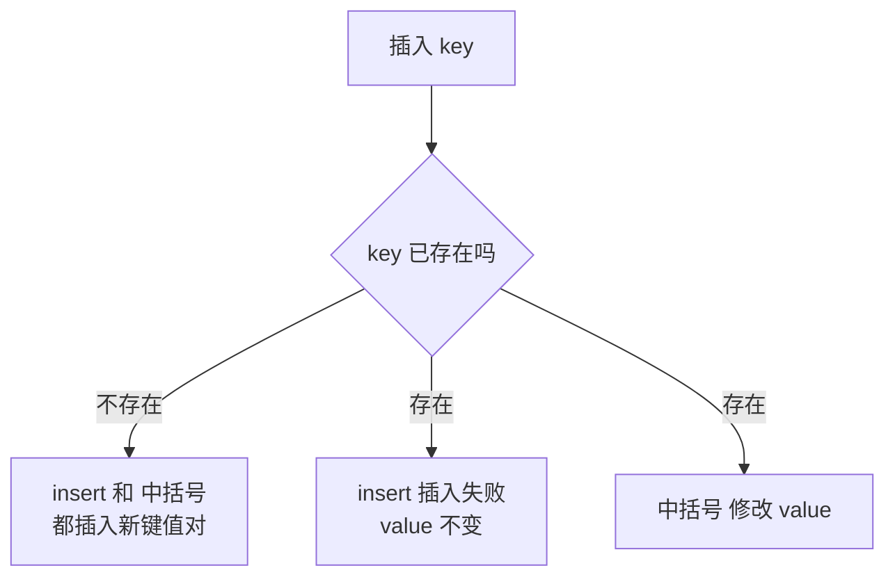

## 本节概述：map 的数据插入

map 的插入方式看起来有很多种，但本质上只有两类：**insert 插入**和**下标 `[]` 插入**。两者在 key 已存在时的行为完全不同，这是本节课的重点。

## 打印函数

```cpp
#include <iostream>
#include <map>
using namespace std;

void printMap(const map<int, int>& m) {
    for (map<int, int>::const_iterator it = m.begin(); it != m.end(); ++it) {
        cout << "key=" << it->first
             << " value=" << it->second << endl;
    }
    cout << "----------------" << endl;
}
```

## 一、insert 插入（3 种写法）

`insert` 是正经的插入函数，参数是一个 pair。写 pair 的方式有三种，但本质都是调用 insert。

### 写法 1：pair 构造函数

```cpp
map<int, int> m;
m.insert(pair<int, int>(1, 18));
printMap(m);
// key=1 value=18
```

### 写法 2：make_pair 函数

```cpp
m.insert(make_pair(3, 20));
printMap(m);
// key=1 value=18
// key=3 value=20
```

> `make_pair` 是一个函数模板，能自动推导类型，写起来比 `pair<int, int>(...)` 省事一点。

### 写法 3：value_type

```cpp
m.insert(map<int, int>::value_type(2, 78));
printMap(m);
// key=1 value=18
// key=2 value=78
// key=3 value=20
```

> `map<int, int>::value_type` 其实就是 `pair<const int, int>` 的别名，这种写法比较偏底层，了解即可。

> [!TIP]
> **三种写法，一种本质**
>
> 上面三种写法都是调用同一个 `insert` 函数，只是构造 pair 的方式不同。
>
> 日常开发记住一种就行，推荐 `make_pair` 最简洁。

## 二、下标 `[]` 插入（最方便）

map 重载了 `[]` 运算符，可以像数组一样用下标插入：

```cpp
m[4] = 6;
printMap(m);
// key=1 value=18
// key=2 value=78
// key=3 value=20
// key=4 value=6
```

> 写起来最舒服，也是实际开发中用得最多的方式。

## 三、insert 和 `[]` 的核心区别

两种方式在 key **不存在**的时候效果一样——都是插入新的键值对。

但在 key **已经存在**的时候，两者行为完全不同：

### insert：key 存在则插入失败

```cpp
// 现在 m 里已经有 key=3，value=20
pair<map<int, int>::iterator, bool> ret;
ret = m.insert(make_pair(3, 21));   // 再插一个 key=3 的

cout << "insert(3, 21) 是否成功：" << ret.second << endl;   // 0（失败）
printMap(m);
// key=3 的 value 还是 20，没有变成 21
```

> `insert` 的返回值是一个 pair：
> - **first**：指向插入位置（或已存在元素）的迭代器
> - **second**：bool 类型，`true` 表示插入成功，`false` 表示 key 已存在、插入失败
>
> 只要 key 已经在 map 里了，insert 就什么也不做，value 不会被覆盖。

### `[]`：key 存在则修改 value

```cpp
m[3] = 22;   // key=3 已经存在
printMap(m);
// key=3 value=22   ← value 被改成了 22
```

> 用 `[]` 访问一个已存在的 key 时，返回的是该 key 对应 value 的引用，所以你可以直接赋值修改它。

### 对比总结



| 方式 | key 不存在时 | key 存在时 |
|---|---|---|
| **insert** | 插入新键值对 | 插入失败，value 不变 |
| **`[]`** | 插入新键值对（value 为默认值） | 修改 value 的值 |

## 四、`[]` 的一个坑：访问即插入

用 `[]` 访问一个不存在的 key 时，即使你只是"读一下"，它也会自动把这个 key 插入进去（value 设为默认值）。

```cpp
map<int, int> m = {
    pair<int, int>(1, 10),
    pair<int, int>(2, 20)
};

cout << "m[0] = " << m[0] << endl;   // 只是读一下 m[0]
printMap(m);
// key=0 value=0   ← 0 被自动插进来了！
// key=1 value=10
// key=2 value=20
```

> [!WARNING]
> **`[]` 是有副作用的**
>
> 如果你只是想"查找"一个 key 是否存在，千万不要用 `[]`——它会偷偷把 key 插入到 map 里，改变 map 的内容。
>
> 查找应该用 `find` 函数（下节课会讲）。
>
> 只有在你确定要插入或修改的时候，才用 `[]`。

## 完整代码示例

```cpp
#include <iostream>
#include <map>
using namespace std;

void printMap(const map<int, int>& m) {
    for (map<int, int>::const_iterator it = m.begin(); it != m.end(); ++it) {
        cout << "key=" << it->first
             << " value=" << it->second << endl;
    }
    cout << "----------------" << endl;
}

int main() {
    map<int, int> m;

    // === insert 的三种写法 ===
    m.insert(pair<int, int>(1, 18));
    m.insert(make_pair(3, 20));
    m.insert(map<int, int>::value_type(2, 78));
    cout << "insert 后：" << endl;
    printMap(m);

    // === 下标插入 ===
    m[4] = 6;
    cout << "下标插入后：" << endl;
    printMap(m);

    // === key 已存在时，insert 不修改 ===
    pair<map<int, int>::iterator, bool> ret;
    ret = m.insert(make_pair(3, 21));
    cout << "insert(3, 21) 成功：" << ret.second << endl;
    cout << "insert 重复 key 后：" << endl;
    printMap(m);

    // === key 已存在时，[] 会修改 ===
    m[3] = 22;
    cout << "m[3] = 22 后：" << endl;
    printMap(m);

    // === [] 访问不存在的 key 会自动插入 ===
    cout << "m[0] = " << m[0] << endl;
    cout << "访问 m[0] 后：" << endl;
    printMap(m);

    return 0;
}
```

运行结果：

```
insert 后：
key=1 value=18
key=2 value=78
key=3 value=20
----------------
下标插入后：
key=1 value=18
key=2 value=78
key=3 value=20
key=4 value=6
----------------
insert(3, 21) 成功：0
insert 重复 key 后：
key=1 value=18
key=2 value=78
key=3 value=20
key=4 value=6
----------------
m[3] = 22 后：
key=1 value=18
key=2 value=78
key=3 value=22
key=4 value=6
----------------
m[0] = 0
访问 m[0] 后：
key=0 value=0
key=1 value=18
key=2 value=78
key=3 value=22
key=4 value=6
----------------
```

## 本章小结

**插入两大类** — insert 和 下标 `[]`，日常用 `[]` 最方便。

**insert 的三种写法** — pair 构造、make_pair、value_type，本质都一样，记住一种就行。

**insert 返回 pair** — first 是迭代器，second 是 bool（是否插入成功）。

**核心区别** — key 不存在时两者都插入；key 存在时 insert 不修改，`[]` 会修改 value。

**`[]` 有副作用** — 访问不存在的 key 会自动插入（value 为默认值）。查找请用 find，不要用 `[]`。

**时间复杂度 O(log n)** — 红黑树插入，效率高。
