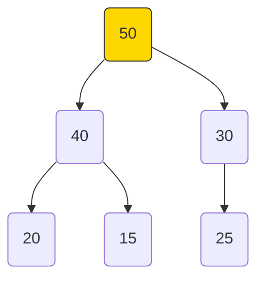
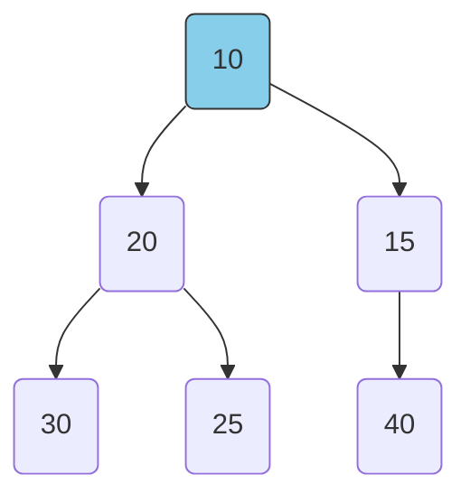
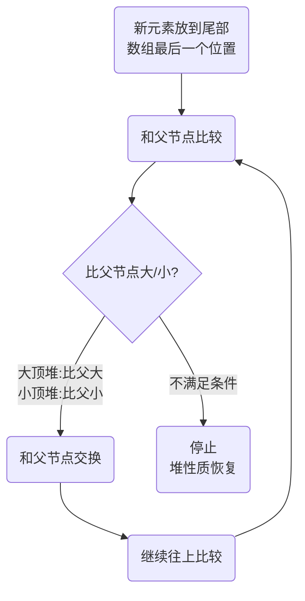
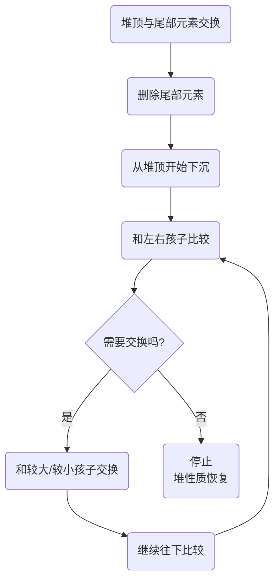

## 本节概述：priority_queue 优先队列

priority_queue 是 STL 里的优先队列容器——它和普通队列不同，不是按先进先出排列，而是按**优先级**排列。优先级最高的元素最先出队。它的底层是**堆**（heap），物理上用数组存储，逻辑上是一棵完全二叉树。

## 两种优先队列

优先队列分两种，区别是谁先出队：

| 类型 | 出队规则 | 对应堆结构 |
|---|---|---|
| 最大优先队列 | 值最大的先出队 | 大顶堆 |
| 最小优先队列 | 值最小的先出队 | 小顶堆 |

默认情况下，priority_queue 是**最大优先队列**（大顶堆）。

## 底层是堆结构

优先队列的底层数据结构叫**堆**（heap），它是一棵**完全二叉树**，但存储在数组里。

### 什么是完全二叉树

除了最后一层，其他层节点都是满的，最后一层节点从左到右依次排列。

```
       50
      /  \
    40    30
   /  \  /
  20  15 25
```

上面这棵就是完全二叉树，用数组存就是：

```
下标:   0   1   2   3   4   5
值:    50  40  30  20  15  25
```

### 父子节点下标关系

数组下标和二叉树节点位置有固定的数学关系：

| 关系 | 公式 | 说明 |
|---|---|---|
| 父节点下标 | (i - 1) / 2 | 整数除法，向下取整 |
| 左孩子下标 | i * 2 + 1 | 下标奇数是左孩子 |
| 右孩子下标 | i * 2 + 2 | 下标偶数是右孩子 |

举个例子，下标 1 的节点（值 40）：

- 父节点：(1-1)/2 = 0 → 值 50
- 左孩子：1*2+1 = 3 → 值 20
- 右孩子：1*2+2 = 4 → 值 15

> [!TIP]
> **奇偶判断左右孩子**
>
> 除了根节点（下标 0），奇数下标一定是左孩子，偶数下标一定是右孩子。
> 比如下标 1、3、5 都是左孩子；下标 2、4 都是右孩子。
> 记住这个小技巧，写代码时判断位置很方便。

## 大顶堆和小顶堆

### 大顶堆（Max Heap）

任意节点的值，都**大于等于**它左右子节点的值。堆顶是最大值。



数组表示：50 40 30 20 15 25

- 50 >= 40 且 50 >= 30
- 40 >= 20 且 40 >= 15
- 30 >= 25

### 小顶堆（Min Heap）

任意节点的值，都**小于等于**它左右子节点的值。堆顶是最小值。



数组表示：10 20 15 30 25 40

- 10 <= 20 且 10 <= 15
- 20 <= 30 且 20 <= 25
- 15 <= 40

## 堆的核心操作原理

### 插入操作：尾部插入 + 上浮

新元素先放到数组末尾（也就是完全二叉树最后一个位置），然后一路往上"游"，直到找到合适的位置。这个过程叫**上浮**。



### 获取堆顶：直接返回第 0 个元素

堆顶就是数组下标为 0 的元素，直接返回就行，时间复杂度 **O(1)**。

### 删除操作：交换 + 下沉 + 删尾部

删除堆顶元素的步骤：
1. 把堆顶和数组最后一个元素交换
2. 把最后一个元素删掉（尾删很快）
3. 把新的堆顶一路往下"沉"，直到找到合适的位置

这个往下调整的过程叫**下沉**。



## 物理结构 vs 逻辑结构

| 角度 | 是什么 | 说明 |
|---|---|---|
| 物理结构 | 数组 vector | 内存连续存储，下标访问 |
| 逻辑结构 | 完全二叉树 | 想象成一棵树，父子关系靠公式算 |

priority_queue 是一个**容器适配器**——它本身不存数据，底层用 vector 来存，然后在上面加了堆的规则。

> [!TIP]
> **为什么用数组存树？**
>
> 完全二叉树用数组存特别高效——没有指针开销，父子关系用数学公式算，
> 随机访问 O(1)，缓存友好。这也是堆排序效率高的原因之一。

## 头文件

使用 priority_queue 需要包含 queue 头文件：

```cpp
#include <queue>
```

虽然叫 priority_queue，但它和 queue 在同一个头文件里。

## 基本使用示例

```cpp
#include <iostream>
#include <queue>
using namespace std;

int main() {
    // 默认是大顶堆（最大优先队列）
    priority_queue<int> pq;

    pq.push(30);
    pq.push(10);
    pq.push(50);
    pq.push(20);
    pq.push(40);

    cout << "堆顶 = " << pq.top() << endl;   // 50（最大值）
    cout << "大小 = " << pq.size() << endl;   // 5

    return 0;
}
```

运行结果：

```
堆顶 = 50
大小 = 5
```

虽然 50 是第三个插进去的，但它是堆顶——因为它最大，优先级最高。

## 本章小结

**priority_queue 优先队列** — 按优先级出队，不是按先进先出。默认是最大优先队列（值最大的先出）。

**底层是堆** — 物理上是数组（vector），逻辑上是完全二叉树。父节点下标 (i-1)/2，左孩子 i*2+1，右孩子 i*2+2。

**大顶堆和小顶堆** — 大顶堆任意节点 >= 子节点，堆顶是最大值；小顶堆任意节点 <= 子节点，堆顶是最小值。

**插入 = 尾插 + 上浮** — 新元素放末尾，然后一路往上调整到合适位置。

**获取堆顶 = 返回第 0 个元素** — O(1) 时间复杂度，直接取数组首元素。

**删除 = 交换 + 下沉 + 尾删** — 堆顶和尾部交换，删掉尾部，堆顶往下沉调整。

**容器适配器** — 底层默认用 vector 存数据，priority_queue 在上面封装堆的规则。

**头文件是 queue** — priority_queue 和 queue 在同一个头文件里。
