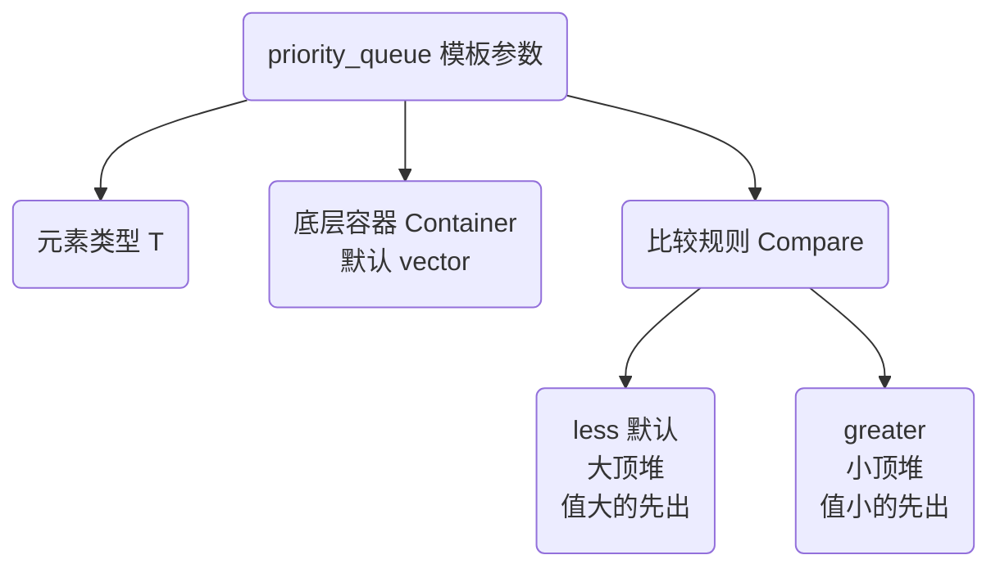

## 本节概述：priority_queue 的对象创建

priority_queue 的对象创建和普通队列不太一样——它的模板参数有三个，除了元素类型，还可以指定底层容器和比较规则。最常用的有两种创建方式：默认构造（大顶堆）和最小优先队列构造（小顶堆）。

## 模板三个参数

priority_queue 是一个类模板，有三个模板参数：

```cpp
template <class T,
          class Container = vector<T>,
          class Compare = less<T>>
class priority_queue;
```

| 参数 | 默认值 | 作用 |
|---|---|---|
| T | 必须指定 | 元素类型 |
| Container | vector<T> | 底层容器类型，默认 vector |
| Compare | less<T> | 比较规则，默认 less（大顶堆） |

## 方式一：默认构造（大顶堆）

只传一个元素类型，默认就是大顶堆（最大优先队列）：

```cpp
#include <queue>
using namespace std;

priority_queue<int> q1;   // 大顶堆，值最大的先出队
```

等价于完整写法：

```cpp
priority_queue<int, vector<int>, less<int>> q1;
```

> [!TIP]
> **less 为什么是大顶堆？**
>
> 初学会觉得反直觉：less 是"小于"的意思，怎么会是大顶堆（大的先出）？
>
> 其实 less<T> 的含义是：父节点和子节点比较时，`父 < 子` 为 false
> —— 也就是父节点不能小于子节点，父节点必须 >= 子节点。
> 所以堆顶是最大的那个元素。
>
> 简单记：**less 表示大的优先，greater 表示小的优先。**

## 方式二：最小优先队列（小顶堆）

三个模板参数全写，第三个传 `greater<int>`：

```cpp
priority_queue<int, vector<int>, greater<int>> q2;   // 小顶堆，值最小的先出队
```

注意第二个参数也要写，不能省略——因为第三个参数的位置在第三个，想传第三个就得把第二个也写上。

### 完整对比示例

```cpp
#include <iostream>
#include <queue>
#include <vector>
using namespace std;

int main() {
    // 大顶堆（默认）
    priority_queue<int> maxHeap;
    maxHeap.push(30);
    maxHeap.push(10);
    maxHeap.push(50);
    maxHeap.push(20);
    maxHeap.push(40);

    cout << "大顶堆堆顶 = " << maxHeap.top() << endl;   // 50

    // 小顶堆
    priority_queue<int, vector<int>, greater<int>> minHeap;
    minHeap.push(30);
    minHeap.push(10);
    minHeap.push(50);
    minHeap.push(20);
    minHeap.push(40);

    cout << "小顶堆堆顶 = " << minHeap.top() << endl;   // 10

    return 0;
}
```

运行结果：

```
大顶堆堆顶 = 50
小顶堆堆顶 = 10
```

同样的数据，大顶堆堆顶是最大值 50，小顶堆堆顶是最小值 10。

## less 和 greater 的对比

| 比较规则 | 含义 | 堆类型 | 堆顶 | 出队顺序 |
|---|---|---|---|---|
| less<T> | 父节点不能小于子节点 | 大顶堆 | 最大值 | 从大到小 |
| greater<T> | 父节点不能大于子节点 | 小顶堆 | 最小值 | 从小到大 |



## 底层容器为什么默认是 vector

堆需要支持：
1. 随机访问（按下标找父子节点）
2. 尾部快速插入删除

vector 两个条件都满足，而且内存连续、缓存友好，是堆的最佳底层容器。

理论上也可以用 deque 做底层，但实际几乎没人这么做——vector 更轻量、性能更好。

> [!WARNING]
> **第二个参数不能省略第三个**
>
> 想写小顶堆时，第二个参数（容器类型）也必须写出来，不能只写第三个。
>
> 错误写法：`priority_queue<int, greater<int>> q;`  // 编译报错
>
> 正确写法：`priority_queue<int, vector<int>, greater<int>> q;`
>
> 因为模板参数是按位置匹配的，第二个位置必须是容器类型。

## 完整代码示例

```cpp
#include <iostream>
#include <queue>
#include <vector>
using namespace std;

int main() {
    // 1. 默认构造 —— 大顶堆
    priority_queue<int> maxHeap;
    maxHeap.push(30);
    maxHeap.push(10);
    maxHeap.push(50);

    cout << "大顶堆:" << endl;
    cout << "  堆顶 = " << maxHeap.top() << endl;    // 50
    cout << "  大小 = " << maxHeap.size() << endl;   // 3

    // 2. 最小优先队列 —— 小顶堆
    priority_queue<int, vector<int>, greater<int>> minHeap;
    minHeap.push(30);
    minHeap.push(10);
    minHeap.push(50);

    cout << "小顶堆:" << endl;
    cout << "  堆顶 = " << minHeap.top() << endl;    // 10
    cout << "  大小 = " << minHeap.size() << endl;   // 3

    return 0;
}
```

运行结果：

```
大顶堆:
  堆顶 = 50
  大小 = 3
小顶堆:
  堆顶 = 10
  大小 = 3
```

## 本章小结

**三种创建方式** — 最常用两种：默认构造（大顶堆）和最小优先队列构造（小顶堆）。

**三个模板参数** — 元素类型、底层容器（默认 vector）、比较规则（默认 less）。

**less 是大顶堆** — less<T> 表示大的优先出队，堆顶是最大值。初学会反直觉，多记两遍。

**greater 是小顶堆** — greater<T> 表示小的优先出队，堆顶是最小值。

**第二个参数不能省** — 写小顶堆时，容器类型 vector<int> 也必须写出来，不能只写第三个参数。

**底层默认 vector** — 堆需要随机访问和尾插尾删，vector 最合适。
