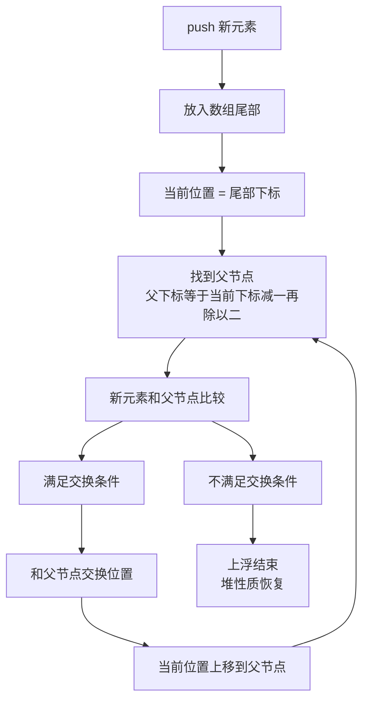

## 本节概述：priority_queue 的入队操作

入队（往优先队列里加元素）调用的是 **`push`** 函数。和普通队列不同，priority_queue 插入后会自动调整堆结构——大顶堆保证堆顶是最大值，小顶堆保证堆顶是最小值。

## 基本用法

```cpp
#include <queue>
using namespace std;

priority_queue<int> pq;
pq.push(30);   // 入队 30
```

参数就是你要插入的元素。

## 大顶堆的入队效果

往大顶堆里依次插入 30、10、50、20、40：

```
push(30) → [ 30 ]                 堆顶 = 30

push(10) → [ 30, 10 ]             堆顶 = 30

push(50) → [ 50, 10, 30 ]         堆顶 = 50（50 浮上去了！）

push(20) → [ 50, 20, 30, 10 ]     堆顶 = 50

push(40) → [ 50, 40, 30, 10, 20 ] 堆顶 = 50
```

每插入一个元素，堆都会自动调整，保证**堆顶始终是最大值**。

> [!TIP]
> **不用你手动排序**
>
> push 之后堆的内部状态你不用关心，只要记住：
> 大顶堆每次 push 完，top() 一定是当前最大值。
> 堆会自动维护它的性质，这就是数据结构的魅力。

## 底层原理：尾部插入 + 上浮

push 的底层做了两件事：

1. 把新元素加到 vector 尾部（push_back）
2. 从尾部开始**上浮**调整，恢复堆性质

### 上浮过程详解

以大顶堆为例，插入 50 的过程：

```
初始堆: [ 30, 10 ]

     30
    /
  10

第一步：尾部插入 50
     30
    /  \
  10    50   ← 新来的放最后

第二步：50 和父节点 30 比较
50 > 30，不满足大顶堆（父要 >= 子），交换

     50
    /  \
  10    30   ← 交换后 50 浮上去了

第三步：已经到根了，停止
堆顶 = 50 ✓
```



## 小顶堆的入队效果

小顶堆也是同样的上浮逻辑，只是比较方向反过来：

```cpp
priority_queue<int, vector<int>, greater<int>> minHeap;
minHeap.push(30);   // [ 30 ]          堆顶 = 30
minHeap.push(10);   // [ 10, 30 ]      堆顶 = 10（10 浮上去了）
minHeap.push(50);   // [ 10, 30, 50 ]  堆顶 = 10
minHeap.push(5);    // [ 5, 10, 50, 30 ] 堆顶 = 5
```

小顶堆每次 push 完，堆顶都是最小值。

## 完整代码示例

```cpp
#include <iostream>
#include <queue>
#include <vector>
using namespace std;

int main() {
    // 大顶堆入队
    priority_queue<int> maxHeap;

    maxHeap.push(30);
    cout << "push 30, top = " << maxHeap.top() << endl;

    maxHeap.push(10);
    cout << "push 10, top = " << maxHeap.top() << endl;

    maxHeap.push(50);
    cout << "push 50, top = " << maxHeap.top() << endl;

    maxHeap.push(20);
    cout << "push 20, top = " << maxHeap.top() << endl;

    maxHeap.push(40);
    cout << "push 40, top = " << maxHeap.top() << endl;

    cout << "size = " << maxHeap.size() << endl;

    cout << endl;

    // 小顶堆入队
    priority_queue<int, vector<int>, greater<int>> minHeap;

    minHeap.push(30);
    cout << "push 30, top = " << minHeap.top() << endl;

    minHeap.push(10);
    cout << "push 10, top = " << minHeap.top() << endl;

    minHeap.push(50);
    cout << "push 50, top = " << minHeap.top() << endl;

    return 0;
}
```

运行结果：

```
push 30, top = 30
push 10, top = 30
push 50, top = 50
push 20, top = 50
push 40, top = 50
size = 5

push 30, top = 30
push 10, top = 10
push 50, top = 10
```

大顶堆插入 50 后堆顶变成 50，之后一直是 50；小顶堆插入 10 后堆顶变成 10，之后一直是 10。完美符合预期。

## 时间复杂度

push 的时间复杂度是 **O(log n)**。

- 尾插是 O(1)
- 上浮最多走树的高度层，完全二叉树高度是 log n
- 所以整体是 O(log n)

> [!TIP]
> **比排序高效得多**
>
> 每次插入一个元素都排一次序的话，时间复杂度是 O(n)。
> 而堆的上浮调整只需要 O(log n)，元素越多优势越明显。
> 这也是优先队列常用在 TopK 问题中的原因。

## 本章小结

**接口是 push** — `pq.push(x)` 往优先队列里插入元素。

**大顶堆 push 后堆顶最大** — 每次插入完，top() 都是当前最大值。

**小顶堆 push 后堆顶最小** — 每次插入完，top() 都是当前最小值。

**底层是尾插 + 上浮** — 新元素先放数组末尾，然后一路往上比较交换，直到满足堆性质。

**时间复杂度 O(log n)** — 上浮最多走树的高度层，比全排序快很多。

**堆自动维护性质** — 不用手动排序，push 完堆顶一定是优先级最高的元素。
