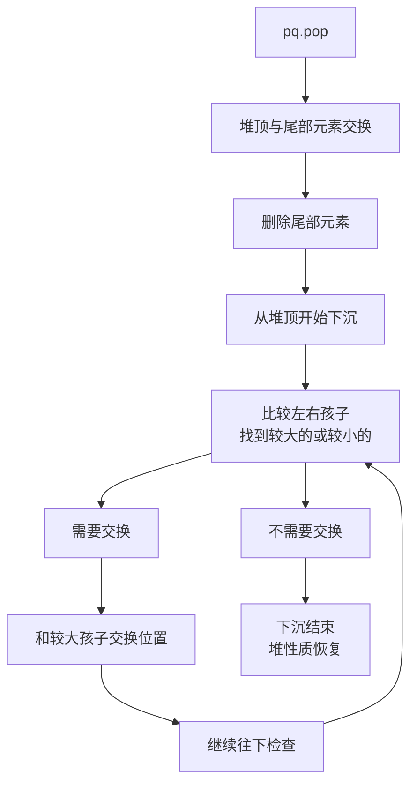

## 本节概述：priority_queue 的出队操作

出队（删除堆顶元素）调用的是 **`pop`** 函数。和普通队列从队头删不一样，优先队列删的是堆顶——也就是优先级最高的那个元素。删完之后堆会自动调整，新的堆顶仍然是剩余元素中优先级最高的。

## 基本用法

```cpp
#include <queue>
using namespace std;

priority_queue<int> pq;
pq.push(30);
pq.push(50);
pq.push(10);

pq.pop();   // 删掉堆顶 50
```

每次 `pop` 就删掉优先级最高的那个元素——大顶堆删最大值，小顶堆删最小值。

## 底层原理：交换 + 下沉 + 删尾部

pop 看着简单，内部做了三步：

1. **交换**：堆顶和数组最后一个元素交换
2. **下沉**：把新的堆顶往下调整，恢复堆性质
3. **删尾部**：把数组最后一个元素删掉（也就是原来的堆顶）

### 为什么不直接删 front？

如果直接删 vector 的第一个元素（下标 0），后面所有元素都要往前挪一格——时间复杂度 **O(n)**。

而交换 + 尾删的方案：
- 交换是 O(1)
- 尾删 pop_back 是 O(1)
- 下沉调整是 O(log n)

总时间复杂度 **O(log n)**，比直接删头高效太多了。

> [!TIP]
> **用尾删代替头删**
>
> 这是堆设计的精髓——利用"删尾快、删头慢"的特点，
> 先把堆顶换到尾部再删掉，代价只是一次交换和一次下沉。
> 用 O(log n) 的下沉换来了 O(n) 的头删开销，非常划算。

### 下沉过程详解（大顶堆为例）

初始堆：[50, 40, 30, 10, 20]

```
      50
     /  \
   40    30
  /  \
 10  20
```

**第一步：堆顶和尾部交换**

交换 50 和 20 → [20, 40, 30, 10, 50]

```
      20
     /  \
   40    30
  /  \
 10  50  ← 原来的堆顶换到尾部了
```

**第二步：删掉尾部**

pop_back 删掉 50 → [20, 40, 30, 10]

```
      20
     /  \
   40    30
  /
 10
```

**第三步：下沉调整**

20 和两个孩子比较：左孩子 40、右孩子 30。
大顶堆要求父 >= 子，20 < 40，不满足。和较大的孩子（40）交换。

交换 20 和 40 → [40, 20, 30, 10]

```
      40
     /  \
   20    30
  /
 10
```

继续检查 20：它的孩子只有 10，20 >= 10，满足大顶堆。下沉结束。

最终堆：[40, 20, 30, 10]，堆顶 40 是剩余元素中的最大值 ✓



## 出队顺序

### 大顶堆的出队顺序：从大到小

```cpp
priority_queue<int> maxHeap;
maxHeap.push(30);
maxHeap.push(10);
maxHeap.push(50);
maxHeap.push(20);
maxHeap.push(40);

// 依次出队：50 40 30 20 10
```

### 小顶堆的出队顺序：从小到大

```cpp
priority_queue<int, vector<int>, greater<int>> minHeap;
minHeap.push(30);
minHeap.push(10);
minHeap.push(50);
minHeap.push(20);
minHeap.push(40);

// 依次出队：10 20 30 40 50
```

> 大顶堆出队 = 降序排列；小顶堆出队 = 升序排列。

## 完整代码示例

```cpp
#include <iostream>
#include <queue>
#include <vector>
using namespace std;

int main() {
    // 大顶堆出队
    priority_queue<int> maxHeap;
    maxHeap.push(30);
    maxHeap.push(10);
    maxHeap.push(50);
    maxHeap.push(20);
    maxHeap.push(40);

    cout << "大顶堆出队顺序（从大到小）：" << endl;
    while (!maxHeap.empty()) {
        cout << maxHeap.top() << " ";
        maxHeap.pop();
    }
    cout << endl;

    // 小顶堆出队
    priority_queue<int, vector<int>, greater<int>> minHeap;
    minHeap.push(30);
    minHeap.push(10);
    minHeap.push(50);
    minHeap.push(20);
    minHeap.push(40);

    cout << "小顶堆出队顺序（从小到大）：" << endl;
    while (!minHeap.empty()) {
        cout << minHeap.top() << " ";
        minHeap.pop();
    }
    cout << endl;

    return 0;
}
```

运行结果：

```
大顶堆出队顺序（从大到小）：
50 40 30 20 10
小顶堆出队顺序（从小到大）：
10 20 30 40 50
```

> [!WARNING]
> **空堆不能 pop！**
>
> 优先队列为空时调用 `pop()` 是未定义行为，会触发断言报错。
> 出队前一定先用 `empty()` 判断一下。
>
> 标准写法是 `while (!pq.empty()) { pq.top(); pq.pop(); }`，安全又简洁。

## 时间复杂度

pop 的时间复杂度是 **O(log n)**：

- 交换：O(1)
- 尾删：O(1)
- 下沉：最多走树的高度层，O(log n)

整体由下沉决定，O(log n)。

## 本章小结

**接口是 pop** — `pq.pop()` 删除堆顶元素（优先级最高的那个）。

**底层三步：交换 + 下沉 + 尾删** — 堆顶和尾部交换，删尾部，新堆顶往下沉调整。

**为什么不直接删 front** — vector 删头是 O(n)，交换 + 尾删 + 下沉是 O(log n)，效率高很多。

**大顶堆出队从大到小** — 每次 pop 都是当前最大值，出完就是降序。

**小顶堆出队从小到大** — 每次 pop 都是当前最小值，出完就是升序。

**时间复杂度 O(log n)** — 由下沉操作决定，和树的高度成正比。

**空堆不能 pop** — 出队前先 empty() 检查，标准写法 while (!empty) 循环。
