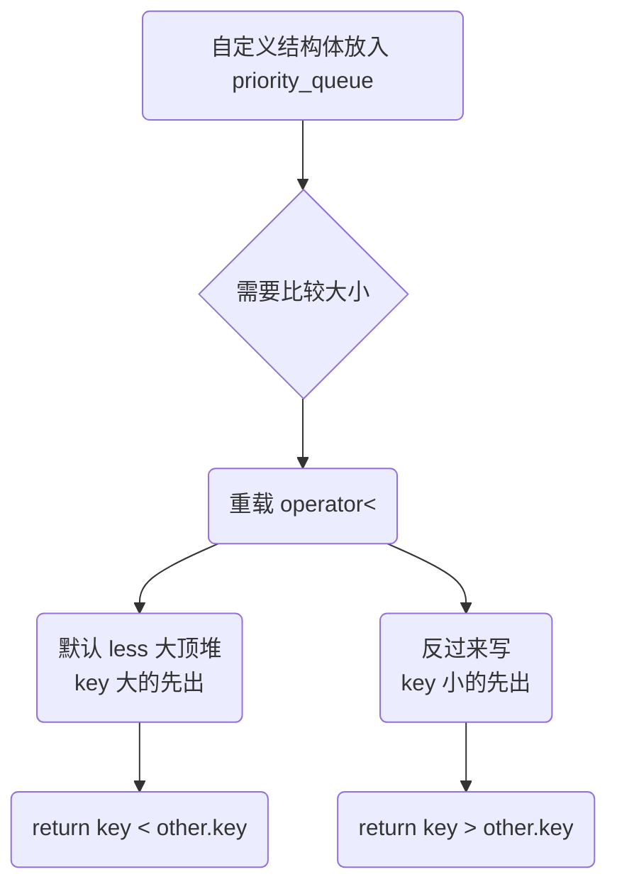

## 本节概述：自定义结构体放入 priority_queue

priority_queue 存 int、double 这些内置类型没问题，因为它们天生能比较大小。但如果存的是自定义结构体，编译器就不知道怎么比较了——这时候需要我们自己定义比较规则。最常用的方式是**重载 operator<**。

## 问题：自定义类型直接放会编译报错

先定义一个结构体，直接放进 priority_queue 试试：

```cpp
#include <iostream>
#include <queue>
#include <string>
using namespace std;

struct Type {
    int key;
    string value;
};

int main() {
    priority_queue<Type> pq;        // ❌ 编译报错！
    pq.push({3, "C"});
    return 0;
}
```

**为什么报错？** 因为 priority_queue 底层是堆，堆需要比较大小来决定元素位置。
int 可以直接用 `<` 比较，但我们自己写的 `Type` 结构体没有定义比较规则，编译器就不知道谁大谁小了。

## 解决方法：重载 operator<

给结构体重载**小于运算符** `operator<`，priority_queue 就能正常工作了。

```cpp
struct Type {
    int key;
    string value;

    // 重载小于运算符
    bool operator<(const Type& other) const {
        return key < other.key;   // 按 key 比较
    }
};
```

重载之后，默认的 priority_queue（用 less<T>）就能正常用了——它内部就是通过 `<` 来比较的。

> [!WARNING]
> **两个 const 都不能少**
>
> 参数的 const：`const Type& other` — 保证不修改对方
> 函数末尾的 const：`... const` — 保证不修改自己的成员变量
>
> 少了任何一个 const 都可能编译报错。priority_queue 的比较规则要求比较函数不能修改元素，所以必须是 const 的。

## 默认是大顶堆

重载了 `operator<` 之后，priority_queue 默认是**大顶堆**——按 key 从大到小出队。

```cpp
priority_queue<Type> pq;
pq.push({3, "C"});
pq.push({1, "A"});
pq.push({2, "B"});

// 出队顺序：3 2 1（从大到小）
```

因为默认的比较规则是 `less<Type>`，而 less 底层调用的就是 `operator<`。

## 想改成小顶堆怎么办

有两种方式：

### 方式一：重载 operator> 配合 greater

把比较规则改成 `greater<Type>`，但 greater 需要 `>` 运算符。不过实际更简单的做法是——**直接让 operator< 返回相反的结果**。

### 方式二：operator< 里反过来写

想让 key 小的先出（小顶堆），就让 `operator<` 返回 `key > other.key`：

```cpp
struct Type {
    int key;
    string value;

    bool operator<(const Type& other) const {
        return key > other.key;   // 反过来写，就变成小顶堆了
    }
};
```



> [!TIP]
> **一个 operator< 走天下**
>
> 只需要重载 `<` 就够了，`>`、`==`、`!=` 都不用管。
> 堆的比较逻辑只用 `<` 就能推导所有关系，这是 STL 的设计哲学。

## 完整代码示例：大顶堆版本

```cpp
#include <iostream>
#include <queue>
#include <string>
using namespace std;

struct Type {
    int key;
    string value;

    // 重载 operator< —— 默认大顶堆（key 大的先出）
    bool operator<(const Type& other) const {
        return key < other.key;
    }
};

int main() {
    priority_queue<Type> pq;   // 大顶堆

    pq.push({3, "C"});
    pq.push({1, "A"});
    pq.push({4, "D"});
    pq.push({2, "B"});

    // 出队顺序：按 key 从大到小
    while (!pq.empty()) {
        cout << pq.top().key << " - " << pq.top().value << endl;
        pq.pop();
    }

    return 0;
}
```

运行结果：

```
4 - D
3 - C
2 - B
1 - A
```

按 key 从大到小出队，完美符合大顶堆的预期。

## 完整代码示例：小顶堆版本

把 operator< 反过来写，就变成小顶堆了：

```cpp
#include <iostream>
#include <queue>
#include <string>
using namespace std;

struct Type {
    int key;
    string value;

    // 反过来写 —— 小顶堆（key 小的先出）
    bool operator<(const Type& other) const {
        return key > other.key;
    }
};

int main() {
    priority_queue<Type> pq;   // 小顶堆（因为 operator< 反过来了）

    pq.push({3, "C"});
    pq.push({1, "A"});
    pq.push({4, "D"});
    pq.push({2, "B"});

    // 出队顺序：按 key 从小到大
    while (!pq.empty()) {
        cout << pq.top().key << " - " << pq.top().value << endl;
        pq.pop();
    }

    return 0;
}
```

运行结果：

```
1 - A
2 - B
3 - C
4 - D
```

按 key 从小到大出队——虽然 priority_queue 还是默认的 less，但因为 operator< 反过来了，效果就变成了小顶堆。

## 常见坑点

### 坑 1：const 忘加

```cpp
// ❌ 错误：函数末尾没加 const
bool operator<(const Type& other) {
    return key < other.key;
}
```

编译报错，因为 priority_queue 的比较要求是 const 的。

### 坑 2：参数没加 const

```cpp
// ❌ 错误：参数没加 const
bool operator<(Type& other) const {
    return key < other.key;
}
```

同样可能编译报错——比较函数不应该修改对方，所以参数必须是 const 引用。

### 坑 3：以为重载 > 就行

很多人直觉上觉得大顶堆应该重载 `>`，但实际上 STL 的默认比较规则是 `less<T>`，用的是 `<` 运算符。所以**只重载 `<` 就够了**，重载 `>` 不会被默认 priority_queue 使用。

> [!TIP]
> **记忆口诀：重载小于号，默认大顶堆**
>
> 自定义类型放 priority_queue，只需要写一个 `operator<`。
> 正常写 a.key < b.key → 大的先出（大顶堆）。
> 反过来写 a.key > b.key → 小的先出（小顶堆）。
> 两个 const 不能少：参数 const + 函数 const。

## 本章小结

**自定义类型不能直接放 priority_queue** — 堆需要比较大小，自定义类型默认没有比较规则，会编译报错。

**解决方法：重载 operator<** — 给结构体加上 `bool operator<(const T& other) const`，priority_queue 就能用了。

**默认是大顶堆** — 重载 operator< 后，默认 less<T> 规则下，值大的先出队。

**反过来写就是小顶堆** — 想让小的先出，就让 operator< 里返回 `>` 的结果。

**两个 const 必须加** — 参数 const 保证不修改对方，函数末尾 const 保证不修改自己。少一个都可能编译报错。

**只需要重载 <** — STL 用小于号就能推导出所有大小关系，不用重载 >、== 等其他运算符。
