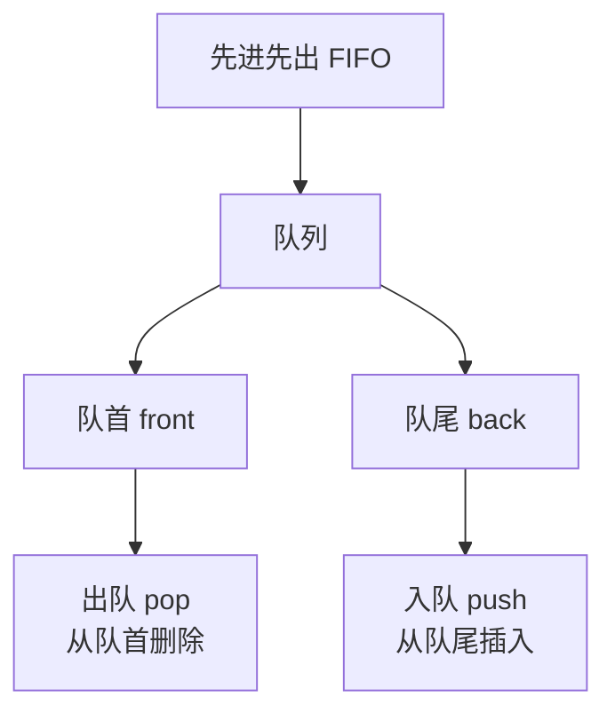
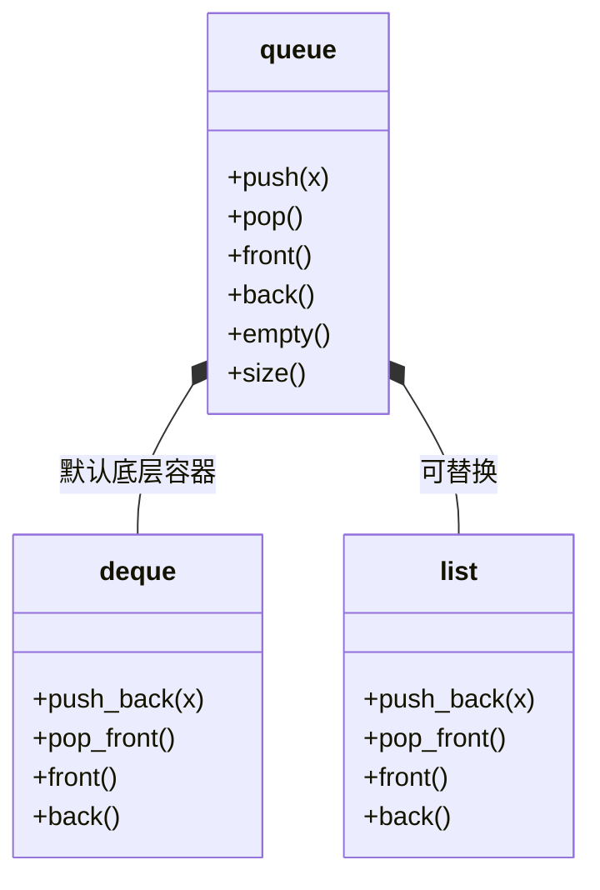

## 本节概述：queue 队列容器

queue 是 STL 里的队列容器——只支持**尾部插入、头部删除**，遵循**先进先出（FIFO）**。它和 stack 一样是"阉割版"的适配器，没有迭代器，不能遍历。

## deque / stack / queue 对比

先把学过的三个容器放一起比一比：

| 对比项 | deque（双端队列） | stack（栈） | queue（队列） |
|---|---|---|---|
| 头插 | ✅ `push_front` | ❌ 不支持 | ❌ 不支持 |
| 尾插 | ✅ `push_back` | ✅ 叫 `push` | ✅ 叫 `push` |
| 头删 | ✅ `pop_front` | ❌ 不支持 | ✅ 叫 `pop` |
| 尾删 | ✅ `pop_back` | ✅ 叫 `pop` | ❌ 不支持 |
| 访问首尾 | `front()` / `back()` | 只有 `top()` | `front()` / `back()` |
| 迭代器 | ✅ begin / end | ❌ 没有 | ❌ 没有 |
| 规则 | 两端都能进出 | 后进先出 LIFO | 先进先出 FIFO |

> queue 可以理解成"deque 去掉了头插和尾删"——剩下尾插（叫 push）和头删（叫 pop）。

## 队列的核心概念



### 四个核心接口

| 接口 | 作用 | 在哪一端 |
|---|---|---|
| `push(x)` | 入队（往队尾加元素） | 队尾 back |
| `pop()` | 出队（删掉队头元素） | 队头 front |
| `front()` | 获取队头元素 | 队头 |
| `back()` | 获取队尾元素 | 队尾 |

> push 是插入，pop 是删除——和 stack 叫法一样，但位置不一样。

### 队头与队尾

队列有两个口子：一头进、一头出。

```
入队 push(1) →  push(2) →  push(3) →
                 ┌───┬───┬───┐
   front 队头 →  │ 1 │ 2 │ 3 │  ← back 队尾
                 └───┴───┴───┘
   ← pop 出队（从队头删）
```

> 队头 front = 最先进去的那个；队尾 back = 最后进去的那个。

### 先进先出 FIFO

**F**irst **I**n **F**irst **O**ut —— 先进去的，先出来。

```
push(1)  push(2)  push(3)
   ↓        ↓        ↓
──────────────────────────────→
  front                     back

pop()    pop()    pop()
   ↓        ↓        ↓
  出 1    出 2    出 3
```

> 进去的顺序是 1 → 2 → 3，出来的顺序也是 1 → 2 → 3——和 stack 正好反过来。

> [!TIP]
> **排队打饭的比喻**：
> 队伍前面是队头，后面是队尾。新来的人往队尾排（push），
> 打完饭的人从队头走（pop）。先来先打到饭，后来的往后排。
> 非常形象。

## 入队时谁在变

连续往队列里 push 元素：

```
空队列：          [ 空 ]
                  front = back

push(1) 后：     [ 1 ]
                  ↑   ↑
               front back

push(2) 后：     [ 1 | 2 ]
                  ↑       ↑
               front     back

push(3) 后：     [ 1 | 2 | 3 ]
                  ↑           ↑
               front         back
```

- **队头 front 不变** — 始终指向第一个进去的元素
- **队尾 back 一直往后走** — 每来一个新元素，back 就往后挪一格

## 出队时谁在变

连续从队头 pop：

```
初始：          [ 1 | 2 | 3 ]
                ↑           ↑
             front         back

pop() 后：      [ 2 | 3 ]
                ↑       ↑
             front     back

pop() 后：      [ 3 ]
                ↑   ↑
             front back

pop() 后：      [ 空 ]  ← 空队列
```

- **队尾 back 不变** — 出队不影响队尾
- **队头 front 一直往后走** — 每出一个人，队头就往后挪一格
- 直到 front 和 back 都没了——**空队列**

> [!WARNING]
> **空队列不能访问 front / back！**
>
> 空队列调用 `front()`、`back()`、`pop()` 都是未定义行为，会崩溃。
> 操作之前一定要用 `empty()` 检查一下。
>
> 这个跟 stack 的空栈不能 top / pop 是一个道理。

## 为什么没有迭代器

队列和栈一样，是**访问受限**的数据结构——刻意不让你随便访问中间元素。

- 没有 `begin()` / `end()`
- 没有 `[]` / `at()`
- **只能操作队头和队尾**

> 这是设计思想——队列的目的就是强制你"先进先出"，保证排队的语义。

## queue 是适配器

queue 和 stack 一样，本质上是一个**容器适配器**——它本身不存数据，底层默认用 deque 来存储，只对外暴露队列相关的接口。



> 底层容器可以替换，默认是 deque，也可以换成 list 等支持头尾操作的容器。

## 基本使用

```cpp
#include <iostream>
#include <queue>
using namespace std;

int main() {
    queue<int> q;

    // 入队
    q.push(10);
    q.push(20);
    q.push(30);

    // 队头和队尾
    cout << "front = " << q.front() << endl;   // 10
    cout << "back = " << q.back() << endl;     // 30

    // 出队
    q.pop();
    cout << "front = " << q.front() << endl;   // 20

    // 判空和大小
    cout << "empty = " << q.empty() << endl;   // 0（非空）
    cout << "size = " << q.size() << endl;     // 2

    return 0;
}
```

运行结果：

```
front = 10
back = 30
front = 20
empty = 0
size = 2
```

## 完整示例：边出队边遍历

队列不支持遍历，但可以边出队边输出：

```cpp
#include <iostream>
#include <queue>
using namespace std;

int main() {
    queue<int> q;

    // 入队 1 2 3 4 5
    for (int i = 1; i <= 5; i++) {
        q.push(i);
    }

    // 边出队边输出（先进先出）
    while (!q.empty()) {
        cout << q.front() << " ";
        q.pop();
    }
    cout << endl;
    // 输出：1 2 3 4 5

    return 0;
}
```

> 注意：遍历完队列也就空了——出一个少一个。

## 本章小结

**queue 队列** — 先进先出（FIFO），尾插头删的容器。

**四个核心接口** — push 入队（队尾）、pop 出队（队头）、front 取队头、back 取队尾。

**跟 stack 正好相反** — stack 是后进先出（一端进出），queue 是先进先出（两端进出）。

**没有迭代器** — 不能遍历、不能随机访问、不能操作中间元素，刻意限制访问方式。

**排队伍比喻** — 新来的排队尾，打完饭从队头走，先来先服务。

**空队不能操作** — 取队头/队尾、出队前都先用 empty() 检查，否则崩溃。

**类模板** — queue 和 stack 一样，也是类模板，底层默认也是 deque。
