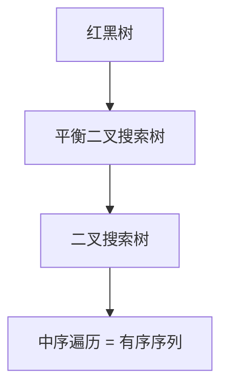
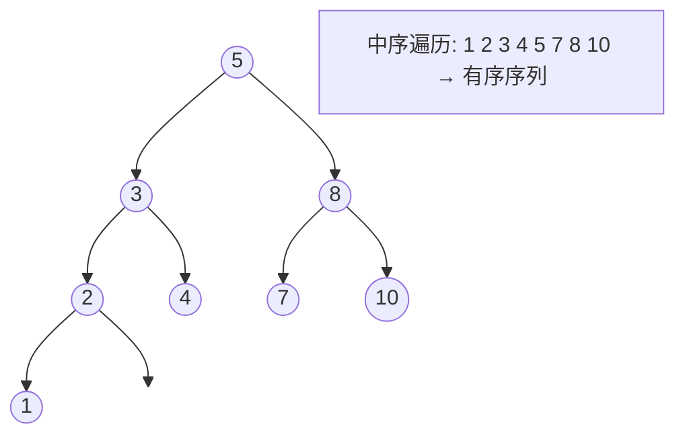

## 本节概述：set 是什么

set 中文叫**集合**，因为底层结构是有序的，所以又叫**有序集合**。它和数学中的集合概念很像——元素不重复，插入后自动排序。

## set 的两大核心特点

| 特点 | 说明 |
|---|---|
| **元素不重复** | 同一个值在 set 中只能出现一次 |
| **元素自动有序** | 每插入一个元素，容器会自动保持有序排列 |

> [!NOTE]
> **还有一个 multiset**
>
> multiset 也是 STL 容器，它**支持元素重复**。除了"元素可重复"这一点之外，其他特性和 set 完全一致。
>
> 头文件也是同一个：`#include <set>`

## 底层结构：红黑树

vector、list、string 这些容器的物理结构都是**线性的**（数组或链表），而 set 和 multiset 是**树形容器**，底层用的是**红黑树**。



**为什么插入后自动有序？** 因为红黑树本质上是一棵二叉搜索树，二叉搜索树的**中序遍历结果天然就是有序序列**。

虽然物理结构是一棵树，但逻辑上它仍然是一个序列——你可以通过迭代器从 `begin()` 走到 `end()`，按顺序访问每一个元素。



## 头文件与基本用法

```cpp
#include <iostream>
#include <set>   // set 和 multiset 都在这个头文件里
using namespace std;

int main() {
    set<int> s;           // 定义一个 set
    multiset<int> ms;     // 定义一个 multiset
    return 0;
}
```

> [!TIP]
> **set 和 multiset 共用一个头文件**
>
> 只需要 `#include <set>`，两种容器都能用。后续课程介绍的增删改查接口，set 和 multiset 基本都一样。

## 本章小结

**set = 有序 + 不重复** — 插入自动排序，元素唯一不重复。

**multiset = 有序 + 可重复** — 除了允许重复元素，其他和 set 一样。

**底层是红黑树** — 红黑树是平衡二叉搜索树，中序遍历得到有序序列，这就是 set 自动排序的原因。

**树形结构 vs 线性结构** — vector/list/string 是线性的，set/multiset 是树形的，时间复杂度更低（O(log n)）。

**头文件只有一个** — `#include <set>` 同时包含 set 和 multiset。
