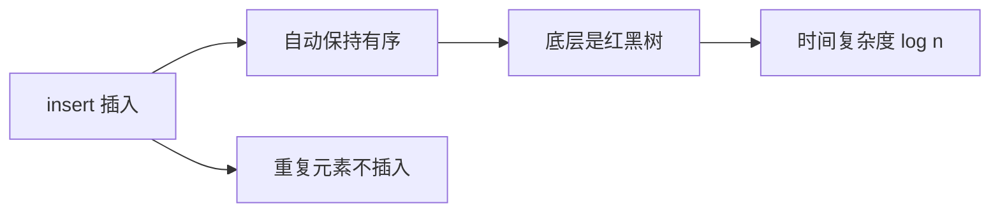

## 本节概述：set 的数据插入

set 的插入用 `insert` 函数。插入操作有两个核心特点：**插入后自动保持有序**、**重复元素不会被插入**。

## 打印函数

```cpp
#include <iostream>
#include <set>
#include <vector>
using namespace std;

void printSet(const set<int>& s) {
    for (set<int>::const_iterator it = s.begin(); it != s.end(); ++it) {
        cout << *it << " ";
    }
    cout << endl;
}
```

## 方式一：插入单个元素

最常用的插入方式——直接传一个值：

```cpp
set<int> s;
s.insert(3);
s.insert(1);
s.insert(4);
s.insert(2);
s.insert(5);
printSet(s);   // 1 2 3 4 5
```

> 不管你按什么顺序插入，最终输出一定是有序的。

### 验证：每次插入后都保持有序

我们每插一个就打印一次，看看是不是每次都有序：

```cpp
set<int> s;

s.insert(3); printSet(s);   // 3
s.insert(2); printSet(s);   // 2 3
s.insert(5); printSet(s);   // 2 3 5
s.insert(4); printSet(s);   // 2 3 4 5
s.insert(1); printSet(s);   // 1 2 3 4 5
```

运行结果：

```
3 
2 3 
2 3 5 
2 3 4 5 
1 2 3 4 5 
```

> 每次插入后都是有序的！因为底层是红黑树（平衡二叉搜索树），每次插入都会调整树的结构，保证中序遍历始终有序。

## 方式二：插入迭代器区间

`insert` 还支持插入一段迭代器区间，而且迭代器不一定是 set 的——其他容器（比如 vector）的迭代器也可以：

```cpp
vector<int> v = {0, 5, 6, 9, 8};
set<int> s = {1, 2, 3, 4};

s.insert(v.begin(), v.end());   // 把 vector 中的元素插进去
printSet(s);   // 0 1 2 3 4 5 6 8 9
```

> [!TIP]
> **迭代器可以来自其他容器**
>
> insert 的迭代器参数是一个模板，只要元素类型兼容就行。vector、list、deque 的迭代器都能用。
>
> 同样是左闭右开区间 `[begin, end)`。

## 插入的两大特点



| 特点 | 说明 |
|---|---|
| **自动有序** | 每次插入后，集合中的元素始终保持从小到大排列 |
| **自动去重** | 如果插入的值已经存在，insert 会直接忽略，不会重复插入 |
| **时间复杂度 O(log n)** | 红黑树的插入效率很高，比 vector 头插 O(n) 快得多 |

> [!NOTE]
> **为什么插入是 O(log n)？**
>
> 红黑树是一棵平衡二叉树，树的高度大约是 log₂n。插入一个元素只需要从根走到叶子，走的步数等于树的高度，所以是 O(log n)。
>
> 对比一下：vector 在头部插入需要挪动所有元素，是 O(n)。数据量越大，红黑树的优势越明显。

## insert 的返回值

`insert(val)` 的返回值是一个 `pair`，包含两个信息：

- **第一个（迭代器）**：指向插入的元素（如果插入成功），或者指向已存在的那个重复元素（如果插入失败）
- **第二个（bool）**：`true` 表示插入成功，`false` 表示元素已存在、插入失败

```cpp
set<int> s = {1, 2, 3};

pair<set<int>::iterator, bool> result;

result = s.insert(4);
cout << "插入4：" << (result.second ? "成功" : "失败") << endl;  // 成功

result = s.insert(2);
cout << "插入2：" << (result.second ? "成功" : "失败") << endl;  // 失败
```

> 这个返回值很有用，可以用来判断插入是否成功。

## 完整代码示例

```cpp
#include <iostream>
#include <set>
#include <vector>
using namespace std;

void printSet(const set<int>& s) {
    for (set<int>::const_iterator it = s.begin(); it != s.end(); ++it) {
        cout << *it << " ";
    }
    cout << endl;
}

int main() {
    // 1. 单个元素插入，验证每次都有序
    set<int> s;
    cout << "=== 逐个插入 ===" << endl;
    s.insert(3); printSet(s);
    s.insert(2); printSet(s);
    s.insert(5); printSet(s);
    s.insert(4); printSet(s);
    s.insert(1); printSet(s);

    // 2. 插入重复元素
    cout << "=== 插入重复元素 3 ===" << endl;
    pair<set<int>::iterator, bool> res = s.insert(3);
    cout << (res.second ? "插入成功" : "插入失败，元素已存在") << endl;
    printSet(s);   // 1 2 3 4 5（还是 5 个，没变）

    // 3. 插入迭代器区间（从 vector 插入）
    cout << "=== 插入 vector 区间 ===" << endl;
    vector<int> v = {0, 5, 6, 9, 8};
    s.insert(v.begin(), v.end());
    printSet(s);   // 0 1 2 3 4 5 6 8 9

    return 0;
}
```

运行结果：

```
=== 逐个插入 ===
3 
2 3 
2 3 5 
2 3 4 5 
1 2 3 4 5 
=== 插入重复元素 3 ===
插入失败，元素已存在
1 2 3 4 5 
=== 插入 vector 区间 ===
0 1 2 3 4 5 6 8 9 
```

## 本章小结

**insert 两种常用方式** — 插入单个值（最常用）、插入迭代器区间。

**插入后自动有序** — 底层红黑树保证，不管插入顺序如何，中序遍历永远有序。

**重复元素不插入** — set 元素唯一，重复的值会被自动忽略。

**insert 返回 pair** — 第一个是迭代器，第二个是 bool（表示是否插入成功）。

**时间复杂度 O(log n)** — 红黑树的优势，数据量大的时候比 vector 高效很多。
