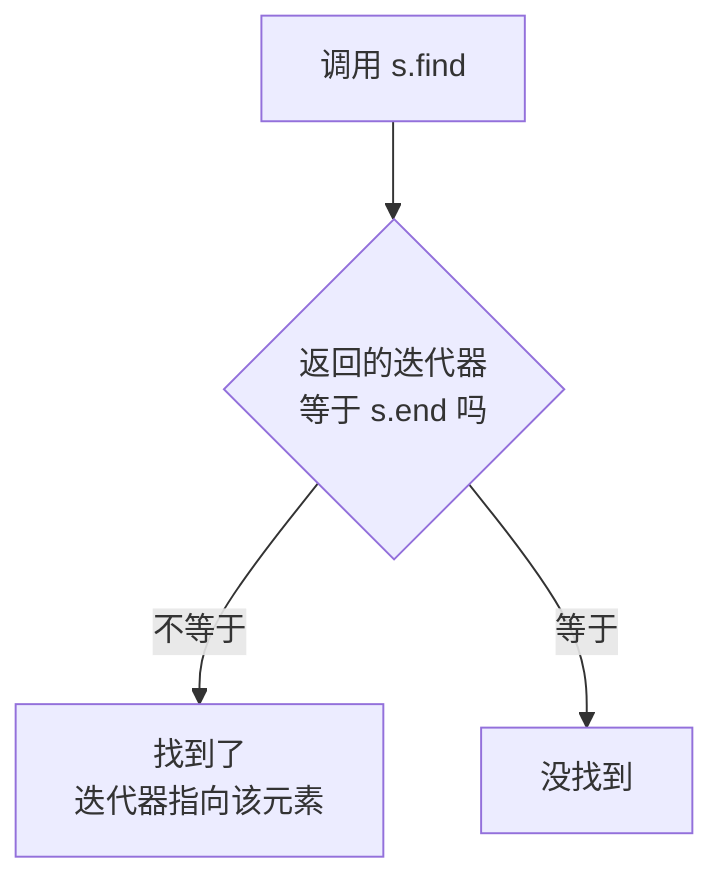

## 本节概述：set 的数据查找

set 的查找用 `find` 函数，返回值是一个迭代器。找到就返回指向该元素的迭代器，找不到就返回 `end()`。

## find 函数的用法

```cpp
#include <iostream>
#include <set>
using namespace std;

int main() {
    set<int> s = {1, 2, 3, 4, 5};

    set<int>::iterator it = s.find(3);

    if (it != s.end()) {
        cout << "找到了：" << *it << endl;   // 找到了：3
    } else {
        cout << "找不到" << endl;
    }

    return 0;
}
```

## 判断是否找到的逻辑



| 返回值 | 含义 |
|---|---|
| 不等于 `s.end()` | 找到了，对迭代器解引用 `*it` 就能拿到值 |
| 等于 `s.end()` | 没找到，此时不能解引用（会崩溃） |

> [!WARNING]
> **找不到时不要解引用**
>
> 如果 `find` 返回 `end()`，说明没找到，这时候 `*it` 是未定义行为，可能会崩溃。
>
> 一定要先判断 `it != s.end()`，再解引用。

## 找到的情况

```cpp
set<int> s = {1, 2, 3, 4, 5};

set<int>::iterator it = s.find(3);
if (it != s.end()) {
    cout << "find: " << *it << endl;   // find: 3
}
```

## 找不到的情况

```cpp
set<int> s = {1, 2, 3, 4, 5};

set<int>::iterator it = s.find(10);   // 10 不在集合里
if (it != s.end()) {
    cout << "find: " << *it << endl;
} else {
    cout << "can't find 10" << endl;   // can't find 10
}
```

## 时间复杂度

`find` 的时间复杂度是 **O(log n)**。

> 因为底层是红黑树，查找一个元素就像在二叉搜索树里搜索——每次比较后排除一半，走的步数等于树的高度（log n）。
>
> 对比一下：vector 的查找需要一个个遍历，是 O(n)。数据越大，set 的查找优势越明显。

## 完整代码示例

```cpp
#include <iostream>
#include <set>
using namespace std;

int main() {
    set<int> s = {1, 2, 3, 4, 5};

    // 1. 找到的情况
    set<int>::iterator it = s.find(3);
    if (it != s.end()) {
        cout << "find: " << *it << endl;
    } else {
        cout << "can't find 3" << endl;
    }

    // 2. 找不到的情况
    it = s.find(10);
    if (it != s.end()) {
        cout << "find: " << *it << endl;
    } else {
        cout << "can't find 10" << endl;
    }

    return 0;
}
```

运行结果：

```
find: 3
can't find 10
```

## 本章小结

**find 返回迭代器** — 找到就返回指向该元素的迭代器，找不到返回 `s.end()`。

**判断方法** — `it != s.end()` 说明找到了，等于 end 说明没找到。

**找到才能解引用** — 一定要先判断再 `*it`，否则可能崩溃。

**时间复杂度 O(log n)** — 红黑树查找效率高，数据量大的时候比线性查找快得多。

**find 是 set 的核心操作** — 后面学删除的时候，find 经常和 erase 搭配使用。
