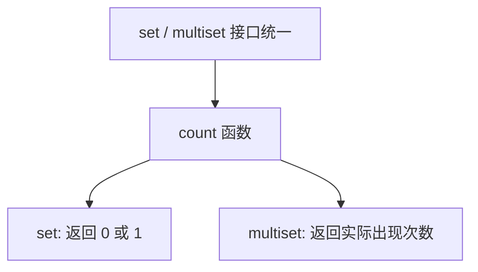

## 本节概述：set 的数据统计

set 的数据统计用 `count` 函数，用来统计某个值在集合中出现了几次。因为 set 不允许重复元素，所以它的返回值只有两种可能：**0 或 1**。

## count 的基本用法

```cpp
#include <iostream>
#include <set>
using namespace std;

int main() {
    set<int> s = {1, 2, 3, 4, 5};

    cout << "元素 0 出现次数：" << s.count(0) << endl;   // 0
    cout << "元素 2 出现次数：" << s.count(2) << endl;   // 1
    cout << "元素 4 出现次数：" << s.count(4) << endl;   // 1
    cout << "元素 6 出现次数：" << s.count(6) << endl;   // 0

    return 0;
}
```

运行结果：

```
元素 0 出现次数：0
元素 2 出现次数：1
元素 4 出现次数：1
元素 6 出现次数：0
```

> 对于 set 来说，`count(val)` 要么返回 0（不存在），要么返回 1（存在）。

## 用循环演示 count

```cpp
set<int> s = {1, 2, 3, 4, 5};

// 遍历 0、2、4、6，看看每个数出现几次
for (int i = 0; i < 8; i += 2) {
    cout << "元素 " << i << " 出现次数：" << s.count(i) << endl;
}
```

运行结果和上面一样。

## 时间复杂度

`count` 的时间复杂度是 **O(log n)**，和 `find` 一样。

> 底层都是红黑树的查找操作，先找到位置再统计。对于 set 来说，找到就返回 1，找不到就返回 0，其实就相当于判断"有没有"。

## 一个问题：为什么叫 count 而不叫 has？

既然 set 中 `count` 只有 0 和 1 两种结果，本质上就是判断"是否存在"，那为什么函数名不叫 `has` 或者 `contains` 呢？

答案是：**为了和 multiset 保持接口统一**。



> multiset 支持重复元素，所以它的 `count` 返回的是真正的数量（可以是 0、1、2、3……）。
>
> set 和 multiset 用同一个函数名 `count`，是 STL 接口设计的统一性体现——学会一个，另一个直接就能用。

## multiset 的 count（扩展）

multiset 允许重复元素，所以 count 的返回值就丰富了：

```cpp
#include <iostream>
#include <set>   // multiset 也在这个头文件里
using namespace std;

int main() {
    multiset<int> ms = {1, 2, 2, 2, 2, 2, 2, 2, 4, 4, 4, 4, 4, 6, 6, 6, 6, 6};

    for (int i = 0; i < 8; i += 2) {
        cout << "元素 " << i << " 出现次数：" << ms.count(i) << endl;
    }

    return 0;
}
```

运行结果：

```
元素 0 出现次数：0
元素 2 出现次数：7
元素 4 出现次数：5
元素 6 出现次数：5
```

> multiset 的 `count` 才真正体现了"统计数量"的含义。

## set 和 multiset 的区别

| 特性 | set | multiset |
|---|---|---|
| 元素重复 | 不允许 | 允许 |
| count 返回值 | 0 或 1 | 0、1、2……（实际数量） |
| 头文件 | `#include <set>` | `#include <set>` |
| 其他接口 | 基本一致 | 基本一致 |

> [!NOTE]
> **multiset 也是有序的**
>
> multiset 的底层也是红黑树，所以元素同样是自动排序的。和 set 的唯一区别就是：multiset 允许重复元素。
>
> 其他接口（insert、find、erase、size、empty 等）用法几乎一样。

## 完整代码示例

```cpp
#include <iostream>
#include <set>
using namespace std;

int main() {
    // === set 的 count ===
    set<int> s = {1, 2, 3, 4, 5};
    cout << "=== set ===" << endl;
    for (int i = 0; i < 8; i += 2) {
        cout << "元素 " << i << " 出现次数：" << s.count(i) << endl;
    }

    // === multiset 的 count ===
    multiset<int> ms = {2, 2, 2, 2, 2, 2, 2, 4, 4, 4, 4, 4, 6, 6, 6, 6, 6};
    cout << "\n=== multiset ===" << endl;
    for (int i = 0; i < 8; i += 2) {
        cout << "元素 " << i << " 出现次数：" << ms.count(i) << endl;
    }

    return 0;
}
```

运行结果：

```
=== set ===
元素 0 出现次数：0
元素 2 出现次数：1
元素 4 出现次数：1
元素 6 出现次数：0

=== multiset ===
元素 0 出现次数：0
元素 2 出现次数：7
元素 4 出现次数：5
元素 6 出现次数：5
```

## 本章小结

**count 统计元素出现次数** — `s.count(val)` 返回 val 在集合中出现的次数。

**set 的 count 只有 0 或 1** — 因为 set 元素不重复，所以 count 本质就是判断"有没有"。

**为什么叫 count 不叫 has** — 为了和 multiset 接口统一。multiset 的 count 返回真正的数量。

**时间复杂度 O(log n)** — 和 find 一样，红黑树查找效率高。

**multiset 是 set 的"重复版"** — 除了允许重复元素，其他特性和接口基本一致，头文件也都是 `#include <set>`。
