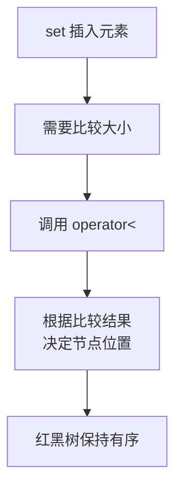
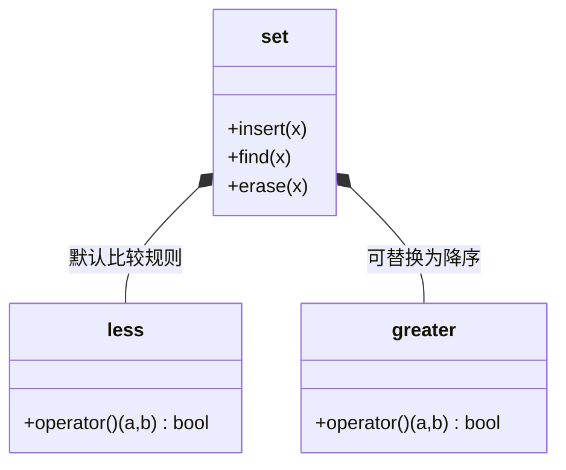

## 本节概述：set 的排序规则

set 插入 int、string 这些内置类型时，可以自动排序——因为它们天生就有比较大小的机制。但如果插入的是自定义类型（比如结构体、类），set 就不知道怎么比较了，会编译报错。这时候就需要我们自己定义排序规则。

## 问题：自定义类型无法直接放入 set

我们先定义一个类，看看直接放进 set 会发生什么：

```cpp
#include <iostream>
#include <set>
#include <string>
using namespace std;

class Cgaga {
private:
    string _name;      // 课程名
    int _priority;     // 学习优先级

public:
    // 默认构造
    Cgaga() : _name(""), _priority(-1) {}

    // 有参构造
    Cgaga(string name, int priority)
        : _name(name), _priority(priority) {}
};

int main() {
    set<Cgaga> s;           // ❌ 编译报错！
    s.insert(Cgaga("STL", 4));
    return 0;
}
```

> **为什么报错？** set 底层是红黑树，插入元素时需要比较大小才能决定放哪里。
>
> int 可以直接用 `<` 比较，string 也重载了 `<`，但我们自己写的 `Cgaga` 类没有定义比较规则，所以编译器不知道两个 `Cgaga` 对象谁大谁小。

## 解决方法：重载 operator<

给自定义类型重载**小于运算符** `operator<`，set 就能比较大小了。

```cpp
class Cgaga {
private:
    string _name;
    int _priority;

public:
    Cgaga() : _name(""), _priority(-1) {}
    Cgaga(string name, int priority)
        : _name(name), _priority(priority) {}

    // 重载小于运算符
    bool operator<(const Cgaga& other) const {
        return _priority < other._priority;   // 按优先级从小到大排序
    }
};
```

> [!NOTE]
> **operator< 的写法要点**
>
> 1. 参数是 `const T&` — const 引用，保证不修改对方
> 2. 函数末尾加 `const` — 保证不修改自己的成员变量
> 3. 返回 `bool` — 比较结果，true 表示"左边小于右边"
>
> 这两个 const 不能少，否则 set 可能用不了。

## 验证：自定义类型能正确排序

我们给类加一个 `print` 方法，方便看效果：

```cpp
class Cgaga {
private:
    string _name;
    int _priority;

public:
    Cgaga() : _name(""), _priority(-1) {}
    Cgaga(string name, int priority)
        : _name(name), _priority(priority) {}

    bool operator<(const Cgaga& other) const {
        return _priority < other._priority;
    }

    // 打印方法
    void print() const {
        cout << "[" << _priority << "] " << _name << endl;
    }
};
```

然后插入几门课程，看看排序效果：

```cpp
int main() {
    set<Cgaga> s;

    s.insert(Cgaga("算法零基础", 5));
    s.insert(Cgaga("面向对象", 2));
    s.insert(Cgaga("零基础语法", 1));
    s.insert(Cgaga("数据结构", 3));
    s.insert(Cgaga("STL", 4));
    s.insert(Cgaga("项目实战", 6));

    // 遍历输出
    for (set<Cgaga>::iterator it = s.begin(); it != s.end(); ++it) {
        it->print();
    }

    return 0;
}
```

运行结果：

```
[1] 零基础语法
[2] 面向对象
[3] 数据结构
[4] STL
[5] 算法零基础
[6] 项目实战
```

> 完美！课程按照优先级从小到大排列好了，正好是一整套 C++ 的学习路线。

## 排序规则的原理



set 默认使用 `std::less<T>` 作为比较规则，而 `std::less<T>` 底层就是调用 `operator<`。所以只要我们重载了 `<`，set 就能正常工作。

### 仿函数比较类图



> [!TIP]
> **只需要重载 < 就够了**
>
> 你可能会想：set 排序需要比较大小，那 `>`、`==`、`!=` 这些要不要也重载？
>
> 答案是：**只需要重载 `<` 就够了**。
>
> 红黑树只需要知道"谁小谁大"，用 `<` 就能推导出所有关系：
> - `a > b` 等价于 `b < a`
> - `a == b` 等价于 `!(a < b) && !(b < a)`
> - `a != b` 等价于 `a < b || b < a`
>
> 所以 STL 的设计是：只要你提供了 `<`，其他关系都能推导出来。

## 完整代码示例

```cpp
#include <iostream>
#include <set>
#include <string>
using namespace std;

class Cgaga {
private:
    string _name;
    int _priority;

public:
    // 默认构造
    Cgaga() : _name(""), _priority(-1) {}

    // 有参构造
    Cgaga(string name, int priority)
        : _name(name), _priority(priority) {}

    // 重载小于运算符 —— set 的排序依据
    bool operator<(const Cgaga& other) const {
        return _priority < other._priority;
    }

    // 打印方法
    void print() const {
        cout << "[" << _priority << "] " << _name << endl;
    }
};

int main() {
    set<Cgaga> s;

    // 乱序插入
    s.insert(Cgaga("算法零基础", 5));
    s.insert(Cgaga("面向对象", 2));
    s.insert(Cgaga("零基础语法", 1));
    s.insert(Cgaga("数据结构", 3));
    s.insert(Cgaga("STL", 4));
    s.insert(Cgaga("项目实战", 6));

    // 按顺序输出
    for (set<Cgaga>::iterator it = s.begin(); it != s.end(); ++it) {
        it->print();
    }

    return 0;
}
```

运行结果：

```
[1] 零基础语法
[2] 面向对象
[3] 数据结构
[4] STL
[5] 算法零基础
[6] 项目实战
```

## 本章小结

**自定义类型不能直接放进 set** — 因为 set 需要比较大小来维持红黑树的有序性，自定义类型默认没有比较规则。

**解决方法：重载 operator<** — 给类加上 `bool operator<(const T& other) const`，set 就能用了。

**只需要重载 <** — 红黑树只用小于运算符就能推导出所有大小关系，`>`、`==` 等不需要单独重载。

**两个 const 不能少** — 参数 const 保证不修改对方，函数末尾 const 保证不修改自己。

**排序规则决定了 set 的顺序** — 你想按什么字段排、想升序还是降序，都可以通过 operator< 来控制。
