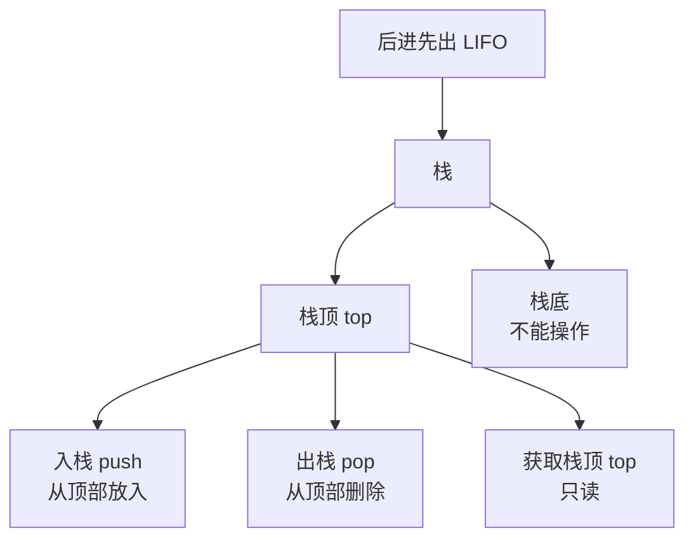

## 本节概述：stack 栈容器

stack 是 STL 里的栈容器——只支持尾部插入和删除，遵循**后进先出（LIFO）**。结构非常简单，没有迭代器，不能遍历。

## vector / deque / stack 对比

| 对比项 | vector | deque | stack |
|---|---|---|---|
| 头插 | ❌ 支持但慢（O(n)） | ✅ 支持（O(1)） | ❌ 不支持 |
| 尾插 | ✅ 支持 | ✅ 支持 | ✅ 支持（叫 push） |
| 头删 | ❌ 支持但慢 | ✅ 支持 | ❌ 不支持 |
| 尾删 | ✅ 支持 | ✅ 支持 | ✅ 支持（叫 pop） |
| 迭代器 | ✅ begin / end | ✅ begin / end | ❌ 没有 |
| 随机访问 | ✅ `[]` / `at` | ✅ `[]` / `at` | ❌ 没有 |
| 访问首尾 | front / back | front / back | 只有 top（栈顶） |

> stack 是"阉割版"的容器——把很多功能都去掉了，只保留了最核心的栈操作。

## 栈的核心概念



### 三个核心接口

| 接口 | 作用 | 有无参数 |
|---|---|---|
| `push(x)` | 入栈（往栈顶放元素） | 有，传要插入的值 |
| `pop()` | 出栈（删掉栈顶元素） | 无，直接删最顶上的 |
| `top()` | 获取栈顶元素 | 无，返回栈顶元素的引用 |

### 栈顶 top

栈只有一个口子——顶部。所有操作都在顶部进行：

```
入栈 push(1) →  push(2) →  push(3) →
                       ┌───┐
                       │ 3 │  ← top 栈顶
                       ├───┤
                       │ 2 │
                       ├───┤
                       │ 1 │
                       └───┘

出栈 pop()  →   pop()  →   pop()  →
```

> [!TIP]
> **叠盘子的比喻**：
> 盘子一个一个往上叠（push），也只能从最上面一个一个往下拿（pop）。
> top 永远指向最上面那一个盘子。

### 后进先出 LIFO

**L**ast **I**n **F**irst **O**ut —— 最后放进去的，最先被拿出来。

```
push(1)  push(2)  push(3)
   ↓        ↓        ↓
──────────────────────────────→
                              top = 3

pop()    pop()    pop()
   ↓        ↓        ↓
  出 3    出 2    出 1
```

> 进去的顺序是 1 → 2 → 3，出来的顺序是 3 → 2 → 1，反过来了。

## 为什么没有迭代器

栈是一种**访问受限**的数据结构——刻意不让你随便访问中间元素。

- 没有 `begin()` / `end()`
- 没有 `[]` / `at()`
- 没有 `front()` / `back()`
- **只能操作栈顶**

> 这是设计思想——栈的目的就是强制你只能在一端操作，保证 LIFO 的语义。

## 基本使用

```cpp
#include <iostream>
#include <stack>
using namespace std;

int main() {
    stack<int> stk;

    // 入栈
    stk.push(10);
    stk.push(20);
    stk.push(30);

    // 获取栈顶
    cout << stk.top() << endl;   // 30

    // 出栈
    stk.pop();
    cout << stk.top() << endl;   // 20

    stk.pop();
    cout << stk.top() << endl;   // 10

    // 判空和大小
    cout << stk.empty() << endl;  // 0（非空）
    cout << stk.size() << endl;   // 1

    return 0;
}
```

运行结果：

```
30
20
10
0
1
```

> [!WARNING]
> **空栈不能 pop 或 top！**
>
> 空栈调用 `pop()` 或 `top()` 是未定义行为，会崩溃。
> 操作之前一定要用 `empty()` 检查一下。

## 完整示例：边弹边遍历

栈不支持遍历，但可以边弹边输出：

```cpp
#include <iostream>
#include <stack>
using namespace std;

int main() {
    stack<int> stk;

    // 入栈 1 2 3 4 5
    for (int i = 1; i <= 5; i++) {
        stk.push(i);
    }

    // 边弹边输出（后进先出）
    while (!stk.empty()) {
        cout << stk.top() << " ";
        stk.pop();
    }
    cout << endl;
    // 输出：5 4 3 2 1

    return 0;
}
```

> 注意：遍历完栈也就空了——弹一个少一个。

## 本章小结

**stack 栈** — 后进先出（LIFO），只能在栈顶操作的容器。

**三个核心接口** — push 入栈、pop 出栈、top 取栈顶。

**没有迭代器** — 不能遍历、不能随机访问、不能操作中间元素，刻意限制访问方式。

**空栈不能弹** — 操作前用 empty() 检查，否则崩溃。

**叠盘子比喻** — 只能在最上面放和拿，最上面那个就是 top。
