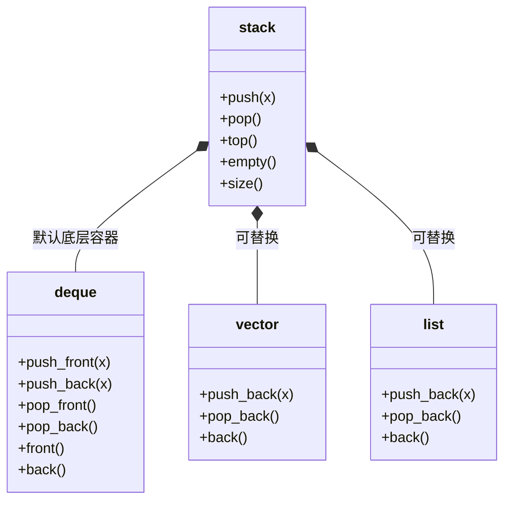

## 本节概述：stack 的容器替换

stack 是个**适配器**——它本身不存数据，只负责包装一个底层容器。默认底层是 deque，但你完全可以把它换成别的，甚至换成你自己写的容器。这就是**容器替换**。

## 为什么能替换

回到 stack 的类模板定义：

```cpp
template <class T, class Container = deque<T>>
class stack;
```

两个模板参数：

| 参数 | 含义 | 默认值 |
|---|---|---|
| `T` | 元素类型 | 必须显式给出 |
| `Container` | 底层容器类型 | `deque<T>` |

第二个参数是**默认参数**——不写就自动用 deque，写了就用你指定的。

## 把底层换成 vector

想让 stack 底层用 vector 而不是 deque？只要在第二个模板参数里写 `vector<int>`：

```cpp
#include <iostream>
#include <stack>
#include <vector>   // 换 vector 就要引入 vector 头文件
using namespace std;

int main() {
    stack<int, vector<int>> stk;   // 底层换成 vector

    stk.push(6);
    stk.push(7);
    stk.push(8);

    cout << stk.top() << endl;   // 8
    stk.pop();
    cout << stk.top() << endl;   // 7

    return 0;
}
```

> [!WARNING]
> **别忘了对应的头文件**
>
> 把底层换成 vector 之后，如果报"未定义的标识符"，不是 stack 的锅——是因为你没 `#include <vector>`。
> 用什么底层容器，就要引入什么容器的头文件。

运行结果：

```
8
7
```

> 表面用法完全没变——push、top、pop 这些接口一个都不用改。
> 变的只是**底层存储结构**，对使用者来说几乎是透明的。

## 验证：真的换掉了吗

光看代码不够，我们用断点实锤一下。

在 deque 的 `push_back` 和 vector 的 `push_back` 各打一个断点，然后运行 `stk.push(6)`——

**结果**：程序直接停在了 **vector 的 push_back** 里，deque 的断点根本没触发。

调用堆栈长这样：

```
main
 └── stack<int, vector<int>>::push   ← stack 的 push
      └── vector<int>::push_back     ← 最终调到了 vector！
```

从调用堆栈里能清楚看到三层：

| 层级 | 位置 | 说明 |
|---|---|---|
| 最上层 | main 里的 `stk.push(6)` | 我们的调用 |
| 中间 | `stack::push` | stack 的包装层 |
| 最底层 | `vector::push_back` | 真正干活的地方 |

> 再往下走就会进入 vector 的扩容逻辑了——这也侧面印证了底层确实是 vector。

## 不限于 deque 和 vector

容器替换不限于 deque 和 vector 这两种标准库容器。

**你完全可以自己实现一个容器**，只要它提供了 stack 需要的接口，就能塞进 `Container` 参数里当底层用。

stack 要求底层容器至少支持这些接口：

- `push_back(x)` — 尾插
- `pop_back()` — 尾删
- `back()` — 取尾元素
- `empty()` — 判空
- `size()` — 取大小

> [!TIP]
> **适配器的真正威力**
>
> 这就是适配器模式的精髓：
> - **上层**（stack）定义接口和语义（LIFO）
> - **下层**（底层容器）负责真正的存储和操作
> - 上下层之间靠一组约定好的接口（push_back / pop_back / back ...）对接
>
> 想换底层实现？改个模板参数就行，上层代码一行都不用动。

### 适配器模式类图



## 什么时候需要替换

| 场景 | 推荐底层 | 原因 |
|---|---|---|
| 默认情况 | `deque` | 尾插尾删都快，还不会像 vector 那样整体搬迁 |
| 追求连续内存、随机访问中间元素（虽然 stack 用不到） | `vector` | 内存连续，缓存友好 |
| 特殊需求（如自定义内存池） | 自己实现的容器 | 完全可控 |

> 一般来说，默认的 deque 就够用了，不用刻意去换。容器替换更多是让你理解"适配器"这个设计思想。

## 本章小结

**stack 有两个模板参数** — 第一个是元素类型 T，第二个是底层容器 Container，默认是 `deque<T>`。

**容器替换就是改第二个参数** — 写成 `stack<int, vector<int>>` 就能把底层换成 vector，记得 `#include <vector>`。

**断点验证调用栈** — 在 vector 的 push_back 打断点，会发现 stack::push 最终调到了 vector::push_back，证明替换成功。

**不限于标准容器** — 只要你自己写的容器提供了 push_back / pop_back / back / empty / size，就能当 stack 的底层。

**这就是适配器模式** — 上层定义语义，下层负责存储，靠接口对接，换底层只改模板参数就行。
