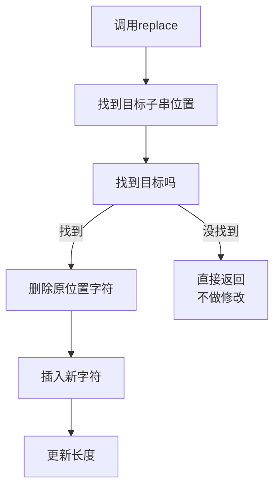

## 本节概述：string 的数据替换

使用 `replace` 成员函数替换字符串中的内容，先删后插，有多个重载版本。

## replace 常用重载总览

| 版本 | 语法 | 参数说明 |
|---|---|---|
| 下标替换 | `s.replace(pos, count, str)` | pos=位置，count=删几个，str=替换成什么 |
| 迭代器替换 | `s.replace(begin, end, str)` | 左闭右开区间，str=替换成什么 |
| 取前 n 个字符 | `s.replace(pos, count, str, n)` | 只取 str 的前 n 个字符替换 |

## 版本一：下标替换

```cpp
string s = "hello woooorld";
s.replace(7, 5, "o");
cout << s << endl;   // hello world
```

> [!NOTE]
> 三个参数含义：
> - **7** = 位置（从第 7 个字符开始）
> - **5** = 删除个数（删掉 5 个字符 "oooor"）
> - **"o"** = 替换成什么（插入 "o"）
>
> ```
> 下标: 0 1 2 3 4 5 6 7 8 9 10 11 12 13
> 字符: h e l l o   w o o o  o  r  l  d
>                       ↑ ↑ ↑ ↑  ↑
>                    删这5个，替换成 "o"
> 结果: hello world
> ```

> [!TIP]
> **replace = 先删后插**：
> 1. 先从位置 7 删掉 5 个字符
> 2. 再在位置 7 插入 "o"
>
> 本质就是 erase + insert 的组合。

### replace 执行流程



## 版本二：迭代器替换

```cpp
string s = "hello woooorld";
s.replace(s.begin() + 7, s.begin() + 12, "o");
cout << s << endl;   // hello world
```

> [!WARNING]
> 两个迭代器确定一个**左闭右开区间** `[begin+7, begin+12)`：
> - `begin + 7` → 第 7 个字符（第一个 'o'）
> - `begin + 12` → 第 12 个字符（'l'，不包含）
> - 删除 [7, 12) 区间的 5 个字符（12 - 7 = 5）
>
> 跟版本一 `replace(7, 5, "o")` 效果完全一样！
> ```
> 12 - 7 = 5  ←→  count = 5
> ```
>
> **所有迭代器区间都是左闭右开**——这是 C++ 的通用规则。

## 版本三：取前 n 个字符替换

```cpp
string s = "hello woooorld";
s.replace(7, 5, "o and ***一堆乱七八糟东西", 1);
cout << s << endl;   // hello world
```

> [!NOTE]
> 四个参数含义：
> - **7** = 位置
> - **5** = 删除个数
> - **"o and ..."** = 源字符串
> - **1** = 只取源字符串的前 1 个字符
>
> 所以只取 "o"，替换效果跟前面一样。

## 参数命名解读

> [!TIP]
> F12 看函数签名，参数名就能猜含义：
> ```cpp
> basic_string& replace(
>     size_t pos,        // pos = 偏移量（位置）
>     size_t count,      // count = 删除个数
>     const charT* str   // str = 替换的字符串
> );
> ```
> - `pos` → position（位置）
> - `count` → 个数
> - `size_t` → unsigned long long（64 位无符号整数）
>
> **不需要死记**——写代码时括号一弹出来，看参数名和类型就能猜出含义。

## 下标 vs 迭代器对比

| 对比项 | 下标版本 | 迭代器版本 |
|---|---|---|
| 语法 | `replace(pos, count, str)` | `replace(begin, end, str)` |
| 指定范围 | 位置 + 个数 | 左闭右开区间 |
| 个数计算 | 直接给 count | end - begin = count |
| 理解难度 | 简单直观 | 需要理解左闭右开 |

## 完整代码示例

```cpp
#include <iostream>
#include <string>
using namespace std;

int main() {
    // 1. 下标替换
    string s1 = "hello woooorld";
    s1.replace(7, 5, "o");
    cout << "下标: " << s1 << endl;    // hello world

    // 2. 迭代器替换
    string s2 = "hello woooorld";
    s2.replace(s2.begin() + 7, s2.begin() + 12, "o");
    cout << "迭代器: " << s2 << endl;  // hello world

    // 3. 取前 n 个字符替换
    string s3 = "hello woooorld";
    s3.replace(7, 5, "o and something", 1);
    cout << "取前n: " << s3 << endl;   // hello world

    return 0;
}
```

运行结果：

```
下标: hello world
迭代器: hello world
取前n: hello world
```

## 本章小结

**replace** — 先删后插：从指定位置删掉 count 个字符，再插入新字符串。

**三种常用版本** — 下标替换（pos + count + str）、迭代器替换（左闭右开区间 + str）、取前 n 个字符替换（pos + count + str + n）。

**下标 vs 迭代器** — 效果一样，下标更直观，迭代器需要理解左闭右开。

**不需要死记** — 写代码时 IDE 提示参数名和类型，看懂就行。
