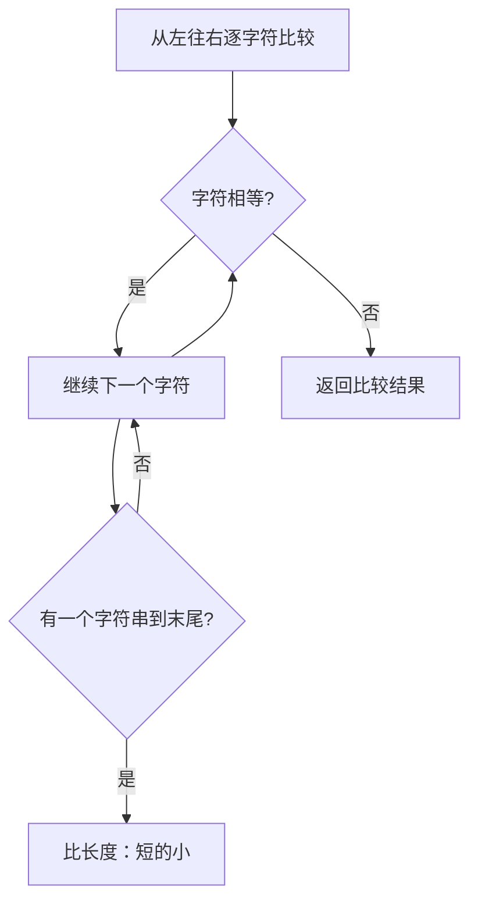

## 本节概述：string 的比较操作

string 有两种比较方式：`compare` 成员函数（返回三值）和关系运算符（返回 bool）。

## 两种比较方式总览

| 方式 | 返回类型 | 返回值 | 适用场景 |
|---|---|---|---|
| `compare` | int | -1 / 0 / 1 | 需要知道大小关系 |
| `==` `<` `>` 等 | bool | true / false | 只需要判断一个条件 |

## compare 函数

### 返回值含义

| 返回值 | 含义 | 记忆 |
|---|---|---|
| `0` | 相等 | 两边一样 |
| `1` | 左边 > 右边 | 左大返正 |
| `-1` | 左边 < 右边 | 左小返负 |

> [!TIP]
> **记忆技巧**：`s1.compare(s2)` 把 s1 放左边，s2 放右边。
> - s1 > s2 → 返回 1（正）
> - s1 < s2 → 返回 -1（负）
> - s1 == s2 → 返回 0
>
> 符号方向跟大小关系一致——左大返正，左小返负。

### 情况一：相等

```cpp
string s1 = "AAB";
string t11 = "AAB";
int ret1 = s1.compare(t11);
cout << ret1 << endl;   // 0
```

### 情况二：左边大于右边

```cpp
string t12 = "AAA";
int ret2 = s1.compare(t12);
cout << ret2 << endl;   // 1
```

> 逐字符比较：A=A → A=A → B>A → 返回 1

### 情况三：左边小于右边

```cpp
string t13 = "AAC";
int ret3 = s1.compare(t13);
cout << ret3 << endl;   // -1
```

> 逐字符比较：A=A → A=A → B<C → 返回 -1

### 情况四：长度不同

```cpp
string t14 = "AABA";
int ret4 = s1.compare(t14);
cout << ret4 << endl;   // -1（s1 短，s1 < t14）
```

> [!WARNING]
> **长度不同时怎么比？**
>
> 源码逻辑（F12 进去）：
> 1. 取两个字符串长度的**最小值** minLen
> 2. 先比较前 minLen 个字符
> 3. 如果前 minLen 个字符相等，再比长度：
>    - 左边长度 < 右边长度 → 返回 -1
>    - 左边长度 > 右边长度 → 返回 1
>
> **记忆**：短的减长的 = 负的，就像 1 减 2 = -1。

## 关系运算符

除了 compare，还可以直接用 `==` `<` `>` `!=` `<=` `>=`：

```cpp
string s1 = "AAB";
string t11 = "AAB";
string t12 = "AAA";

cout << (s1 == t11) << endl;   // 1（true，相等）
cout << (s1 != t11) << endl;  // 0（false，不是不等）
cout << (s1 < t12) << endl;   // 0（false，AAB 不小于 AAA）
cout << (s1 > t12) << endl;   // 1（true，AAB 大于 AAA）
```

> [!NOTE]
> **compare vs 关系运算符的区别**：
>
> | 对比项 | compare | 关系运算符 |
> |---|---|---|
> | 返回类型 | int（三值） | bool（二值） |
> | 返回值 | -1 / 0 / 1 | true / false |
> | 信息量 | 知道大小关系 | 只有是和否 |
> | 底层 | 成员函数 | 运算符重载 |
>
> 关系运算符底层也是调用类似的比较逻辑，只是封装成了 `operator==`、`operator<` 等。

## 比较规则：字典序



> 字典序就是查字典的顺序——从第一个字符开始比，第一个一样就比第二个，以此类推。
> 如果前面全一样，短的字符串更小。

## 完整代码示例

```cpp
#include <iostream>
#include <string>
using namespace std;

int main() {
    string s1 = "AAB";

    // 1. compare — 相等
    string t11 = "AAB";
    cout << "AAB compare AAB = " << s1.compare(t11) << endl;    // 0

    // 2. compare — 左大于右
    string t12 = "AAA";
    cout << "AAB compare AAA = " << s1.compare(t12) << endl;    // 1

    // 3. compare — 左小于右
    string t13 = "AAC";
    cout << "AAB compare AAC = " << s1.compare(t13) << endl;    // -1

    // 4. compare — 长度不同
    string t14 = "AABA";
    cout << "AAB compare AABA = " << s1.compare(t14) << endl;   // -1

    // 5. 关系运算符
    cout << "(AAB == AAB) = " << (s1 == t11) << endl;    // 1
    cout << "(AAB != AAB) = " << (s1 != t11) << endl;    // 0
    cout << "(AAB < AAA)  = " << (s1 < t12) << endl;     // 0
    cout << "(AAB > AAA)  = " << (s1 > t12) << endl;     // 1

    return 0;
}
```

运行结果：

```
AAB compare AAB = 0
AAB compare AAA = 1
AAB compare AAC = -1
AAB compare AABA = -1
(AAB == AAB) = 1
(AAB != AAB) = 0
(AAB < AAA)  = 0
(AAB > AAA)  = 1
```

## 本章小结

**compare** — 成员函数，返回 int 三值：0 相等、1 左大于右、-1 左小于右。

**关系运算符** — `==` `!=` `<` `>` `<=` `>=`，返回 bool，运算符重载。

**比较规则** — 逐字符比较（字典序），前面全一样则短的更小。

**长度不同时** — 取最小长度比较，前面相等则比长度，短的返回 -1。
