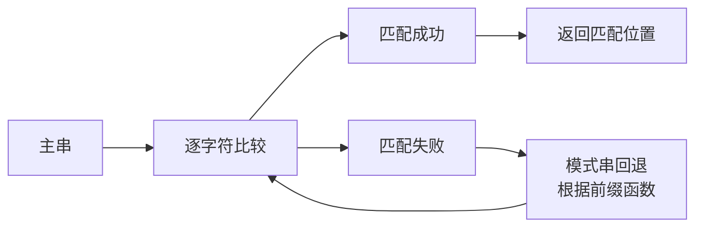

## 本节概述：string 的数据查找

使用 `find` 和 `rfind` 成员函数查找子串或字符，返回找到的位置下标，找不到返回 -1。

## 两个查找函数总览

| 函数 | 搜索方向 | 返回值 |
|---|---|---|
| `find` | 从左往右找 | 找到的位置下标，找不到返回 -1 |
| `rfind` | 从右往左找 | 找到的位置下标，找不到返回 -1 |

## find：从左往右查找

### 字符串匹配原理



### 查找子串

```cpp
string s = "hello woooorld";
int pos = s.find("ooo");
cout << pos << endl;   // 7
```

> [!NOTE]
> `find("ooo")` 在字符串中从左往右找 "ooo" 子串，找到就返回**起始位置**。
> ```
> 下标: 0 1 2 3 4 5 6 7 8 9 10 11 12 13
> 字符: h e l l o   w o o o  o  r  l  d
>                       ↑
>                    位置 7 找到 "ooo"
> ```

### 查找失败

```cpp
int pos = s.find("ooo", 8);   // 从位置 8 开始找
cout << (int)pos << endl;       // -1（找不到）
```

> [!WARNING]
> **找不到时返回的是什么？**
>
> 返回的是 `string::npos`，类型是 `size_t`（unsigned long long）。
> 直接打印会显示一个巨大的数字：`18446744073709551615`
>
> 转成 `int` 就是 **-1**。
>
> 所以判断是否找到的标准写法：
> ```cpp
> if (s.find("ooo") == -1) {       // 或者 string::npos
>     cout << "没找到" << endl;
> }
> ```

### 指定起始位置

```cpp
int pos = s.find("ooo", 5);   // 从位置 5 开始找
cout << pos << endl;           // 7（找到了）
```

> 第二个参数指定从哪个位置开始找，跟 `substr` 的起始位置类似。

### 查找字符

```cpp
int pos1 = s.find('o');        // 找第一个 'o'
cout << pos1 << endl;          // 4

int pos2 = s.find('o', pos1 + 1);  // 从 pos1+1 开始找第二个 'o'
cout << pos2 << endl;               // 7
```

> [!TIP]
> **查找第 N 个字符的技巧**：
> 1. 先 `find` 找第一个 → 得到位置 pos1
> 2. 再从 `pos1 + 1` 开始 `find` → 找到第二个
> 3. 以此类推
>
> ```cpp
> // 函数嵌套调用
> int pos2 = s.find('o', s.find('o') + 1);  // 找第二个 'o'
> ```
> 老师说：嵌套写多了代码会越来越晦涩，不建议写太深。

## rfind：从右往左查找

```cpp
int pos = s.rfind("ooo");
cout << pos << endl;   // 9
```

> [!NOTE]
> `rfind` 从右往左找，找到的第一个匹配结果：
> ```
> 下标: 0 1 2 3 4 5 6 7 8 9 10 11 12 13
> 字符: h e l l o   w o o o  o  r  l  d
>                           ↑
>                        位置 9（从右边数第一个 "ooo" 的起始位置）
> ```
>
> find 返回 7（最左边的匹配），rfind 返回 9（最右边的匹配）。

## find vs rfind 对比

| 对比项 | find | rfind |
|---|---|---|
| 搜索方向 | 从左往右 | 从右往左 |
| 返回值 | 最左边匹配的起始位置 | 最右边匹配的起始位置 |
| 找不到 | -1（string::npos） | -1（string::npos） |
| 参数 | 字符串/字符 + 可选起始位置 | 字符串/字符 + 可选起始位置 |

## 完整代码示例

```cpp
#include <iostream>
#include <string>
using namespace std;

int main() {
    string s = "hello woooorld";

    // 1. 查找子串
    cout << "find ooo: " << s.find("ooo") << endl;       // 7

    // 2. 从指定位置查找
    cout << "find ooo from 5: " << s.find("ooo", 5) << endl;  // 7
    cout << "find ooo from 8: " << (int)s.find("ooo", 8) << endl;  // -1

    // 3. 查找失败判断
    if (s.find("xxx") == -1) {
        cout << "xxx 没找到" << endl;
    }

    // 4. 查找字符
    int pos1 = s.find('o');
    cout << "第一个 o: " << pos1 << endl;               // 4

    int pos2 = s.find('o', pos1 + 1);
    cout << "第二个 o: " << pos2 << endl;               // 7

    // 5. rfind 从右往左
    cout << "rfind ooo: " << s.rfind("ooo") << endl;     // 9

    return 0;
}
```

运行结果：

```
find ooo: 7
find ooo from 5: 7
find ooo from 8: -1
xxx 没找到
第一个 o: 4
第二个 o: 7
rfind ooo: 9
```

## 本章小结

**find** — 从左往右找子串或字符，返回最左边匹配的起始位置。

**rfind** — 从右往左找子串或字符，返回最右边匹配的起始位置。

**找不到** — 返回 `string::npos`，转 int 就是 -1，用 `== -1` 判断。

**指定起始位置** — 第二个参数控制从哪里开始找，可以用来找第 N 个匹配。
