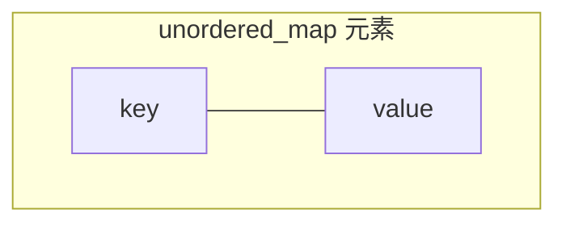
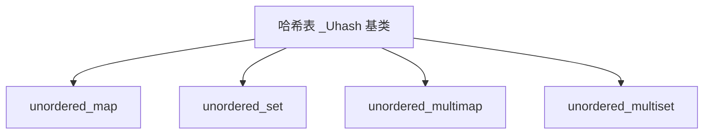
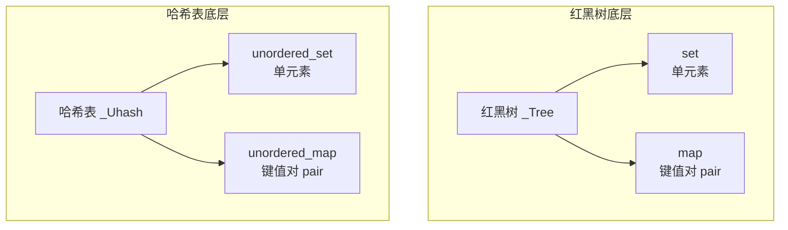

## 本节概述：unordered_map 是什么

unordered_map 是 STL 中的**无序映射容器**，功能和 map 类似——存储的也是键值对（key-value），key 不重复。但底层实现完全不同：map 底层是红黑树，unordered_map 底层是**哈希表**。

## 一、unordered_map 的核心概念

unordered_map 和 map 一样，每个元素都是一个 pair：

- **first = key（键）**
- **second = value（值）**

这就是我们常说的**键值对**。



### unordered_map 的三大特点

| 特点 | 说明 |
|---|---|
| **key 不重复** | 每个 key 只能出现一次，插入重复 key 会失败 |
| **无序** | 元素不按 key 排序，存储顺序取决于哈希值（底层哈希表） |
| **value 不参与哈希** | value 只是和 key 绑定在一起，不影响哈希计算 |

> [!NOTE]
> **还有一个 unordered_multimap**
>
> unordered_multimap 和 unordered_map 的区别就是：**key 可以重复**。
>
> 除了这一点，其他特性和接口基本一致，头文件也都是 `#include <unordered_map>`。

## 二、底层结构：哈希表

unordered_map 和 unordered_set 的底层结构**一模一样**，都是哈希表（`_Uhash` 基类）。



区别只在于哈希表节点存的内容，以及如何从节点中提取 key：

- **unordered_set**：存一个值，哈希键就是这个值本身
- **unordered_map**：存一个 pair，通过 key 提取器（extract）把 pair 的 first 取出来作为哈希键

> 所以 unordered_set 和 unordered_map 很多接口的用法都高度相似，学会 unordered_set 之后学 unordered_map 会非常快。

### 哈希表的结构示意

```mermaid
graph TD
    subgraph 哈希表 buckets
        B0[bucket 0<br/>---]
        B1[bucket 1<br/>(1, 100)]
        B2[bucket 2<br/>(2, 200) -> (12, 300)]
        B3[bucket 3<br/>---]
        B4[bucket 4<br/>(4, 400)]
        B5[bucket 5<br/>---]
        Bn[bucket n-1<br/>---]
    end
    H[hash(key)] --> B0
    H --> B1
    H --> B2
    H --> B3
    H --> B4
    H --> B5
    H --> Bn
```

> key 通过哈希函数计算出一个下标，找到对应的 bucket（桶），然后把键值对放进桶里。
> 如果多个 key 哈希到同一个桶，就用链表串起来（拉链法）。

### 逻辑结构是线性的

虽然物理结构是哈希表，但 unordered_map 同样提供了 `begin()` 和 `end()` 迭代器，你可以像遍历线性容器一样从头走到尾。只不过遍历顺序不是按 key 排序的，而是哈希表的存储顺序。

## 三、set 系列 vs map 系列对比



| 容器 | 底层 | 元素类型 | 排序 | 头文件 |
|---|---|---|---|---|
| set | 红黑树 | 单值 | 有序 | `<set>` |
| map | 红黑树 | pair 键值对 | 按 key 有序 | `<map>` |
| unordered_set | 哈希表 | 单值 | 无序 | `<unordered_set>` |
| unordered_map | 哈希表 | pair 键值对 | 无序 | `<unordered_map>` |

> 规律很清晰：set 存单元素，map 存键值对；前缀 unordered_ 表示底层是哈希表、无序。

## 四、头文件与基本定义

```cpp
#include <unordered_map>   // unordered_map 和 unordered_multimap 都在这个头文件里
using namespace std;

int main() {
    unordered_map<int, int> um;              // key 是 int，value 也是 int
    unordered_map<int, string> um2;          // key 是 int，value 是 string
    unordered_multimap<int, int> umm;        // unordered_multimap，key 可重复
    return 0;
}
```

> unordered_map 需要两个模板参数：第一个是 key 的类型，第二个是 value 的类型。

## 五、为什么叫 unordered_map？

因为它的元素是**无序的**——你插入的顺序和打印出来的顺序不一定一致，而且也不会按 key 的大小排序。

```cpp
unordered_map<int, int> um = {
    pair<int, int>(3, 30),
    pair<int, int>(1, 10),
    pair<int, int>(4, 40),
    pair<int, int>(2, 20)
};

// 打印出来不一定是 1、2、3、4 的顺序，取决于哈希函数和桶的数量
```

> [!TIP]
> **什么时候用 unordered_map，什么时候用 map？**
>
> - **追求查找速度**：用 unordered_map，平均时间复杂度 O(1)
> - **需要有序**：用 map，元素按 key 排好序
> - **内存敏感**：map 更省内存，哈希表有负载因子的空间开销
>
> 实际开发中 unordered_map 用得越来越多，因为大多数场景只需要快速查找，不需要排序。

## 本章小结

**unordered_map = 无序键值对的集合** — 每个元素是一个 pair，first 是 key，second 是 value。

**unordered_map 三大特点** — key 不重复、无序（底层哈希表）、value 不参与哈希。

**底层是哈希表** — 和 unordered_set 共用同一个 _Uhash 基类，通过 key 提取器区分是 set 还是 map。

**set vs map** — set 存单元素，map 存键值对 pair。map 用 pair 的 first 作为哈希键。

**时间复杂度平均 O(1)** — 哈希表查找、插入、删除平均都是常数时间，比红黑树的 O(log n) 更快。

**头文件是 `<unordered_map>`** — 包含 unordered_map 和 unordered_multimap 两种容器。

**unordered_multimap 是 key 可重复版** — 头文件一样，接口差不多，唯一区别是 key 允许重复。
