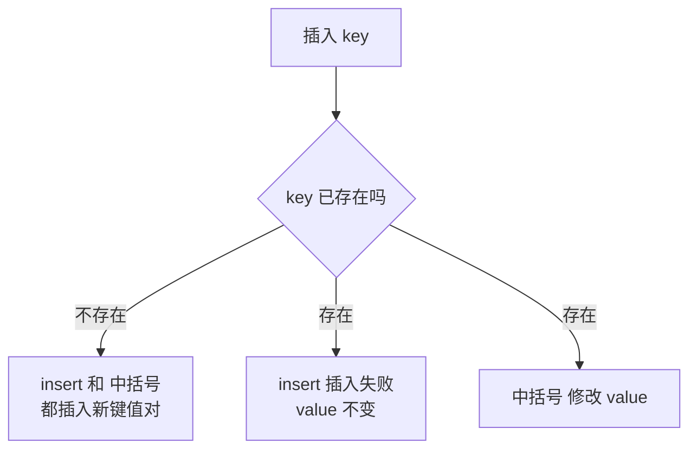

## 本节概述：unordered_map 的数据插入

unordered_map 的插入方式看起来有很多种，但本质上只有两类：**insert 插入**和**下标 中括号 插入**。两者在 key 已存在时的行为完全不同，这是本节课的重点。

## 打印函数

```cpp
#include <iostream>
#include <unordered_map>
using namespace std;

void printMap(const unordered_map<int, int>& um) {
    for (unordered_map<int, int>::const_iterator it = um.begin(); it != um.end(); ++it) {
        cout << "key=" << it->first
             << " value=" << it->second << endl;
    }
    cout << "----------------" << endl;
}
```

## 一、insert 插入（3 种写法）

`insert` 是正经的插入函数，参数是一个 pair。写 pair 的方式有三种，但本质都是调用 insert。

### 写法 1：pair 构造函数

```cpp
unordered_map<int, int> um;
um.insert(pair<int, int>(1, 18));
printMap(um);
// key=1 value=18
```

### 写法 2：make_pair 函数

```cpp
um.insert(make_pair(3, 20));
printMap(um);
// key=1 value=18
// key=3 value=20
```

> `make_pair` 是一个函数模板，能自动推导类型，写起来比 `pair<int, int>(...)` 省事一点。

### 写法 3：value_type

```cpp
um.insert(unordered_map<int, int>::value_type(2, 78));
printMap(um);
// key=1 value=18
// key=2 value=78
// key=3 value=20
```

> `unordered_map<int, int>::value_type` 其实就是 `pair<const int, int>` 的别名，这种写法比较偏底层，了解即可。

> [!TIP]
> **三种写法，一种本质**
>
> 上面三种写法都是调用同一个 `insert` 函数，只是构造 pair 的方式不同。
>
> 日常开发记住一种就行，推荐 `make_pair` 最简洁。

## 二、下标 中括号 插入（最方便）

unordered_map 重载了 `中括号` 运算符，可以像数组一样用下标插入：

```cpp
um[4] = 6;
printMap(um);
// key=1 value=18
// key=2 value=78
// key=3 value=20
// key=4 value=6
```

> 写起来最舒服，也是实际开发中用得最多的方式。

## 三、insert 和 中括号 的核心区别

两种方式在 key **不存在**的时候效果一样——都是插入新的键值对。

但在 key **已经存在**的时候，两者行为完全不同：

### insert：key 存在则插入失败

```cpp
// 现在 um 里已经有 key=3，value=20
pair<unordered_map<int, int>::iterator, bool> ret;
ret = um.insert(make_pair(3, 21));   // 再插一个 key=3 的

cout << "insert(3, 21) 是否成功：" << ret.second << endl;   // 0（失败）
printMap(um);
// key=3 的 value 还是 20，没有变成 21
```

> `insert` 的返回值是一个 pair：
> - **first**：指向插入位置（或已存在元素）的迭代器
> - **second**：bool 类型，`true` 表示插入成功，`false` 表示 key 已存在、插入失败
>
> 只要 key 已经在 unordered_map 里了，insert 就什么也不做，value 不会被覆盖。

### 中括号：key 存在则修改 value

```cpp
um[3] = 22;   // key=3 已经存在
printMap(um);
// key=3 value=22   ← value 被改成了 22
```

> 用 `中括号` 访问一个已存在的 key 时，返回的是该 key 对应 value 的引用，所以你可以直接赋值修改它。

### 对比总结



| 方式 | key 不存在时 | key 存在时 |
|---|---|---|
| **insert** | 插入新键值对 | 插入失败，value 不变 |
| **中括号** | 插入新键值对（value 为默认值） | 修改 value 的值 |

## 四、中括号 的一个坑：访问即插入

用 `中括号` 访问一个不存在的 key 时，即使你只是"读一下"，它也会自动把这个 key 插入进去（value 设为默认值）。

```cpp
unordered_map<int, int> um = {
    pair<int, int>(1, 10),
    pair<int, int>(2, 20)
};

cout << "um[0] = " << um[0] << endl;   // 只是读一下 um[0]
printMap(um);
// key=0 value=0   ← 0 被自动插进来了！
// key=1 value=10
// key=2 value=20
```

> [!WARNING]
> **中括号 是有副作用的**
>
> 如果你只是想"查找"一个 key 是否存在，千万不要用 `中括号`——它会偷偷把 key 插入到 unordered_map 里，改变 unordered_map 的内容。
>
> 查找应该用 `find` 函数（下节课会讲）。
>
> 只有在你确定要插入或修改的时候，才用 `中括号`。

## insert vs 中括号 怎么选？

| 场景 | 推荐方式 | 原因 |
|---|---|---|
| 只想插入，不想覆盖 | insert | 安全，key 已存在时不会修改 |
| 想插入或修改都可以 | 中括号 | 方便，写起来简洁 |
| 需要知道插入是否成功 | insert | 返回值的 second 告诉你成功还是失败 |

## 完整代码示例

```cpp
#include <iostream>
#include <unordered_map>
using namespace std;

void printMap(const unordered_map<int, int>& um) {
    for (unordered_map<int, int>::const_iterator it = um.begin(); it != um.end(); ++it) {
        cout << "key=" << it->first
             << " value=" << it->second << endl;
    }
    cout << "----------------" << endl;
}

int main() {
    unordered_map<int, int> um;

    // === insert 的三种写法 ===
    um.insert(pair<int, int>(1, 18));
    um.insert(make_pair(3, 20));
    um.insert(unordered_map<int, int>::value_type(2, 78));
    cout << "insert 后：" << endl;
    printMap(um);

    // === 下标插入 ===
    um[4] = 6;
    cout << "下标插入后：" << endl;
    printMap(um);

    // === key 已存在时，insert 不修改 ===
    pair<unordered_map<int, int>::iterator, bool> ret;
    ret = um.insert(make_pair(3, 21));
    cout << "insert(3, 21) 成功：" << ret.second << endl;
    cout << "insert 重复 key 后：" << endl;
    printMap(um);

    // === key 已存在时，中括号 会修改 ===
    um[3] = 22;
    cout << "um[3] = 22 后：" << endl;
    printMap(um);

    // === 中括号 访问不存在的 key 会自动插入 ===
    cout << "um[0] = " << um[0] << endl;
    cout << "访问 um[0] 后：" << endl;
    printMap(um);

    return 0;
}
```

运行结果（顺序不固定）：

```
insert 后：
key=2 value=78
key=3 value=20
key=1 value=18
----------------
下标插入后：
key=4 value=6
key=2 value=78
key=3 value=20
key=1 value=18
----------------
insert(3, 21) 成功：0
insert 重复 key 后：
key=4 value=6
key=2 value=78
key=3 value=20
key=1 value=18
----------------
um[3] = 22 后：
key=4 value=6
key=2 value=78
key=3 value=22
key=1 value=18
----------------
um[0] = 0
访问 um[0] 后：
key=4 value=6
key=2 value=78
key=3 value=22
key=1 value=18
key=0 value=0
----------------
```

## 本章小结

**插入两大类** — insert 和 下标 中括号，日常用 中括号 最方便。

**insert 的三种写法** — pair 构造、make_pair、value_type，本质都一样，记住一种就行。

**insert 返回 pair** — first 是迭代器，second 是 bool（是否插入成功）。

**核心区别** — key 不存在时两者都插入；key 存在时 insert 不修改，中括号 会修改 value。

**中括号 有副作用** — 访问不存在的 key 会自动插入（value 为默认值）。查找请用 find，不要用 中括号。

**时间复杂度平均 O(1)** — 哈希表插入，效率比红黑树更高。
