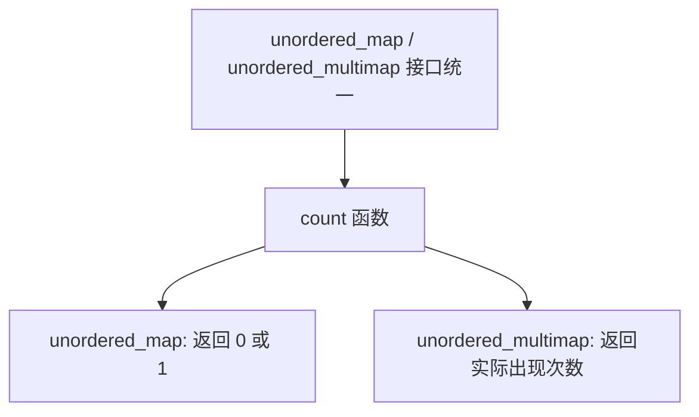

## 本节概述：unordered_map 的数据统计

unordered_map 的数据统计用 `count` 函数，统计某个 key 在 unordered_map 中出现了多少次。因为 unordered_map 的 key 不重复，所以它的返回值只有两种可能：**0 或 1**。

## count 的基本用法

```cpp
#include <iostream>
#include <unordered_map>
using namespace std;

int main() {
    unordered_map<int, int> um = {
        pair<int, int>(1, 4),
        pair<int, int>(3, 20),
        pair<int, int>(2, 80),
        pair<int, int>(4, 90)
    };

    for (int i = -1; i <= 2; ++i) {
        cout << "key=" << i
             << " 出现次数：" << um.count(i) << endl;
    }

    return 0;
}
```

运行结果：

```
key=-1 出现次数：0
key=0 出现次数：0
key=1 出现次数：1
key=2 出现次数：1
```

> 对于 unordered_map 来说，`count(key)` 要么返回 0（key 不存在），要么返回 1（key 存在）。

## 为什么叫 count 不叫 has？

既然 unordered_map 的 count 只有 0 和 1 两种结果，本质上就是判断"有没有"，那为什么函数名不叫 `has` 或者 `contains` 呢？

答案和 map 一样：**为了和 unordered_multimap 保持接口统一**。



> unordered_multimap 允许 key 重复，所以它的 `count` 返回的是真正的数量（可以是 0、1、2、3……）。
>
> unordered_map 和 unordered_multimap 用同一个函数名 `count`，是 STL 接口设计的统一性体现。

## unordered_multimap 的 count（扩展）

unordered_multimap 支持重复 key，所以 count 的返回值就丰富了：

```cpp
#include <iostream>
#include <unordered_map>   // unordered_multimap 也在这个头文件里
using namespace std;

int main() {
    unordered_multimap<int, int> umm = {
        pair<int, int>(1, 10),
        pair<int, int>(1, 20),
        pair<int, int>(1, 30),
        pair<int, int>(1, 40),
        pair<int, int>(2, 50),
        pair<int, int>(2, 60),
        pair<int, int>(3, 70),
        pair<int, int>(4, 80)
    };

    for (int i = -1; i <= 4; ++i) {
        cout << "key=" << i
             << " 出现次数：" << umm.count(i) << endl;
    }

    return 0;
}
```

运行结果：

```
key=-1 出现次数：0
key=0 出现次数：0
key=1 出现次数：4
key=2 出现次数：2
key=3 出现次数：1
key=4 出现次数：1
```

> unordered_multimap 的 `count` 才真正体现了"统计数量"的含义。

## unordered_map 和 unordered_multimap 的区别

| 特性 | unordered_map | unordered_multimap |
|---|---|---|
| key 重复 | 不允许 | 允许 |
| count 返回值 | 0 或 1 | 0、1、2……（实际数量） |
| 头文件 | `#include <unordered_map>` | `#include <unordered_map>` |
| 其他接口 | 基本一致 | 基本一致 |

> [!NOTE]
> **unordered_multimap 也是无序的**
>
> unordered_multimap 的底层也是哈希表，所以元素同样是无序的。和 unordered_map 的唯一区别就是：unordered_multimap 允许 key 重复。
>
> 其他接口（insert、find、erase、size、empty 等）用法基本一致。

## 时间复杂度

`count` 的平均时间复杂度是 **O(1)**，和 `find` 一样。

> 底层都是哈希表的查找操作，先通过哈希找到对应的桶，再统计桶内相同 key 的节点数。对于 unordered_map 来说，找到就返回 1，找不到就返回 0。

## 完整代码示例

```cpp
#include <iostream>
#include <unordered_map>
using namespace std;

int main() {
    // === unordered_map 的 count ===
    unordered_map<int, int> um = {
        pair<int, int>(1, 4),
        pair<int, int>(3, 20),
        pair<int, int>(2, 80),
        pair<int, int>(4, 90)
    };
    cout << "=== unordered_map ===" << endl;
    for (int i = -1; i <= 4; ++i) {
        cout << "key=" << i
             << " 出现次数：" << um.count(i) << endl;
    }

    // === unordered_multimap 的 count ===
    unordered_multimap<int, int> umm = {
        pair<int, int>(1, 10),
        pair<int, int>(1, 20),
        pair<int, int>(1, 30),
        pair<int, int>(1, 40),
        pair<int, int>(2, 50),
        pair<int, int>(2, 60),
        pair<int, int>(3, 70),
        pair<int, int>(4, 80)
    };
    cout << "\n=== unordered_multimap ===" << endl;
    for (int i = -1; i <= 4; ++i) {
        cout << "key=" << i
             << " 出现次数：" << umm.count(i) << endl;
    }

    return 0;
}
```

运行结果：

```
=== unordered_map ===
key=-1 出现次数：0
key=0 出现次数：0
key=1 出现次数：1
key=2 出现次数：1
key=3 出现次数：1
key=4 出现次数：1

=== unordered_multimap ===
key=-1 出现次数：0
key=0 出现次数：0
key=1 出现次数：4
key=2 出现次数：2
key=3 出现次数：1
key=4 出现次数：1
```

## 本章小结

**count 统计 key 出现次数** — `um.count(key)` 返回 key 在 unordered_map 中出现的次数。

**unordered_map 的 count 只有 0 或 1** — 因为 key 不重复，所以 count 本质就是判断"有没有"。

**为什么叫 count 不叫 has** — 为了和 unordered_multimap 接口统一。unordered_multimap 的 count 返回真正的数量。

**时间复杂度平均 O(1)** — 和 find 一样，哈希表查找效率高。

**unordered_multimap 是 unordered_map 的"重复 key 版"** — 除了允许 key 重复，其他特性和接口基本一致，头文件也都是 `#include <unordered_map>`。

**count 参数是 key** — 统计的是 key 的出现次数，和 value 没关系。

**统一接口设计** — STL 的设计哲学：相同语义用相同函数名，map/multimap 如此，unordered_map/unordered_multimap 也是如此。
