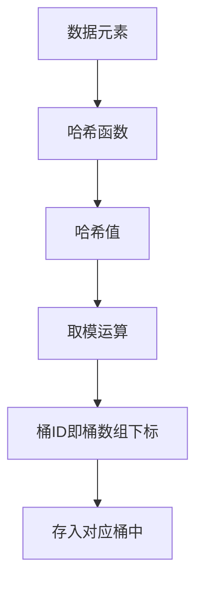
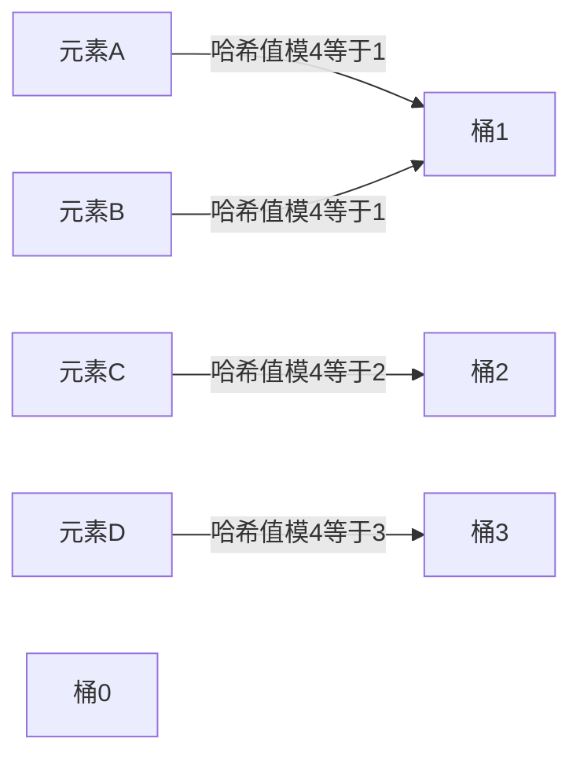
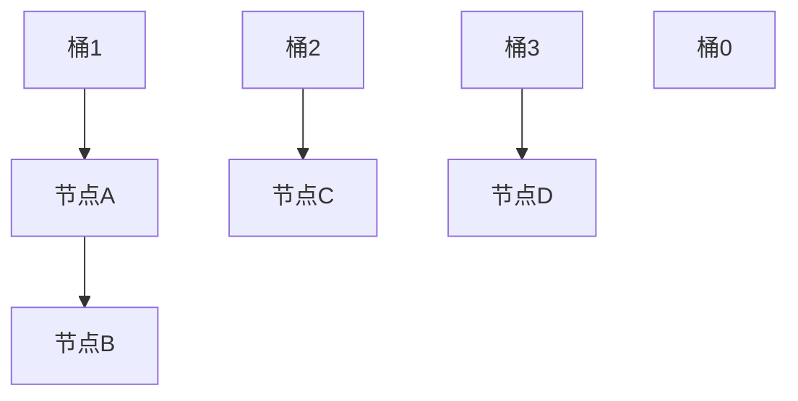

## 本节概述：unordered_set 是什么

unordered_set 中文叫**无序集合**，底层用的是**哈希表**（Hash Table）。它和 set 一样，元素不重复，但元素是无序的——既不是插入顺序，也不是数值顺序。增删改查的均摊时间复杂度是 **O(1)**，比 set 的 O(log n) 更快。

## unordered_set 的两大核心特点

| 特点 | 说明 |
|---|---|
| **元素不重复** | 同一个值在 unordered_set 中只能出现一次 |
| **元素无序** | 元素没有固定顺序，由哈希表底层结构决定 |

> [!NOTE]
> **还有一个 unordered_multiset**
>
> unordered_multiset 也是 STL 容器，它**支持元素重复**。除了"元素可重复"这一点之外，其他特性和 unordered_set 完全一致。
>
> 头文件也是同一个：`#include <unordered_set>`

## 底层结构：哈希表

vector 是数组、list 是链表、set 是红黑树，而 unordered_set 是**哈希表**。

哈希表的核心思想很简单：**用哈希函数把数据转成一个数字（哈希值），再用这个数字去定位存储位置。**

### 哈希表的工作原理



1. 每个元素通过**哈希函数**计算出一个哈希值
2. 哈希值对桶的数量**取模**，得到桶的编号（桶数组的下标）
3. 元素被放入对应编号的**桶**里

### 哈希冲突

理想情况下，每个元素算出来的桶ID都不一样，但现实中不同的元素可能算出相同的桶ID，这就叫**哈希冲突**。



> 元素A和元素B的哈希值取模后都是1，它们都要进桶1，这就是哈希冲突。

### 解决方案：链地址法

STL 的 unordered_set 采用**链地址法**解决哈希冲突：每个桶不是只存一个元素，而是存一个链表。冲突的元素都挂在同一个桶的链表上。



> 桶1里有两个元素A和B，它们通过链表串联起来。

## STL 底层实现细节

unordered_set 的底层比上面说的还要精巧一些：

| 组成部分 | 说明 |
|---|---|
| **桶数组（vector）** | 存每个桶的链表节点位置 |
| **全局双向链表（list）** | 所有哈希节点串联成一个大链表 |
| **虚拟头节点** | 链表的哨兵节点，简化边界处理 |

每个桶在桶数组中对应两个位置：`bucket*2` 和 `bucket*2+1`，分别指向该桶链表的头尾节点位置。所有节点又串联成一条全局的双向链表。

### 桶长度是 2 的幂

桶的数量始终是 **2 的幂**（比如 8、16、32、64……）。为什么要这么设计？

因为可以用**位运算替代取模运算**：

- 普通取模：`hash_value % bucket_count`
- 位运算：`hash_value & (bucket_count - 1)`

位运算比取模运算快得多，这是一个常见的性能优化技巧。

> [!TIP]
> **为什么 2 的幂可以用位运算？**
>
> 假设桶数量是 8（二进制 1000），那么 `bucket_count - 1 = 7`（二进制 0111）。
>
> 任何数和 7 做按位与运算，结果就是这个数除以 8 的余数——和取模效果完全一样，但速度更快。

## 头文件与基本用法

```cpp
#include <iostream>
#include <unordered_set>   // unordered_set 和 unordered_multiset 都在这个头文件里
using namespace std;

int main() {
    unordered_set<int> us;           // 定义一个 unordered_set
    unordered_multiset<int> ums;     // 定义一个 unordered_multiset
    return 0;
}
```

> [!TIP]
> **unordered_set 和 unordered_multiset 共用一个头文件**
>
> 只需要 `#include <unordered_set>`，两种容器都能用。后续课程介绍的增删改查接口，两者基本都一样。

## 本章小结

**unordered_set = 无序 + 不重复** — 元素唯一，但没有固定顺序，底层是哈希表。

**unordered_multiset = 无序 + 可重复** — 除了允许重复元素，其他和 unordered_set 一样。

**底层是哈希表** — 数据通过哈希函数转哈希值，取模得到桶ID，存入对应桶中。均摊时间复杂度 O(1)。

**哈希冲突用链地址法解决** — 每个桶对应一个链表，冲突的元素挂在同一个链表上。

**STL 底层 = vector + list** — 桶数组用 vector，节点用全局双向链表串联，桶长度是 2 的幂，用位运算替代取模。

**头文件只有一个** — `#include <unordered_set>` 同时包含 unordered_set 和 unordered_multiset。
