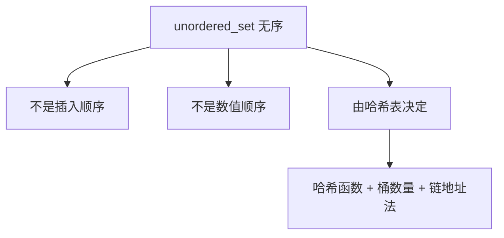

## 本节概述：unordered_set 的对象创建

unordered_set 的对象创建和 set 很像——默认构造、初始化列表、迭代器区间、拷贝构造，四种方式基本一致。但 unordered_set 有两个独特点需要格外注意：**元素是无序的**和**元素不重复**。

## 打印函数：迭代器遍历

先写一个通用的打印函数，后面所有例子都用它。

```cpp
#include <iostream>
#include <unordered_set>
using namespace std;

void printUSet(const unordered_set<int>& us) {
    for (unordered_set<int>::const_iterator it = us.begin(); it != us.end(); ++it) {
        cout << *it << " ";
    }
    cout << endl;
}
```

> [!TIP]
> **const 容器要用 const_iterator**
>
> 函数参数是 `const unordered_set<int>& us`（const 引用），说明不打算修改它。
> 这时候迭代器也必须用 `const_iterator`，不能用普通的 `iterator`——否则编译器会报错。
>
> 记住规律：容器是 const 的，迭代器就用 const_iterator。

## 四种创建方式总览

| 方式 | 语法 | 说明 |
|---|---|---|
| 1. 默认构造 | `unordered_set<int> us` | 空集合 |
| 2. 初始化列表 | `unordered_set<int> us {a, b, c}` | 大括号直接给数据 |
| 3. 迭代器区间 | `unordered_set<int> us(begin, end)` | 左闭右开拷贝 |
| 4. 拷贝构造 | `unordered_set<int> us(other)` | 复制另一个 unordered_set |

## 方式一：默认构造

```cpp
unordered_set<int> us1;
cout << "us1: ";
printUSet(us1);   // （空，什么都不输出）
```

> 默认构造函数创建一个**空的**无序集合，size = 0。这个和 vector、list、set 都一样。

## 方式二：初始化列表

两种写法都可以：

```cpp
// 写法一：等号 + 大括号
unordered_set<int> us2_1 = {9, 8, 7, 6, 5};
cout << "us2_1: ";
printUSet(us2_1);   // 顺序不确定，取决于哈希表结构

// 写法二：直接大括号
unordered_set<int> us2_2 {9, 8, 7, 7, 6, 5};
cout << "us2_2: ";
printUSet(us2_2);   // 顺序不确定，只有 5 个元素（去重了）
```

> [!NOTE]
> **注意两个细节**
>
> 1. **无序**：我插入的是 9 8 7 6 5，输出顺序既不是插入顺序也不是数值顺序，而是由哈希表的底层结构决定的。每次运行结果可能都不一样。
>
> 2. **自动去重**：us2_2 里传了两个 7，但最终只有一个 7。unordered_set 不允许重复元素，重复的会被自动丢弃。
>
> 如果需要支持重复元素，请用 `unordered_multiset`。

## 方式三：迭代器区间

```cpp
unordered_set<int> us3(us2_1.begin(), us2_1.end());
cout << "us3: ";
printUSet(us3);   // 5 个元素，顺序不确定
```

> [!TIP]
> 迭代器区间是**左闭右开** `[begin, end)`：包含起点，不包含终点。
>
> 而且这里的迭代器不一定非得是 unordered_set 的迭代器——vector、list 等其他容器的迭代器也可以，只要元素类型匹配就行。

## 方式四：拷贝构造

```cpp
unordered_set<int> us4(us2_2);
cout << "us4: ";
printUSet(us4);   // 5 个元素，顺序不确定
```

> 括号里传另一个 unordered_set 对象，完整拷贝一份。
> 函数签名：`unordered_set(const unordered_set& other)`

## 关于无序的理解



> 很多初学者会问："为什么我插入 1 2 3 4 5，打印出来是 5 4 3 2 1？"或者"为什么每次运行顺序都不一样？"
>
> 答案很简单：unordered_set 本来就是**无序**的。它的内部排列完全取决于哈希函数和桶的分配，没有任何可预测的顺序。使用 unordered_set 时，不要关心元素的顺序，只需要关心"元素在不在里面"。

## 完整代码示例

```cpp
#include <iostream>
#include <unordered_set>
using namespace std;

void printUSet(const unordered_set<int>& us) {
    for (unordered_set<int>::const_iterator it = us.begin(); it != us.end(); ++it) {
        cout << *it << " ";
    }
    cout << endl;
}

int main() {
    // 1. 默认构造
    unordered_set<int> us1;
    cout << "us1: "; printUSet(us1);

    // 2. 初始化列表（两种写法）
    unordered_set<int> us2_1 = {9, 8, 7, 6, 5};
    cout << "us2_1: "; printUSet(us2_1);

    unordered_set<int> us2_2 {9, 8, 7, 7, 6, 5};
    cout << "us2_2: "; printUSet(us2_2);

    // 3. 迭代器区间
    unordered_set<int> us3(us2_1.begin(), us2_1.end());
    cout << "us3: "; printUSet(us3);

    // 4. 拷贝构造
    unordered_set<int> us4(us2_2);
    cout << "us4: "; printUSet(us4);

    return 0;
}
```

运行结果（顺序可能不同）：

```
us1: 
us2_1: 5 6 7 8 9 
us2_2: 5 6 7 8 9 
us3: 5 6 7 8 9 
us4: 5 6 7 8 9 
```

> [!WARNING]
> **不要依赖 unordered_set 的遍历顺序**
>
> 上面的运行结果只是一个示例，你的输出顺序可能完全不同。
>
> unordered_set 的遍历顺序是不确定的，不同编译器、不同运行环境、甚至不同次运行都可能不一样。
>
> 写代码时绝对不要假设元素会按某种顺序排列，否则会出 bug。

## 本章小结

**四种创建方式** — 默认构造、初始化列表（等号版和括号版都行）、迭代器区间、拷贝构造。

**元素是无序的** — 打印顺序既不是插入顺序也不是数值顺序，由哈希表底层结构决定，不要依赖顺序。

**自动去重** — 重复元素不会被插入，unordered_set 里每个值唯一。想支持重复就用 unordered_multiset。

**打印函数用 const_iterator** — const 引用传参时，迭代器必须用 const_iterator，否则报错。

**跟 set 接口高度一致** — 创建方式基本一样，核心区别就是：set 有序 O(log n)，unordered_set 无序 O(1)。
