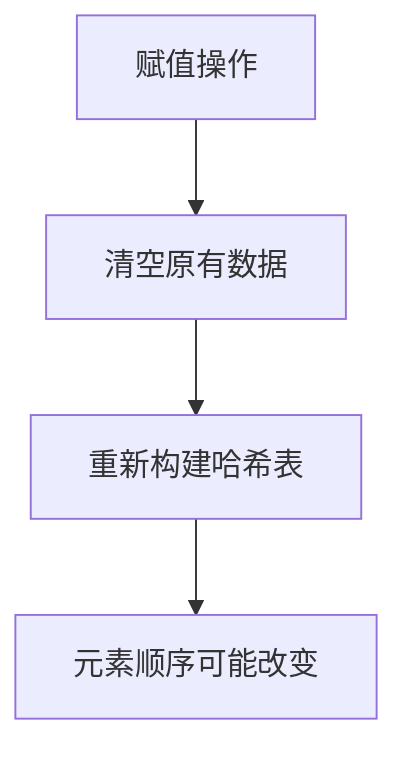

## 本节概述：unordered_set 的赋值操作

unordered_set 的赋值操作主要有两种：用另一个 unordered_set 对象赋值，和用初始化列表赋值。底层都是 `operator=` 的运算符重载。

## 先准备一个初始集合

```cpp
#include <iostream>
#include <unordered_set>
using namespace std;

void printUSet(const unordered_set<int>& us) {
    for (unordered_set<int>::const_iterator it = us.begin(); it != us.end(); ++it) {
        cout << *it << " ";
    }
    cout << endl;
}

int main() {
    unordered_set<int> us = {9, 8, 5, 2, 1, 1};
    cout << "us: ";
    printUSet(us);   // 5 个元素，顺序不确定
    return 0;
}
```

> [!NOTE]
> **定义时的等号 = 构造，不是赋值**
>
> `unordered_set<int> us = {9, 8, 5, 2, 1, 1};` 这行看起来像赋值，实际上走的是**构造函数**（初始化列表构造）。
>
> 只有在对象已经创建好之后，再用等号才是真正的赋值操作。

## 方式一：对象赋值

把一个 unordered_set 完整赋值给另一个 unordered_set：

```cpp
unordered_set<int> us1;
us1 = us;              // 把 us 赋值给 us1
cout << "us1: ";
printUSet(us1);        // 5 个元素，顺序可能和 us 相同或不同
```

> 底层调用的是 `operator=(const unordered_set& other)`，先清空自己，再把对方的元素全部拷贝过来，重新构建哈希表。

## 方式二：初始化列表赋值

直接用大括号给 unordered_set 赋值：

```cpp
unordered_set<int> us2;
us2 = {3, 4, 5};       // 用初始化列表赋值
cout << "us2: ";
printUSet(us2);        // 3 个元素：3 4 5，顺序不确定
```

> 底层调用的是 `operator=(initializer_list<T> il)`，同样是先清空，再把列表里的元素插入哈希表。

## 赋值后顺序可能不同



> 赋值操作不是简单地把元素一个个复制过去，而是会**重新构建哈希表**。所以赋值后元素的遍历顺序可能和原对象不一样——这很正常。
>
> 还是那句话：**unordered_set 不要在意顺序，只关心元素有无。**

> [!TIP]
> **核心观点：unordered_set 不关心顺序**
>
> 使用 unordered_set 的时候，你应该忘掉"顺序"这个概念。
>
> 你只需要关心：
> - 某个元素**在不在**集合里
> - 集合里**有多少个**元素
> - 插入和删除**快不快**
>
> 至于元素怎么排列的，不重要。如果需要有序，请用 set。

## 为什么赋值运算符要返回值？

你有没有想过——赋值运算符的返回值为什么是 `unordered_set&` 而不是 `void`？

因为要支持**连续赋值**：

```cpp
unordered_set<int> a, b, c;
a = b = c = {1, 2, 3};   // 连续赋值
```

**执行顺序**：从右往左

1. 先执行 `c = {1, 2, 3}`，返回 `c` 的引用
2. 再执行 `b = c`（其实是 `b = c的引用`），返回 `b` 的引用
3. 最后执行 `a = b`

如果返回值是 `void`，那么第一步执行完就变成了 `void`，第二步 `b = void` 就会编译报错。

> [!TIP]
> **赋值运算符返回自身引用**
>
> 这是 C++ 面向对象的一个通用规则：赋值运算符 `operator=` 必须返回对象自身的引用（`*this`），才能支持连续赋值的语法。

## 完整代码示例

```cpp
#include <iostream>
#include <unordered_set>
using namespace std;

void printUSet(const unordered_set<int>& us) {
    for (unordered_set<int>::const_iterator it = us.begin(); it != us.end(); ++it) {
        cout << *it << " ";
    }
    cout << endl;
}

int main() {
    unordered_set<int> us = {9, 8, 5, 2, 1, 1};
    cout << "us: "; printUSet(us);

    // 1. 对象赋值
    unordered_set<int> us1;
    us1 = us;
    cout << "us1: "; printUSet(us1);

    // 2. 初始化列表赋值
    unordered_set<int> us2;
    us2 = {3, 4, 5};
    cout << "us2: "; printUSet(us2);

    // 3. 连续赋值
    unordered_set<int> a, b, c;
    a = b = c = {1, 2, 3};
    cout << "a: "; printUSet(a);
    cout << "b: "; printUSet(b);
    cout << "c: "; printUSet(c);

    return 0;
}
```

运行结果（顺序可能不同）：

```
us: 1 2 5 8 9 
us1: 1 2 5 8 9 
us2: 3 4 5 
a: 1 2 3 
b: 1 2 3 
c: 1 2 3 
```

## 本章小结

**两种赋值方式** — 对象赋值（`us1 = us`）和初始化列表赋值（`us2 = {3, 4, 5}`），底层都是 `operator=` 重载。

**定义时的等号 = 构造** — 只有对象已创建后再用等号才是赋值，不要搞混。

**赋值后顺序可能不同** — 赋值操作会重新构建哈希表，元素顺序可能改变。但这没关系，unordered_set 本来就无序。

**赋值运算符返回自身引用** — 目的是支持连续赋值（`a = b = c`），这是 C++ 的通用规则。

**赋值会先清空再拷贝** — 不管哪种赋值，都会先丢掉原来的数据，再重新构建哈希表插入新数据。

**核心心态** — 用 unordered_set 就不要在意顺序，只关心元素有无。
