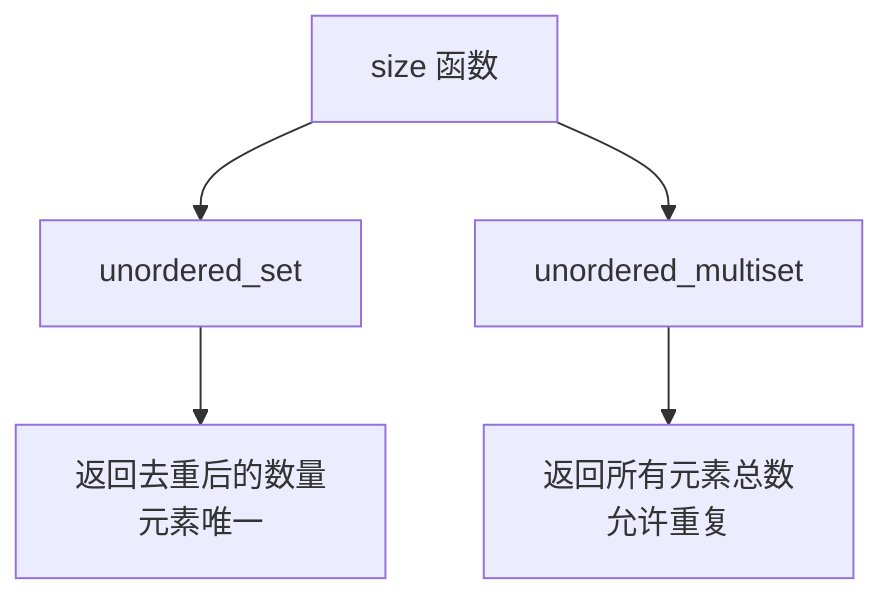

## 本节概述：unordered_set 的大小操作

unordered_set 的大小操作和其他容器完全一致——就两个接口：`empty()` 判空，`size()` 获取元素个数。非常简单。

## 两个接口

| 函数 | 返回值 | 作用 |
|---|---|---|
| `us.empty()` | `bool` | 集合为空返回 true，否则返回 false |
| `us.size()` | `size_t` | 返回集合中元素的个数 |

## 空集合的情况

```cpp
#include <iostream>
#include <unordered_set>
using namespace std;

int main() {
    unordered_set<int> us1;   // 默认构造，空集合

    cout << "us1.empty() = " << us1.empty() << endl;   // 1（true，空）
    cout << "us1.size()  = " << us1.size()  << endl;   // 0（0 个元素）

    return 0;
}
```

运行结果：

```
us1.empty() = 1
us1.size()  = 0
```

> 空集合：`empty()` 返回 `true`（打印出来是 1），`size()` 返回 0。

## 非空集合的情况

```cpp
unordered_set<int> us2 = {1, 1, 1, 1, 6, 7, 8, 9};

cout << "us2.empty() = " << us2.empty() << endl;   // 0（false，非空）
cout << "us2.size()  = " << us2.size()  << endl;   // 5
```

运行结果：

```
us2.empty() = 0
us2.size()  = 5
```

> [!NOTE]
> **为什么 size 是 5，不是 8？**
>
> 我传了 8 个元素进去：四个 1，加上 6、7、8、9。
>
> 但 unordered_set 不允许重复元素，四个 1 实际上只保留了一个。所以最终集合里只有 **1、6、7、8、9** 五个元素，size = 5。
>
> 这又复习了一遍 unordered_set 的核心特性：**元素不重复**。

## 对比 unordered_multiset



| 容器 | 是否允许重复 | size 含义 |
|---|---|---|
| `unordered_set` | 不允许 | 去重后的元素个数 |
| `unordered_multiset` | 允许 | 所有元素的总数（含重复） |

> unordered_multiset 支持重复元素，所以它的 size 就是所有元素的实际数量。
>
> 比如 `unordered_multiset<int> ums = {1, 1, 1, 6, 7, 8, 9};` 的 size 是 7，不是 5。

## 完整代码示例

```cpp
#include <iostream>
#include <unordered_set>
using namespace std;

int main() {
    // 空集合
    unordered_set<int> us1;
    cout << "us1.empty() = " << us1.empty() << endl;
    cout << "us1.size()  = " << us1.size()  << endl;

    cout << "----------------" << endl;

    // 非空集合
    unordered_set<int> us2 = {1, 1, 1, 1, 6, 7, 8, 9};
    cout << "us2.empty() = " << us2.empty() << endl;
    cout << "us2.size()  = " << us2.size()  << endl;

    cout << "----------------" << endl;

    // unordered_multiset 对比
    unordered_multiset<int> ums = {1, 1, 1, 1, 6, 7, 8, 9};
    cout << "ums.size()  = " << ums.size()  << endl;   // 8（所有元素都算）

    return 0;
}
```

运行结果：

```
us1.empty() = 1
us1.size()  = 0
----------------
us2.empty() = 0
us2.size()  = 5
----------------
ums.size()  = 8
```

## 本章小结

**两个接口** — `empty()` 判空，`size()` 获取元素个数。所有 STL 容器都是这俩，高度统一。

**unordered_set 的 size 是去重后的数量** — 因为不允许重复元素，所以 size 一定 ≤ 你插入的元素总数。

**unordered_multiset 的 size 是总数** — 支持重复元素，size 就是所有元素的实际数量。

**这节课很简单** — 但它是后面操作的基础，插入、删除后都常用 size 来判断容器状态。
