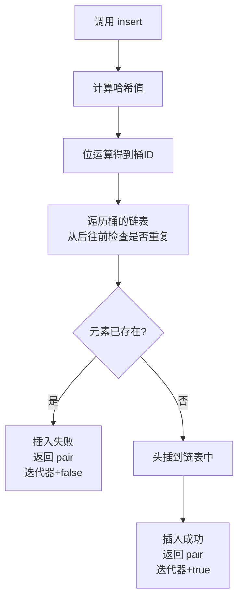

## 本节概述：unordered_set 的数据插入

unordered_set 的插入用 `insert` 函数。插入操作有两个核心特点：**元素无序排列**、**重复元素不会被插入**。时间复杂度均摊 O(1)。

## 打印函数

```cpp
#include <iostream>
#include <unordered_set>
#include <vector>
using namespace std;

void printUSet(const unordered_set<int>& us) {
    for (unordered_set<int>::const_iterator it = us.begin(); it != us.end(); ++it) {
        cout << *it << " ";
    }
    cout << endl;
}
```

## 方式一：插入单个元素

最常用的插入方式——直接传一个值：

```cpp
unordered_set<int> us;
us.insert(3);
us.insert(1);
us.insert(4);
us.insert(2);
us.insert(5);
printUSet(us);   // 元素顺序不确定，取决于哈希表
```

> 不管你按什么顺序插入，最终元素都在哈希表里，遍历顺序由哈希结构决定。

### 插入会打乱顺序

我们每插一个就打印一次，看看顺序怎么变化：

```cpp
unordered_set<int> us;

us.insert(3); printUSet(us);   // 3
us.insert(2); printUSet(us);   // 顺序可能变化
us.insert(5); printUSet(us);   // 顺序可能变化
us.insert(4); printUSet(us);   // 顺序可能变化
us.insert(1); printUSet(us);   // 顺序可能变化
```

运行结果（顺序可能不同）：

```
3 
2 3 
2 3 5 
2 3 4 5 
1 2 3 4 5 
```

> [!NOTE]
> **插入会打乱原来的顺序**
>
> 和 set 插入后保持有序不同，unordered_set 每次插入新元素后，之前元素的相对顺序可能会变化。
>
> 这是因为插入可能触发**扩容（rehash）**——桶数量不够时会扩容并重新分配所有元素的位置。
>
> 还是那句话：不要关心顺序，只关心元素在不在。

## 方式二：make_pair 风格

对于 set 来说，插入就是直接传值，所以很简单。unordered_set 也一样：

```cpp
unordered_set<int> us;
us.insert(10);
```

> 相比之下，map 的 insert 因为要传 key 和 value，所以会用到 pair。unordered_set 只有 key 没有 value，直接传值就行，不用 make_pair。

## 方式三：插入迭代器区间

`insert` 还支持插入一段迭代器区间，而且迭代器不一定是 unordered_set 的——其他容器（比如 vector）的迭代器也可以：

```cpp
vector<int> v = {0, 5, 6, 9, 8};
unordered_set<int> us = {1, 2, 3, 4};

us.insert(v.begin(), v.end());   // 把 vector 中的元素插进去
printUSet(us);   // 0 1 2 3 4 5 6 8 9（顺序不确定）
```

> [!TIP]
> **迭代器可以来自其他容器**
>
> insert 的迭代器参数是一个模板，只要元素类型兼容就行。vector、list、deque 的迭代器都能用。
>
> 同样是左闭右开区间 `[begin, end)`。

## 插入的底层过程



底层插入的步骤：

1. 对要插入的值**计算哈希值**
2. 用位运算（`hash & (bucket_count - 1)`）得到**桶ID**
3. **从后往前**遍历该桶的链表，检查是否有相同元素
4. 如果找到相同元素——插入失败，返回 pair（迭代器指向已存在元素，bool 为 false）
5. 如果没找到——**头插**到链表中，返回 pair（迭代器指向新元素，bool 为 true）

> [!TIP]
> **为什么从后往前遍历？为什么头插？**
>
> STL 的实现中，每个桶的链表尾部靠近虚拟头节点。从后往前遍历、找到就头插，是一种效率优化：刚插入的元素大概率最近会被访问，放在链表前面（靠近桶入口）可以减少下次查找的遍历长度。

## insert 的返回值

`insert(val)` 的返回值是一个 `pair`，包含两个信息：

- **第一个（迭代器）**：指向插入的元素（如果插入成功），或者指向已存在的那个重复元素（如果插入失败）
- **第二个（bool）**：`true` 表示插入成功，`false` 表示元素已存在、插入失败

```cpp
unordered_set<int> us = {1, 2, 3};

pair<unordered_set<int>::iterator, bool> result;

result = us.insert(4);
cout << "插入4：" << (result.second ? "成功" : "失败") << endl;  // 成功

result = us.insert(2);
cout << "插入2：" << (result.second ? "成功" : "失败") << endl;  // 失败
```

> 这个返回值很有用，可以用来判断插入是否成功。

## 插入的特点总结

| 特点 | 说明 |
|---|---|
| **元素无序** | 插入后元素的排列顺序由哈希表决定，没有规律 |
| **自动去重** | 如果插入的值已经存在，insert 会直接忽略，不会重复插入 |
| **时间复杂度均摊 O(1)** | 哈希表的插入效率很高，大部分情况下一次就能定位 |
| **可能触发扩容** | 元素太多、负载因子过高时，会自动扩容并重新哈希 |

> [!WARNING]
> **均摊 O(1) 不等于每次都是 O(1)**
>
> "均摊"的意思是：大多数情况下插入很快（O(1)），但偶尔会触发扩容（rehash），这时候所有元素都要重新分配位置，是 O(n)。
>
> 但因为扩容的频率很低，平均下来每次插入的时间复杂度还是 O(1)。这和 vector 的 push_back 均摊 O(1) 是一个道理。

## 完整代码示例

```cpp
#include <iostream>
#include <unordered_set>
#include <vector>
using namespace std;

void printUSet(const unordered_set<int>& us) {
    for (unordered_set<int>::const_iterator it = us.begin(); it != us.end(); ++it) {
        cout << *it << " ";
    }
    cout << endl;
}

int main() {
    // 1. 单个元素插入
    unordered_set<int> us;
    cout << "=== 逐个插入 ===" << endl;
    us.insert(3); printUSet(us);
    us.insert(2); printUSet(us);
    us.insert(5); printUSet(us);
    us.insert(4); printUSet(us);
    us.insert(1); printUSet(us);

    // 2. 插入重复元素
    cout << "=== 插入重复元素 3 ===" << endl;
    pair<unordered_set<int>::iterator, bool> res = us.insert(3);
    cout << (res.second ? "插入成功" : "插入失败，元素已存在") << endl;
    printUSet(us);

    // 3. 插入迭代器区间（从 vector 插入）
    cout << "=== 插入 vector 区间 ===" << endl;
    vector<int> v = {0, 5, 6, 9, 8};
    us.insert(v.begin(), v.end());
    printUSet(us);

    return 0;
}
```

运行结果（顺序可能不同）：

```
=== 逐个插入 ===
3 
2 3 
2 3 5 
2 3 4 5 
1 2 3 4 5 
=== 插入重复元素 3 ===
插入失败，元素已存在
1 2 3 4 5 
=== 插入 vector 区间 ===
0 1 2 3 4 5 6 8 9 
```

## 本章小结

**insert 三种写法** — 直接传值（最常用）、make_pair 风格（set 简单不需要）、迭代器区间插入。

**元素无序排列** — 底层是哈希表，插入后顺序由哈希结构决定，不要依赖顺序。

**重复元素不插入** — unordered_set 元素唯一，重复的值会被自动忽略。

**insert 返回 pair** — 第一个是迭代器，第二个是 bool（表示是否插入成功）。

**底层过程** — 算哈希值找桶 → 从后往前遍历链表判断是否重复 → 不重复则头插。

**时间复杂度均摊 O(1)** — 哈希表的优势，大部分情况很快，偶尔扩容慢一些，平均下来还是 O(1)。
