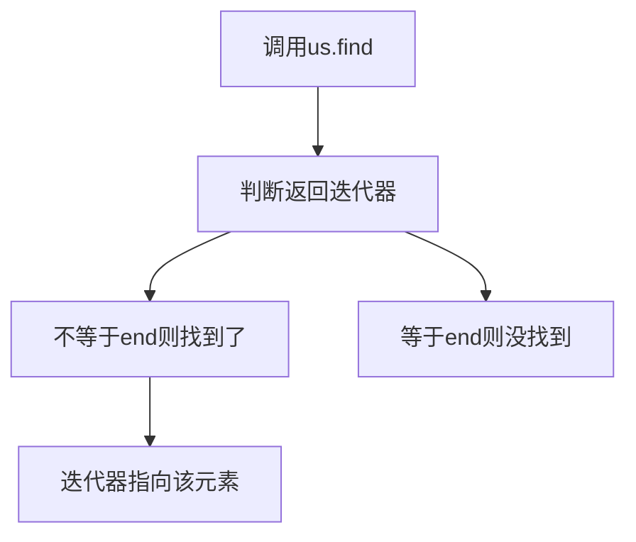
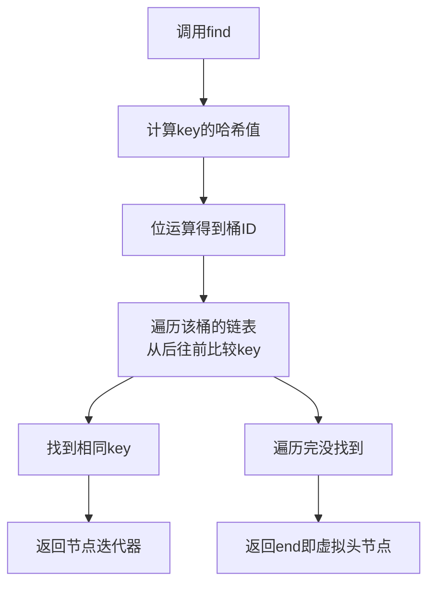

## 本节概述：unordered_set 的数据查找

unordered_set 的查找用 `find` 函数，返回值是一个迭代器。找到就返回指向该元素的迭代器，找不到就返回 `end()`。时间复杂度均摊 O(1)。

## find 函数的用法

```cpp
#include <iostream>
#include <unordered_set>
using namespace std;

int main() {
    unordered_set<int> us = {1, 2, 3, 4, 5};

    unordered_set<int>::iterator it = us.find(3);

    if (it != us.end()) {
        cout << "找到了：" << *it << endl;   // 找到了：3
    } else {
        cout << "找不到" << endl;
    }

    return 0;
}
```

## 判断是否找到的逻辑



| 返回值 | 含义 |
|---|---|
| 不等于 `us.end()` | 找到了，对迭代器解引用 `*it` 就能拿到值 |
| 等于 `us.end()` | 没找到，此时不能解引用（会崩溃） |

> [!WARNING]
> **找不到时不要解引用**
>
> 如果 `find` 返回 `end()`，说明没找到，这时候 `*it` 是未定义行为，可能会崩溃。
>
> 一定要先判断 `it != us.end()`，再解引用。

## 找到的情况

```cpp
unordered_set<int> us = {1, 2, 3, 4, 5};

unordered_set<int>::iterator it = us.find(3);
if (it != us.end()) {
    cout << "find: " << *it << endl;   // find: 3
}
```

## 找不到的情况

```cpp
unordered_set<int> us = {1, 2, 3, 4, 5};

unordered_set<int>::iterator it = us.find(10);   // 10 不在集合里
if (it != us.end()) {
    cout << "find: " << *it << endl;
} else {
    cout << "can't find 10" << endl;   // can't find 10
}
```

## 查找的底层过程



底层查找的步骤：

1. 对要查找的 key **计算哈希值**
2. 用位运算得到**桶ID**，定位到对应的桶
3. **从后往前**遍历该桶的链表，逐个比较 key
4. 找到相同 key — 返回该节点的迭代器
5. 遍历完整个桶都没找到 — 返回 `end()`（虚拟头节点）

> [!TIP]
> **为什么均摊 O(1)？**
>
> 如果哈希函数设计得好，元素均匀分布在各个桶里，每个桶的链表长度都很短（接近 1），那么查找几乎一步到位，就是 O(1)。
>
> 最坏情况下（所有元素都冲突到一个桶里），查找退化成 O(n)。但实际使用中哈希函数足够好，均摊下来就是 O(1)。

## 时间复杂度

`find` 的时间复杂度是 **均摊 O(1)**。

> 底层是哈希表，通过哈希值直接定位桶，然后在短链表中遍历。大部分情况下只需要几次比较就能找到。
>
> 对比一下：set 的 find 是 O(log n)，vector 的查找需要一个个遍历是 O(n)。数据量越大，unordered_set 的查找优势越明显。

## 完整代码示例

```cpp
#include <iostream>
#include <unordered_set>
using namespace std;

int main() {
    unordered_set<int> us = {1, 2, 3, 4, 5};

    // 1. 找到的情况
    unordered_set<int>::iterator it = us.find(3);
    if (it != us.end()) {
        cout << "find: " << *it << endl;
    } else {
        cout << "can't find 3" << endl;
    }

    // 2. 找不到的情况
    it = us.find(10);
    if (it != us.end()) {
        cout << "find: " << *it << endl;
    } else {
        cout << "can't find 10" << endl;
    }

    return 0;
}
```

运行结果：

```
find: 3
can't find 10
```

## 本章小结

**find 返回迭代器** — 找到就返回指向该元素的迭代器，找不到返回 `us.end()`。

**判断方法** — `it != us.end()` 说明找到了，等于 end 说明没找到。

**找到才能解引用** — 一定要先判断再 `*it`，否则可能崩溃。

**底层过程** — 算哈希值找桶 → 从后往前遍历链表比较 key → 找到返回节点迭代器，没找到返回 end。

**时间复杂度均摊 O(1)** — 哈希表查找效率高，数据量大的时候比 set 和 vector 都快。

**find 是 unordered_set 的核心操作** — 后面学删除的时候，find 经常和 erase 搭配使用。
