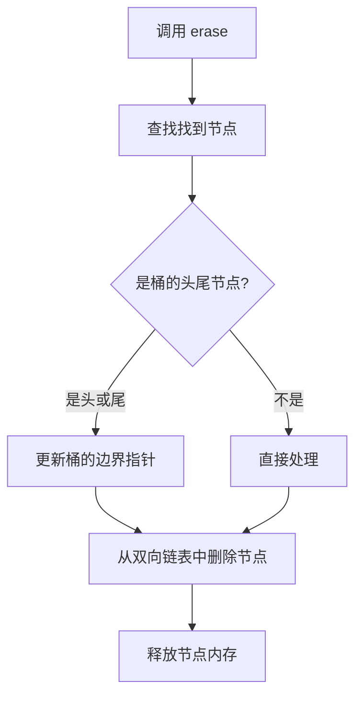

## 本节概述：unordered_set 的数据删除

unordered_set 的删除用 `erase` 函数，有四种常用方式：按值删除、按迭代器删除、按区间删除、clear 清空。底层都是哈希表的节点删除，时间复杂度均摊 O(1)。

## 打印函数

```cpp
#include <iostream>
#include <unordered_set>
using namespace std;

void printUSet(const unordered_set<int>& us) {
    for (unordered_set<int>::const_iterator it = us.begin(); it != us.end(); ++it) {
        cout << *it << " ";
    }
    cout << endl;
}
```

## 方式一：按值删除

直接传一个值，`erase` 会找到并删掉它：

```cpp
unordered_set<int> us = {1, 2, 3, 4, 5};
int n = us.erase(3);       // 删除值为 3 的元素，返回删除的个数
cout << "删除了 " << n << " 个" << endl;   // 删除了 1 个
printUSet(us);             // 剩下 4 个元素
```

> 按值删除的底层逻辑其实是：先 find 找到位置，再按迭代器删除。一步到位，方便书写。
>
> 返回值是删除的元素个数，对于 unordered_set 来说只能是 0 或 1。

## 方式二：按迭代器删除

传一个迭代器进去，删除迭代器指向的那个元素：

```cpp
unordered_set<int> us = {1, 2, 3, 4, 5};

unordered_set<int>::iterator it = us.find(4);   // 先找到 4 的位置
if (it != us.end()) {
    us.erase(it);                                // 按迭代器删除
}
printUSet(us);   // 剩下 4 个元素
```

> [!TIP]
> **为什么要先 find 再 erase？**
>
> 如果你已经有一个迭代器了（比如遍历过程中想删除某个元素），直接传迭代器给 erase 比传值更高效——省掉了一次查找。
>
> 但要注意：必须保证迭代器有效（不等于 end）才能删除，否则行为未定义。

## 方式三：按区间删除

传两个迭代器，删除区间内的所有元素：

```cpp
unordered_set<int> us = {1, 2, 3, 4, 5};

unordered_set<int>::iterator itL = us.find(2);
unordered_set<int>::iterator itR = us.find(4);

us.erase(itL, itR);   // 删除 [itL, itR) 区间
printUSet(us);
```

> [!WARNING]
> **unordered_set 不建议用区间删除**
>
> 对于 set 这种有序容器，区间删除很有意义——比如删除所有大于等于 2 且小于 4 的元素。
>
> 但 unordered_set 是**无序**的，迭代器区间对应的元素没有什么范围意义。你不知道区间里到底包含哪些元素，因为顺序是不确定的。
>
> 所以 unordered_set 的区间删除用得很少，一般都是按值删或者按迭代器删。

## 方式四：clear 清空

一次性清空所有元素：

```cpp
unordered_set<int> us = {1, 2, 3, 4, 5};
cout << "clear 前 size = " << us.size() << endl;   // 5
us.clear();
cout << "clear 后 size = " << us.size() << endl;   // 0
```

> clear 会删除所有元素，size 变为 0，但桶数组本身可能不会释放（容量保留）。

## 删除的底层过程



底层删除的步骤：

1. 先通过查找**找到要删除的节点**
2. 检查节点是不是桶的**头或尾节点**，如果是，需要更新桶的边界指针（指向新的头尾）
3. 从**全局双向链表**中摘除该节点（修改前后节点的指针）
4. **释放节点内存**

> [!TIP]
> **哈希表操作的复杂度排行**
>
> 整个哈希表最复杂的是**插入**（需要判断重复、可能触发扩容），其次是**删除**（需要处理桶边界），最简单的是**查找**（只遍历不修改）。
>
> 这也是为什么面试中经常考哈希表的插入和删除——实现起来细节最多。

## 迭代器失效

> [!WARNING]
> **删除后，指向被删元素的迭代器会失效**
>
> 如果一个迭代器指向了被删除的那个元素，删除之后这个迭代器就失效了。继续使用它是未定义行为，可能导致程序崩溃。

```cpp
unordered_set<int> us = {1, 2, 3, 4, 5};
unordered_set<int>::iterator it = us.find(2);
us.erase(it);        // 删除 it 指向的元素
// cout << *it;     // 错误！it 已经失效，不能再用了
```

> 其他没被删除的元素的迭代器仍然有效，只有指向被删元素的那个迭代器会失效。
>
> 注意：unordered_set 扩容时所有迭代器都会失效，但删除操作不会触发扩容。

## 四种删除方式对比

| 删除方式 | 写法 | 返回值 | 适用场景 |
|---|---|---|---|
| 按值删除 | `us.erase(val)` | 删除个数（0或1） | 知道值，直接删，最方便 |
| 按迭代器删除 | `us.erase(it)` | 无 | 已经有迭代器了，高效 |
| 按区间删除 | `us.erase(first, last)` | 无 | 不建议用，无序区间无意义 |
| clear 清空 | `us.clear()` | 无 | 一次性清空所有元素 |

## 完整代码示例

```cpp
#include <iostream>
#include <unordered_set>
using namespace std;

void printUSet(const unordered_set<int>& us) {
    for (unordered_set<int>::const_iterator it = us.begin(); it != us.end(); ++it) {
        cout << *it << " ";
    }
    cout << endl;
}

int main() {
    // 1. 按值删除
    unordered_set<int> us = {1, 2, 3, 4, 5};
    cout << "原始: "; printUSet(us);
    int n = us.erase(3);
    cout << "删除了 " << n << " 个元素" << endl;
    cout << "删3后: "; printUSet(us);

    // 2. 按迭代器删除
    us = {1, 2, 3, 4, 5};   // 恢复
    unordered_set<int>::iterator it = us.find(4);
    if (it != us.end()) {
        us.erase(it);
    }
    cout << "删4后: "; printUSet(us);

    // 3. clear 清空
    us.clear();
    cout << "clear后 size = " << us.size() << endl;

    return 0;
}
```

运行结果（顺序可能不同）：

```
原始: 1 2 3 4 5 
删除了 1 个元素
删3后: 1 2 4 5 
删4后: 1 2 3 5 
clear后 size = 0
```

## 本章小结

**erase 四种方式** — 按值删除（最方便，返回删除个数）、按迭代器删除（最高效）、按区间删除（不建议用，无序区间无意义）、clear 清空。

**按值删除返回个数** — 对于 unordered_set 来说只能是 0 或 1，因为元素不重复。

**底层过程** — 先查找找到节点 → 处理桶边界（头尾节点删除时更新） → 双向链表删除 → 释放内存。

**操作复杂度排行** — 插入最复杂，其次删除，查找最简单。

**迭代器失效** — 指向被删元素的迭代器会失效，删除后不能再用。其他元素的迭代器不受影响。

**时间复杂度均摊 O(1)** — 哈希表删除效率高，和查找差不多。
