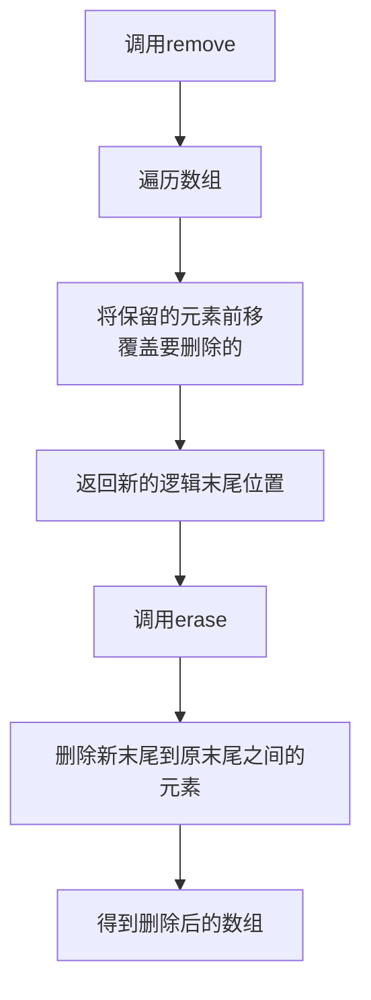
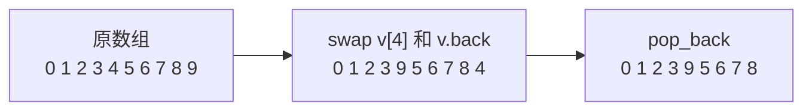

## 本节概述：vector 的高效删除

vector 底层是数组，中间删除要挪后面所有元素，O(n)。本节介绍一种 O(1) 的高效删除技巧：**交换到尾部再删**。

## 低效删除：erase

vector 中间 erase 删除时，后面的元素要往前挪，O(n)。

### 第一版：普通 erase

```cpp
void remove1(vector<int>& v, int index) {
    v.erase(v.begin() + index);   // 删第 index 个元素
}
```

> 代码只有一行，但底层要做大量内存移动。
> 删 index 位置后，index 后面所有元素都要往前挪一位。

### 低效验证

```cpp
vector<int> v;
for (int i = 0; i < 100000; i++) {   // 插 10 万个
    v.push_back(i);
}
for (int i = 0; i < 50000; i++) {    // 删 5 万次
    remove1(v, 4);                   // 每次删第 4 个
}
```

> [!WARNING]
> 外层循环 N 次，每次 erase 是 O(n)（挪后面元素）。
> 总时间复杂度 **O(n²)** — 数据量一大就卡死。
> 老师实测：10 万删 5 万要等好几秒甚至十几秒。

## erase-remove 惯用法

另一种高效删除多个元素的方式是 **remove + erase** 组合，俗称 erase-remove 惯用法。



> remove 只负责"把要保留的元素挪到前面"，并不真正删除元素，所以需要配合 erase 来真正缩小数组。

## 高效删除：交换 + pop_back

### 第二版：swap + pop_back

```cpp
void remove2(vector<int>& v, int index) {
    swap(v[index], v.back());   // 把要删的换到最后
    v.pop_back();                // 尾部删除，O(1)
}
```

### 原理图解



> [!TIP]
> 两次操作都是 O(1)：
> - **swap** — 交换两个元素，只改两个位置的值，O(1)
> - **pop_back** — 尾部删除，不用挪任何元素，O(1)
>
> 总时间复杂度 **O(1)** — 不管数组多大都是常数时间！

### 正确性验证

```cpp
vector<int> v;
for (int i = 0; i < 10; i++) {
    v.push_back(i);
}
remove2(v, 4);   // 删下标 4（元素 4）

// 结果: 0 1 2 3 9 5 6 7 8
// 4 被删了，9 从尾部换到了原来 4 的位置
```

> 删完后元素 4 确实没了，9 从尾部跑到了 index=4 的位置。
> 顺序变了，但**删除操作是正确的** — 该删的确实删了。

> [!NOTE]
> 这个技巧**不关心元素顺序**时才能用。
> 如果要求删除后其他元素保持原序，就只能用 erase（O(n)）。

## 两种删除对比表

| 对比项 | remove1（erase） | remove2（swap+pop） |
|---|---|---|
| **时间复杂度** | O(n) | O(1) |
| **元素顺序** | 保持原序 | 顺序会变 |
| **实现** | `v.erase(v.begin()+index)` | `swap(v[index], v.back()); v.pop_back();` |
| **适用场景** | 需要保持顺序 | 不关心顺序 |
| **大数据量** | 慢（O(n²) 循环删除） | 秒出（O(n) 循环删除） |

## 性能对比

```cpp
// 10 万个元素，删 5 万次
// remove1: O(n²) → 等待好几秒
// remove2: O(n)  → 秒出
```

> 5 万次循环删除：
> - remove1：每次 O(n)，总共 O(n²) → 很慢
> - remove2：每次 O(1)，总共 O(n) → 秒出
>
> 这就是算法的魅力 — 同样的功能，时间复杂度差了一个量级。

## 完整代码示例

```cpp
#include <iostream>
#include <vector>
#include <algorithm>   // swap
using namespace std;

void printVector(const vector<int>& v) {
    for (int i = 0; i < v.size(); i++) {
        cout << v[i] << " ";
    }
    cout << endl;
}

// 低效删除：O(n)
void remove1(vector<int>& v, int index) {
    v.erase(v.begin() + index);
}

// 高效删除：O(1)
void remove2(vector<int>& v, int index) {
    swap(v[index], v.back());
    v.pop_back();
}

int main() {
    // 1. 正确性验证
    cout << "=== 正确性验证 ===" << endl;
    vector<int> v1;
    for (int i = 0; i < 10; i++) v1.push_back(i);
    cout << "原始: "; printVector(v1);   // 0 1 2 3 4 5 6 7 8 9

    remove2(v1, 4);
    cout << "删[4]: "; printVector(v1);   // 0 1 2 3 9 5 6 7 8

    // 2. 性能对比
    cout << "\n=== 性能对比 ===" << endl;
    int N = 100000;

    // remove1
    vector<int> v2;
    for (int i = 0; i < N; i++) v2.push_back(i);
    cout << "remove1 开始..." << endl;
    for (int i = 0; i < N / 2; i++) remove1(v2, 4);
    cout << "remove1 结束" << endl;

    // remove2
    vector<int> v3;
    for (int i = 0; i < N; i++) v3.push_back(i);
    cout << "remove2 开始..." << endl;
    for (int i = 0; i < N / 2; i++) remove2(v3, 4);
    cout << "remove2 结束" << endl;

    return 0;
}
```

## 本章小结

**低效删除** — erase 中间删除要挪后面所有元素，O(n)，循环删除变 O(n²)。

**高效删除** — swap 交换到尾部 + pop_back，两次 O(1) 操作，循环删除变 O(n)。

**前提条件** — 不关心元素顺序才能用，需要保持原序只能用 erase。

**算法的魅力** — 同样的功能，时间复杂度差一个量级，大数据量下天壤之别。
