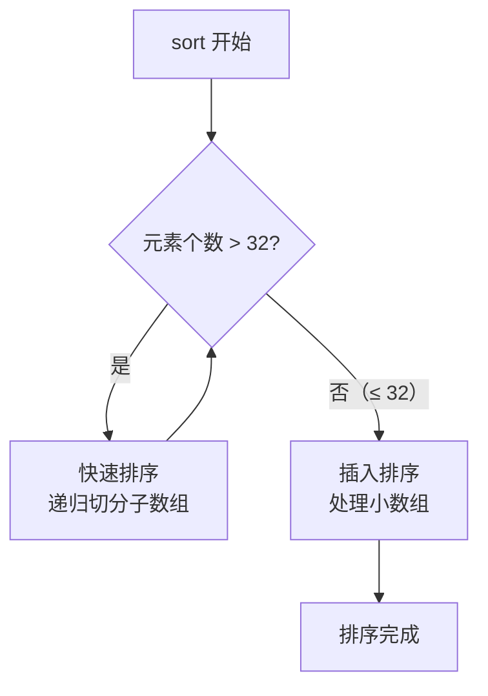

## 本节概述：vector 的数据排序

利用 `<algorithm>` 头文件中的 sort 接口，可以对 vector 进行排序。本节还深入源码分析 sort 的底层实现——快排 + 插入排序的混合策略。

## 基本用法：默认升序排序

```cpp
#include <iostream>
#include <vector>
#include <algorithm>   // sort 在这个头文件里
using namespace std;

void printVector(const vector<int>& v) {
    for (int i = 0; i < v.size(); i++) {
        cout << v[i] << " ";
    }
    cout << endl;
}

int main() {
    vector<int> v = {9, 8, 7, 1, 2, 3, 4};
    printVector(v);   // 9 8 7 1 2 3 4

    sort(v.begin(), v.end());   // 默认升序
    printVector(v);   // 1 2 3 4 7 8 9
}
```

> [!TIP]
> sort 传两个迭代器 `[begin, end)`，左闭右开——end 取不到。
> 默认是**升序**（从小到大）。

## 降序排序：传比较函数

sort 可以传第三个参数——一个**比较函数**，控制排序方向。

```cpp
bool cmp(int a, int b) {
    return a > b;   // 大于号 = 降序
}

sort(v.begin(), v.end(), cmp);   // 9 8 7 4 3 2 1
```

> [!NOTE]
> **记忆技巧**：
> - `return a > b` → 降序（大的排前面）
> - `return a < b` → 升序（小的排前面）
>
> 看符号方向就知道排出来的顺序——大于号就是从大到小，小于号就是从小到大。

### 比较函数的要求

- 参数：**两个**，类型跟 vector 元素一致
- 返回值：bool（int 也行），告诉 sort 怎么排
- 函数名：随便取

> [!WARNING]
> 比较函数要求不高——参数两个、返回一个比较结果就行。
> 老师试了用 double 参数排 int 数组，甚至返回 int，都能跑。
> 但正常人不会这么写，参数类型跟元素类型保持一致就好。

## 完整代码示例

```cpp
#include <iostream>
#include <vector>
#include <algorithm>
using namespace std;

void printVector(const vector<int>& v) {
    for (int i = 0; i < v.size(); i++) {
        cout << v[i] << " ";
    }
    cout << endl;
}

// 降序比较函数
bool cmp(int a, int b) {
    return a > b;
}

int main() {
    vector<int> v = {9, 8, 7, 1, 2, 3, 4};
    cout << "原始: ";  printVector(v);   // 9 8 7 1 2 3 4

    // 1. 默认升序
    sort(v.begin(), v.end());
    cout << "升序: ";  printVector(v);   // 1 2 3 4 7 8 9

    // 2. 降序（传比较函数）
    sort(v.begin(), v.end(), cmp);
    cout << "降序: ";  printVector(v);   // 9 8 7 4 3 2 1

    return 0;
}
```

## 源码分析：sort 底层实现

老师 F12 进源码，发现 sort 不是单纯用一种排序：

### 混合策略：快排 + 插入排序



| 阶段 | 算法 | 条件 | 原因 |
|---|---|---|---|
| 大数组 | 快速排序 | 元素 > 32 | 平均 O(n log n)，适合大数据量 |
| 小数组 | 插入排序 | 元素 ≤ 32 | 小数据量下插入排序常数更小，实际更快 |

> [!TIP]
> **为什么不用纯快排？**
> - 快排平均 O(n log n)，但最坏会退化到 O(n²)
> - 数据量小时，快排的递归开销比排序本身还大
> - 插入排序在小数据量（≤32）时实际更快——没有递归开销，常数小
>
> **混合策略**让 sort 在各种情况下都能保持好性能——随机数据、有序数据、小数据量都扛得住。

### 为什么学那么多排序？

> [!NOTE]
> 这堂课的核心问题：**为什么这么多排序都要学？**
>
> 答案：**每个排序都有它的用处。**
> - 快排平均最快，但最坏 O(n²)
> - 插入排序小数据量最快，但大数据量 O(n²)
> - 归并排序稳定，但需要额外空间
>
> STL 的 sort 用的就是**混合策略**——快排切分到够小，再换插入排序。
> 没有一种排序是万能的，组合使用才能在各种场景下保持高效。

## 本章小结

**基本用法** — `sort(v.begin(), v.end())`，默认升序，传比较函数实现降序。

**比较函数** — `return a > b` 降序，`return a < b` 升序，参数两个、返回 bool。

**底层实现** — 快排 + 插入排序混合策略：大数组用快排递归切分，小数组（≤32）换插入排序。

**为什么学多种排序** — 每种排序都有适用场景，混合使用比单用一种更高效。
