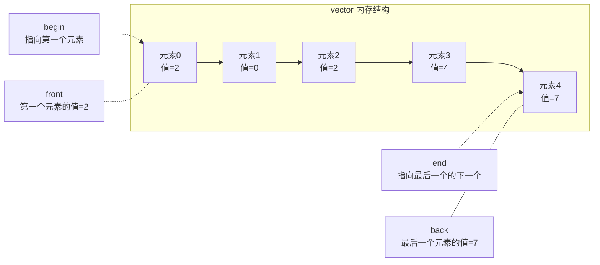
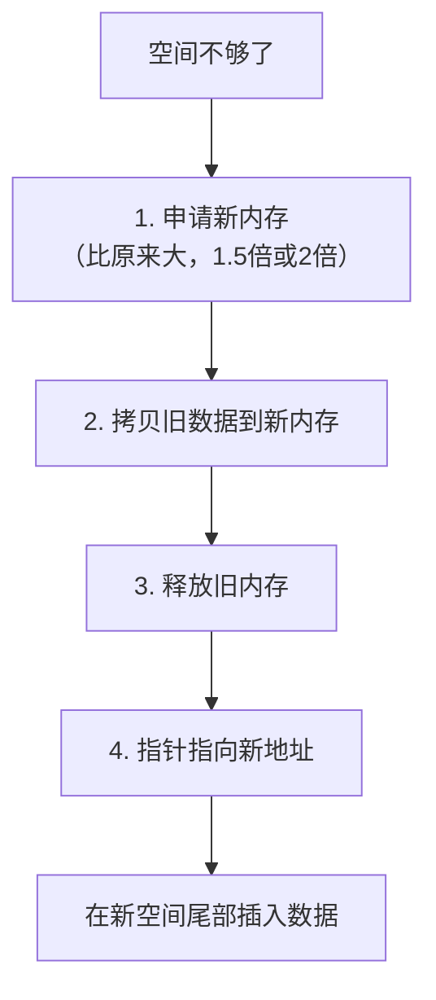

## 本节概述：vector 是什么

**vector** 是 STL 中使用最频繁的容器，本质上是一个**柔性数组**——能动态扩缩容的数组。

普通数组（刚性数组）一旦定义，元素个数就固定了，无法扩容。vector 打破了这个限制，可以随时往尾部加数据，满了就自动扩容，所以叫"柔性"——以柔克刚。

> [!NOTE]
> STL 就是对 C++ 常用数据结构的封装。vector 底层就是顺序表（动态数组），我们在第三章手写过的那个东西，STL 给封装好了。

## vector 的逻辑结构



四个常用位置：

| 名称 | 含义 | 返回类型 |
|---|---|---|
| **front** | 第一个元素的**值** | 元素本身 |
| **back** | 最后一个元素的**值** | 元素本身 |
| **begin** | 指向第一个元素的**迭代器** | 迭代器（类似指针） |
| **end** | 指向最后一个元素**下一个位置**的迭代器 | 迭代器（类似指针） |

> [!TIP]
> **迭代器**就当成**指针**来理解——通过 `*` 解引用拿值，能加减移动位置。
> 实际上迭代器是一个类，但功能跟指针差不多，初学不用深究。
>
> **为什么 end 指向最后一个的下一个？**
> 因为 STL 表示区间统一用**左闭右开** `[begin, end)`——begin 能取到值，end 取不到。这样遍历时 `it != end` 就知道该停了。

## 动态扩缩容原理

vector 底层就是一块连续的数组内存。当空间不够时，自动扩容。

**扩容四步走**：



举个例子，数组 `[6, 8, 7, 9]`，长度 4，要插入 3：

```
步骤1：数组满了，申请新内存（1.5倍 → 长度变6）
步骤2：把 6, 8, 7, 9 拷贝过去
步骤3：释放旧的 4 长度内存
步骤4：first 指针指向新地址
步骤5：在尾部位置赋值为 3 → [6, 8, 7, 9, 3]
步骤6：后面还有一个空位，下次插入不用扩容
```

> [!WARNING]
> 如果不扩容直接在后面加，就是**数组下标越界**——C++ 中的**未定义行为（UB）**。
> 那块内存可能是别的变量的，乱写会导致难以排查的 bug。

> 扩容倍数看底层实现：有的 1.5 倍，有的 2 倍。我们在第三章手写顺序表时用的是 2 倍，STL 的 vector 具体几倍后面专门讲。

## 基本使用

### 头文件

```cpp
#include <vector>
```

### 定义和初始化

```cpp
// 定义一个 int 类型的 vector
vector<int> v;

// 初始化（跟数组初始化很像）
vector<int> v = {2, 0, 2, 4};

// 模板支持任意类型
vector<double> vd;
vector<char> vc;

// 甚至嵌套
vector<vector<int>> vv;   // 二维 vector
```

> 定义方式跟普通数组几乎一样——大括号 + 逗号分隔。
> vector 是一个**类**，v 是它的一个**对象**（实例）。

### 查看容量 capacity

```cpp
cout << v.capacity() << endl;   // 输出 4（初始 4 个元素）
```

> **capacity** — 当前已分配的内存能容纳多少个元素（不是实际有多少个元素）。

### 尾部插入 push_back

```cpp
v.push_back(7);   // 在尾部插入 7 → [2, 0, 2, 4, 7]
cout << v.capacity() << endl;   // 输出 6（扩容了）
```

> 插入前容量 4，插入后变成了 6——不是变成 5 而是 6，因为扩容是按倍数来的（这里 1.5 倍：4×1.5=6）。
> 具体扩容机制后面专门讲。

### 四个位置的使用

```cpp
// front / back — 直接拿值
cout << v.front() << endl;   // 2（第一个元素的值）
cout << v.back() << endl;    // 7（最后一个元素的值）

// begin / end — 迭代器，要解引用才能拿值
cout << *v.begin() << endl;       // 2（begin 指向第一个元素）
cout << *(v.end() - 1) << endl;   // 7（end 指向最后元素的下一个，减1才是最后元素）
```

> [!WARNING]
> `*v.end()` 会报错！因为 end 指向的是最后一个元素的**下一个位置**——那是一个无效位置，不能解引用。
> 想拿最后一个元素，用 `*(v.end() - 1)` 或者直接用 `v.back()`。

## front/back vs begin/end 区别

| 对比项 | front / back | begin / end |
|---|---|---|
| 返回什么 | **元素的值** | **迭代器（类似指针）** |
| 怎么拿值 | 直接用，不用解引用 | 要加 `*` 解引用 |
| 能加减移动吗 | 不能 | 能（`it++`、`it-1` 等） |
| 用途 | 只想拿头/尾的值 | 遍历、算法操作 |

> 简单记：
> - 只想拿值 → 用 **front / back**
> - 要遍历或传给算法 → 用 **begin / end**

## 完整代码示例

```cpp
#include <iostream>
#include <vector>
using namespace std;

int main() {
    // 定义 + 初始化
    vector<int> v = {2, 0, 2, 4};

    // 容量
    cout << "初始容量: " << v.capacity() << endl;   // 4

    // 尾部插入
    v.push_back(7);
    cout << "插入后容量: " << v.capacity() << endl; // 6

    // front 和 back
    cout << "front: " << v.front() << endl;   // 2
    cout << "back: " << v.back() << endl;     // 7

    // begin 和 end（迭代器要解引用）
    cout << "*begin: " << *v.begin() << endl;          // 2
    cout << "*(end-1): " << *(v.end() - 1) << endl;    // 7

    // 遍历（用迭代器）
    for (auto it = v.begin(); it != v.end(); it++) {
        cout << *it << " ";
    }
    cout << endl;   // 2 0 2 4 7

    return 0;
}
```

运行结果：

```
初始容量: 4
插入后容量: 6
front: 2
back: 7
*begin: 2
*(end-1): 7
2 0 2 4 7
```

## 本章小结

**vector** 是 STL 中最常用的容器，本质是**柔性数组**——能动态扩缩容。

**逻辑结构**：front（首元素值）、back（尾元素值）、begin（指向首元素的迭代器）、end（指向尾元素下一个的迭代器，左闭右开）。

**迭代器**当成指针理解——`*` 解引用拿值，能加减移动。

**扩容四步**：申请新内存 → 拷贝旧数据 → 释放旧内存 → 指针指向新地址。倍数 1.5 倍或 2 倍看实现。

**基本操作**：`push_back` 尾部插入，`capacity` 查容量，`front/back` 拿值，`*begin / *(end-1)` 用迭代器拿值。
