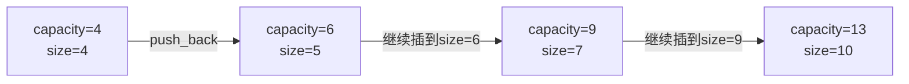
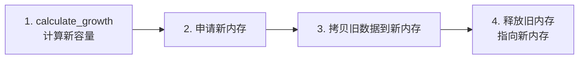

## 本节概述：vector 的扩容机制

本节深入讲解 vector 的 capacity 和 size 的关系、扩容原理、resize 接口，以及源码层面的扩容算法。

## capacity 和 size 的区别

| 概念 | 含义 | 接口 | 比喻 |
|---|---|---|---|
| **capacity（容量）** | 底层数组最多能放多少元素 | `v.capacity()` | 碗能盛多少饭 |
| **size（大小）** | 已经放了多少元素 | `v.size()` | 碗已经盛了多少饭 |

> [!TIP]
> **capacity 永远大于等于 size** — 碗里盛的饭不能超过碗的容量。
> size 可以等于 capacity（碗满了），但不会超过。

## 扩容触发条件

当 **capacity == size**（碗满了）时，再插入元素就会触发扩容。

```cpp
vector<int> v1 = {9, 8, 7, 6};   // 4 个元素

cout << v1.size() << endl;       // 4
cout << v1.capacity() << endl;   // 4

v1.push_back(3);                  // 碗满了，触发扩容

cout << v1.size() << endl;       // 5
cout << v1.capacity() << endl;   // 6（4 × 1.5 = 6）
```

> 扩容前 capacity=4，size=4，碗满了。
> push_back 之后 size 变 5，capacity 变 6（4 × 1.5 = 6）。

## 扩容系数



| 扩容前 capacity | 扩容后 capacity | 计算过程 |
|---|---|---|
| 4 | 6 | 4 + 4/2 = 6 |
| 6 | 9 | 6 + 6/2 = 9 |
| 9 | 13 | 9 + 9/2 = 9+4 = 13（整除向下取整） |
| 13 | 19 | 13 + 13/2 = 13+6 = 19 |

> [!WARNING]
> 扩容公式不是 `capacity × 1.5`，而是 `capacity + capacity / 2`（整除向下取整）。
> - 9 × 1.5 = 13.5 → 但实际是 13（9 + 9/2 = 9 + 4 = 13）
> - 除法是整除，向下取整
>
> 不同编译器/操作系统扩容系数不同：MSVC 是 1.5 倍，GCC 是 2 倍，这里讲的是 MSVC。

## 源码分析：calculate_growth

老师 F12 进源码，核心逻辑在 `calculate_growth` 函数：

```cpp
// 伪代码（简化版）
size_type calculate_growth(size_type new_size) {
    size_type old_capacity = capacity();
    size_type new_capacity = old_capacity + old_capacity / 2;  // 核心公式
    
    if (new_capacity < new_size) {
        return new_size;    // 扩容后还不够，直接用 new_size
    }
    return new_capacity;
}
```

> 两个分支：
> 1. **正常扩容** — `capacity + capacity / 2`，返回新容量
> 2. **及时止损** — 如果传进来的 size 特别大（比如 100 万），反复扩容到那个值是 log 级别，直接返回 size 本身，变成 O(1)

> [!NOTE]
> 为什么 9 扩容后是 13 不是 14？
> - 9 / 2 = 4（整除向下取整）
> - 9 + 4 = 13
> 
> 不是 9 × 1.5 = 13.5 → 13，而是整除的结果。

## 扩容本质四步走




> 跟顺序表的扩容一模一样——算新容量 → 申请 → 拷贝 → 释放。

## resize 接口

resize 改变的是 **size**，不是直接改 capacity。但如果 size 超过当前 capacity，会触发扩容。

### resize 三种情况

| 情况 | 操作 | 效果 |
|---|---|---|
| resize(n)，n > size | 扩大 size | 新元素默认填 0，capacity 不够就扩容 |
| resize(n, value)，n > size | 扩大 size | 新元素填 value |
| resize(n)，n < size | 缩小 size | 元素变少，**capacity 不变** |

```cpp
// 情况一：resize 扩大，新元素默认填 0
v1.resize(18);    // size 变 18，新元素全填 0
// capacity: 13 → 19（不够用，触发扩容）

// 情况二：resize 扩大，指定填充值
v1.resize(20, 6); // size 变 20，新增的 2 个元素填 6
// capacity: 19 → 28（不够用，触发扩容）

// 情况三：resize 100，超大值
v1.resize(100);   // size 变 100
// capacity: 100（直接等于 size，走的是及时止损分支）

// 情况四：resize 缩小
v1.resize(5);     // size 变 5
// capacity: 100（不变！不会缩容）
```

> [!WARNING]
> **resize 不会自动缩容！** 只会扩容，不会缩容。
> resize(5) 之后 size=5，但 capacity 还是 100——元素变少了，但底层内存没释放。
> 缩容方法后面的章节会讲（swap 技巧）。

## 完整代码示例

```cpp
#include <iostream>
#include <vector>
using namespace std;

void printVector(const vector<int>& v) {
    for (vector<int>::iterator it = v.begin(); it != v.end(); it++) {
        cout << *it << " ";
    }
    cout << endl;
}

int main() {
    vector<int> v1 = {9, 8, 7, 6};
    cout << "初始:" << endl;
    cout << "  size=" << v1.size() << "  capacity=" << v1.capacity() << endl;
    // size=4  capacity=4

    // 触发扩容
    v1.push_back(3);
    cout << "push_back后:" << endl;
    cout << "  size=" << v1.size() << "  capacity=" << v1.capacity() << endl;
    // size=5  capacity=6

    // 继续插到 size=6，再触发扩容
    v1.push_back(1);
    v1.push_back(2);
    cout << "再插3个后:" << endl;
    cout << "  size=" << v1.size() << "  capacity=" << v1.capacity() << endl;
    // size=7  capacity=9

    // 继续插到 size=9，再触发扩容
    for (int i = 0; i < 3; i++) {
        v1.push_back(i);
    }
    cout << "再插3个后:" << endl;
    cout << "  size=" << v1.size() << "  capacity=" << v1.capacity() << endl;
    // size=10  capacity=13（9 + 9/2 = 13）

    // resize 扩大，默认填 0
    v1.resize(18);
    cout << "resize(18)后:" << endl;
    cout << "  size=" << v1.size() << "  capacity=" << v1.capacity() << endl;
    // size=18  capacity=19（13 + 13/2 = 19）
    printVector(v1);   // 原有元素不变，新增的全是 0

    // resize 扩大，指定填充值
    v1.resize(20, 6);
    cout << "resize(20,6)后:" << endl;
    cout << "  size=" << v1.size() << "  capacity=" << v1.capacity() << endl;
    // size=20  capacity=28（19 + 19/2 = 28）

    // resize 超大值
    v1.resize(100);
    cout << "resize(100)后:" << endl;
    cout << "  size=" << v1.size() << "  capacity=" << v1.capacity() << endl;
    // size=100  capacity=100（及时止损）

    // resize 缩小
    v1.resize(5);
    cout << "resize(5)后:" << endl;
    cout << "  size=" << v1.size() << "  capacity=" << v1.capacity() << endl;
    // size=5  capacity=100（不缩容！）

    return 0;
}
```

## 本章小结

**capacity vs size** — capacity 是容量（碗多大），size 是大小（盛了多少饭），capacity >= size。

**扩容公式** — `capacity + capacity / 2`（整除向下取整），不是 `× 1.5`。不同编译器系数不同。

**扩容触发** — capacity == size 时再插入就扩容，四步走：算新容量 → 申请 → 拷贝 → 释放。

**及时止损** — size 特别大时直接返回 size，避免反复扩容的 log 开销。

**resize** — 改 size 不直接改 capacity。扩大时不够会扩容，缩小时**不会缩容**。
