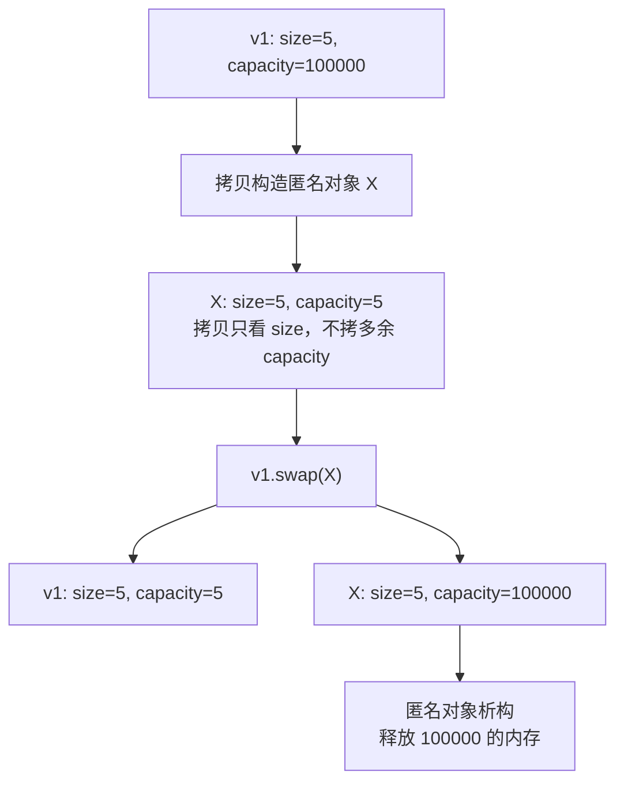

## 本节概述：vector 的内存交换

利用 swap 成员函数，可以实现两个 vector 的内存交换，还能用来**缩容**和**清理内存**。

## 一、基本用法：交换两个 vector

```cpp
vector<int> v1 = {1, 2, 3, 4, 5};
vector<int> v2 = {9, 8, 7, 6, 5};

printVector(v1);   // 1 2 3 4 5
printVector(v2);   // 9 8 7 6 5

v1.swap(v2);       // 交换内存

printVector(v1);   // 9 8 7 6 5
printVector(v2);   // 1 2 3 4 5
```

> swap 交换的是底层的指针——三个指针互换（首、尾、容量末尾），O(1)，不是逐个拷贝。

## 二、缩容

上节课讲过：resize 缩小时 **capacity 不会变小**。用 swap 可以实现缩容。

### 问题：resize 不缩容

```cpp
vector<int> v1;
v1.resize(100000);   // 扩到很大
v1.resize(5);         // 缩到 5

cout << v1.capacity() << endl;   // 还是 100000！不缩容
```

### 解决：swap 缩容

```cpp
vector<int> v1;
v1.resize(100000);
v1.resize(5);

// 一行搞定
vector<int>(v1).swap(v1);

cout << v1.capacity() << endl;   // 5！缩容成功
```

> [!TIP]
> `vector<int>(v1)` — 用拷贝构造生成一个**匿名对象**。
> 拷贝构造时，新对象的 capacity 只跟 size 有关，不会把多余的 capacity 也拷过来。
> 所以匿名对象的 capacity=5，跟 v1 swap 之后，v1 的 capacity 就变成了 5。
> 匿名对象在这行结束后自动析构，释放掉原来的大内存。

### 原理分步图解



### 分步写法（帮助理解）

```cpp
vector<int> v1;
v1.resize(100000);
v1.resize(5);

// 分步写法（等价于 vector<int>(v1).swap(v1)）
vector<int> x(v1);                    // 拷贝构造，x 的 capacity=5
cout << x.capacity() << endl;         // 5
x.swap(v1);                           // 交换后 v1 的 capacity=5
// x 持有原来的大内存，x 析构时释放
```

## 三、内存清理（capacity 归零）

clear 只清 size，不清 capacity。要彻底释放内存，用 swap + 空初始化列表。

### 问题：clear 不清内存

```cpp
vector<int> v2;
v2.resize(100000);
v2.clear();   // 清空所有元素

cout << v2.size() << endl;       // 0
cout << v2.capacity() << endl;   // 还是 100000！内存没释放
```

### 解决：swap 彻底清理

```cpp
vector<int> v2;
v2.resize(100000);
v2.clear();

vector<int>().swap(v2);   // 用空匿名对象交换

cout << v2.size() << endl;       // 0
cout << v2.capacity() << endl;   // 0！彻底释放
```

> [!NOTE]
> `vector<int>()` — 用**默认构造**生成一个空匿名对象（size=0, capacity=0）。
> 跟 v2 swap 之后，v2 变成空的，匿名对象持有原来的大内存并自动析构释放。

## 三种操作对比表

| 操作 | 语法 | 效果 | capacity 变化 |
|---|---|---|---|
| **swap** | `v1.swap(v2)` | 两个 vector 互换 | 交换彼此的 capacity |
| **swap 缩容** | `vector<int>(v1).swap(v1)` | v1 缩到 size 对应的容量 | capacity → size |
| **swap 清理** | `vector<int>().swap(v2)` | v2 彻底清空 | capacity → 0 |

> [!WARNING]
> **clear ≠ 释放内存**：clear 只把 size 变 0，capacity 不变。
> 真正释放内存只能用 swap 技巧。

## 完整代码示例

```cpp
#include <iostream>
#include <vector>
using namespace std;

void printVector(const vector<int>& v) {
    for (vector<int>::iterator it = v.begin(); it != v.end(); it++) {
        cout << *it << " ";
    }
    cout << endl;
}

int main() {
    // 1. 基本交换
    vector<int> v1 = {1, 2, 3, 4, 5};
    vector<int> v2 = {9, 8, 7, 6, 5};
    cout << "交换前:" << endl;
    cout << "  v1: "; printVector(v1);   // 1 2 3 4 5
    cout << "  v2: "; printVector(v2);   // 9 8 7 6 5

    v1.swap(v2);
    cout << "交换后:" << endl;
    cout << "  v1: "; printVector(v1);   // 9 8 7 6 5
    cout << "  v2: "; printVector(v2);   // 1 2 3 4 5

    // 2. 缩容
    vector<int> v3;
    v3.resize(100000);
    v3.resize(5);
    cout << "\n缩容前 capacity=" << v3.capacity() << endl;   // 100000+

    vector<int>(v3).swap(v3);
    cout << "缩容后 capacity=" << v3.capacity() << endl;     // 5

    // 3. 内存清理
    vector<int> v4;
    v4.resize(100000);
    v4.clear();
    cout << "\nclear后 size=" << v4.size() << " capacity=" << v4.capacity() << endl;
    // size=0  capacity=100000+

    vector<int>().swap(v4);
    cout << "swap后 size=" << v4.size() << " capacity=" << v4.capacity() << endl;
    // size=0  capacity=0

    return 0;
}
```

## 本章小结

**swap** — 交换两个 vector 的底层指针，O(1)。

**缩容技巧** — `vector<int>(v).swap(v)` — 拷贝构造匿名对象（capacity=size）再交换，匿名对象析构释放大内存。

**内存清理技巧** — `vector<int>().swap(v)` — 用空匿名对象交换，capacity 归零。

**clear 不释放内存** — 只清 size，capacity 不变。真正释放只能用 swap。
