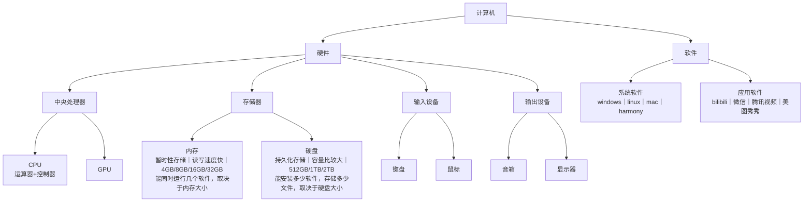
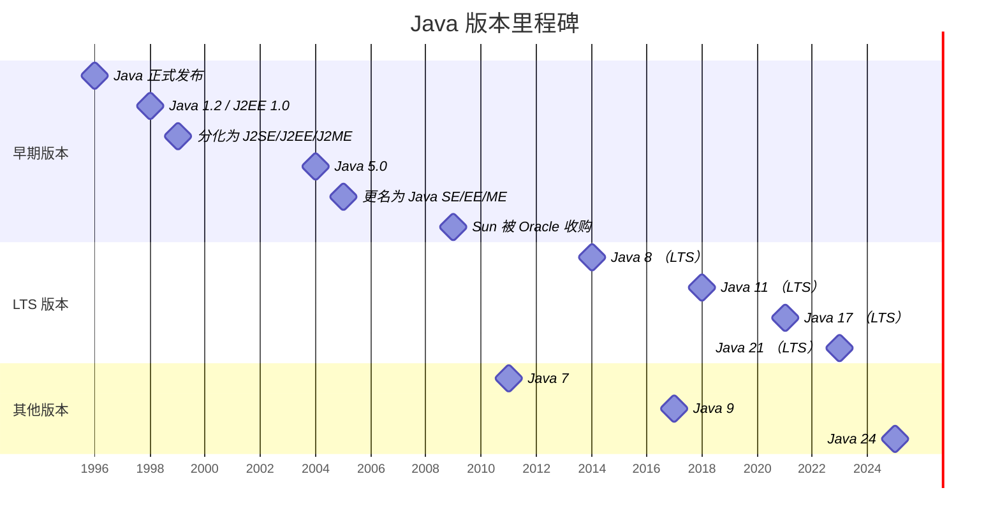
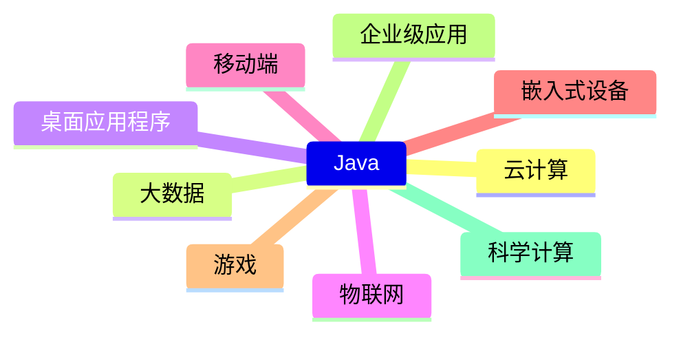
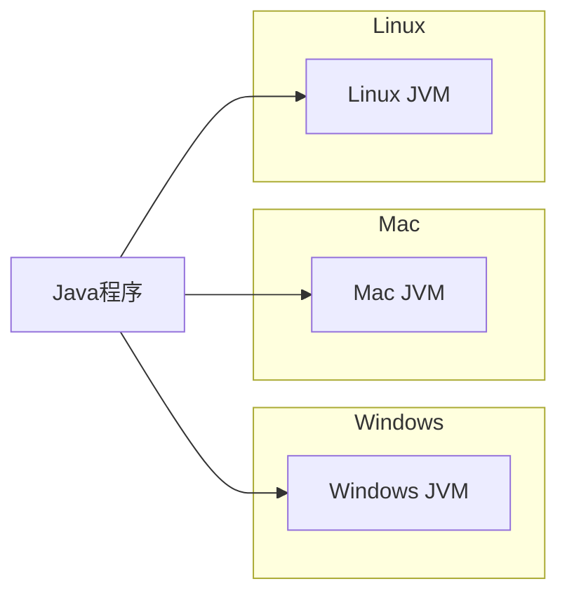
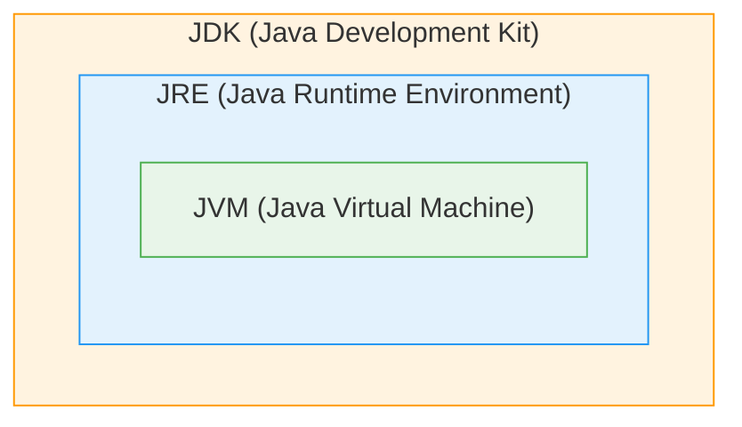
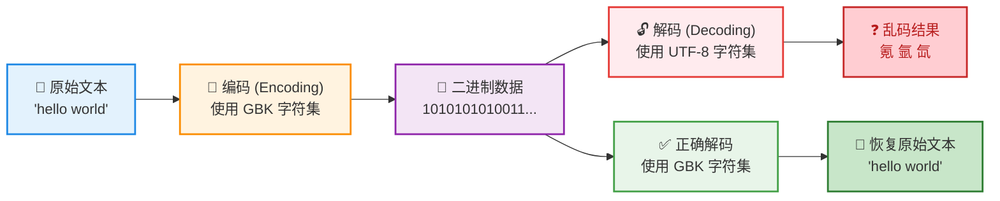

## 1. 计算机的组成

**计算机硬件与软件结构**：

计算机系统分为硬件和软件两大部分。

硬件包括中央处理器（CPU含运算器+控制器、GPU）、存储器（内存为暂时性存储、读写快、容量4G–32G，决定同时运行软件数量；硬盘为持久化存储、容量512G–2T，决定安装软件与文件存储量）、输入设备（键盘、鼠标）和输出设备（音箱、显示器）。

软件包括系统软件（Windows、Linux、macOS、HarmonyOS）和应用软件（Bilibili、微信、腾讯视频、美图秀秀）。



> **提示**：
>
> 运行本地化 AI 模型（如大语言模型、图像生成模型等）时，建议内存配置不低于 16GB，以保证模型加载和运行的流畅性。

## 2. 软件开发介绍

### 2.1 人际交互的两种方式

**图形化界面**（graphical user interface GUI）：这种方式简单直观，使用者易于接受，容易上手操作。

**命令行方式**（command line interface CLI）：需要有一个控制台，输入特定的指令，让计算机完成一些操作。较为麻烦，需要记住一些命令。（win+r cmd）

### 2.2 常用的dos命令

Windows 常用命令速查表

| 功能说明           | 命令及常用形式                                               |
| :----------------- | :----------------------------------------------------------- |
| 切换分区           | `盘符:`（例如切换到 D 盘：`d:`）                             |
| 切换目录           | `cd 目录名`（进入指定目录）<br>`cd /`（回到根目录）<br>`cd ..`（回到上一级目录） |
| 查看目录下内容     | `dir`                                                        |
| 创建目录           | `md 新目录名`                                                |
| 删除空目录         | `rd 空目录名`                                                |
| 创建空文本文档     | `type nul > 文件名.扩展名`                                   |
| 追加内容到文本文档 | `echo 文本内容 >> 文件名.扩展名`                             |
| 查看文本文档内容   | `type 文件名.扩展名`                                         |
| 删除文件           | `del 文件名.扩展名`（删除指定文件）<br>`del *.*`（删除当前目录下所有文件）<br>`del 目录名`（删除该目录下所有文件） |
| 清屏               | `cls`                                                        |
| 调阅历史命令       | 方向键 `↑` 和 `↓`                                            |
| 退出命令提示符     | `exit`                                                       |
| 复制文件           | `copy 源文件 目标路径`                                       |
| 移动文件           | `move 源文件 目标路径`                                       |
| 重命名文件/目录    | `ren 原文件名 新文件名`                                      |
| 显示网络配置       | `ipconfig`                                                   |
| 测试网络连通性     | `ping 目标地址`                                              |
| 查看系统信息       | `systeminfo`                                                 |
| 查看当前目录路径   | `chdir` 或 `cd`                                              |
| 创建多级目录       | `mkdir 目录名\子目录名`（`md` 也支持）                       |
| 删除非空目录       | `rmdir /s 目录名` 或 `rd /s 目录名`                          |
| 查看文件树结构     | `tree`                                                       |
| 关机               | `shutdown /s`                                                |
| 重启               | `shutdown /r`                                                |
| 查看帮助           | `命令 /?`（例如 `cd /?`）                                    |

## 3. 计算机编程语言介绍

计算机语言：人与计算机交流的方式。

发展：

第一代：机器语言

```hex
1010 0000 0000 0001
1010 0011 0000 0001
0000 0000 1101 1000
0010 1000 1101 1000
```

第二代：汇编语言

```assembly
MOV AL,01H
MOV AL,01H
ADD AL,BL
SUB AL,BL
```

第三代：高级语言

```java
public static void main（String[] args） {
  int x = 1;
  int y = 2;
  System.out.println（"x加y的和是" + （x+y））;
}
```

高级语言 （编译）->汇编语言（汇编）->机器语言

高级语言 （编译）->机器语言

## 4. Java语言概述

### 4.1 Java简介

Java是sun（Stanford university network，斯坦福大学网络公司）1995年推出的一门高级编程语言。

Java之父是詹姆斯·高斯林。

2009年sun公司被oracle以74亿美元收购。

Java最新版本是Java23。

本库知识点基于Java17学习。

### 4.2 Java发展时间线



> **提示**：
>
> 企业中按比例：Java17 > Java11 > Java8 > …

### 4.3 Java se、ee、me区别

Java SE、Java EE、Java ME 是 Java 平台三个不同版本，面向不同的应用场景：

| 版本        | 全称               | 定位                           | 核心组件                                                     | 典型应用                                                  |
| :---------- | :----------------- | :----------------------------- | :----------------------------------------------------------- | :-------------------------------------------------------- |
| **Java SE** | Standard Edition   | 标准版，Java 的核心基础        | JVM、JDK、基本类库（java.lang、java.util、I/O、JDBC、Swing、JavaFX 等） | 桌面应用、基础服务器程序、命令行工具                      |
| **Java EE** | Enterprise Edition | 企业版，构建大型分布式企业应用 | 在 SE 之上增加：Servlet、JSP、EJB、JPA、JMS、Web Services、CDI、JTA 等 | Web 应用、企业级后端系统、微服务（Jakarta EE 为其继任者） |
| **Java ME** | Micro Edition      | 微型版，资源受限设备           | SE 的子集，加上针对嵌入式设备的 API（如 MIDP、CLDC、CDC）    | 功能手机、嵌入式设备、智能卡、传感器                      |

### 4.4 Java应用领域




### 4.5 Java语言特点

**特点一：面向对象**

两个基本概念：类、对象

三大特性：封装、继承、多态

**特点二：健壮性**

吸收了C/C++语言的优点、但去掉了其影响程序健壮性的部分（如指针、内存的申请与释放等），提供了一个相对完全的内存管理与访问机制。

**特点三：跨平台性**

通过Java语言编写的应用程序在不同的系统上都可以运行。“where once,run anywhere!”

原理：只要在需要运行Java应用程序的操作系统上，安装Java虚拟机（JVM）即可。由JVM来负责Java程序在该系统中的运行。



其他特点：多线程、分布式、高性能、动态性...

## 5. Java的环境搭建

### 5.1 JDK、JRE与JVM

**JDK（Java Development Kit Java开发工具包）**

JDK是提供给Java开发人员使用的，其中包含了java的开发工具，也包括了JRE。所以安装了JDK，就不用在单独安装JRE了。其中的开发工具：编译工具（javac.exe），打包工具（jar.exe）等。

**JRE（Java Runtime Environment Java运行环境）**

包括Java虚拟机（JVMJavaVirtualMachine）和Java程序所需的核心类库等，如果想要运行一个开发好的Java程序，计算机中只需要安装JRE即可。

**JVM（Java Virtual Machine Java虚拟机）**

JVM是一个虚拟的计算机，包括一套字节码指令集、一组寄存器、栈、垃圾回收，堆和 方法区等。对于不同的平台，有不同的虚拟机。只有某平台提供了对应的java虚拟机，Java程序才可在此平台运行。




> **提示**：
>
> JDK = JRE +开发工具集（例如Javac编译工具等）
>
> JRE = JVM + Java SE标准类库

### 5.2 下载与安装

**官方网址**：[ORACLE](www.oracle.com) 建议Java17

**安装**：欢迎程序向导 下一步->安装路径 避免路径有中文或者空格等特殊符号 下一步->安装进度->安装成功->关闭

**验证安装结果**：

win+r cmd 

```bash
java -version
#或者
javac -version
```

出现版本号说明安装成功

**配置环境变量**：

当命令行运行`java -version`时，出现`'java'不是内部或外部命令...`时，需要配置环境变量。

什么是环境变量？

环境：软件运行的环境，这里指操作系统的环境。

变量：用一个单词（又称为标识符）等于一个值。例如：age = 18;

这里需要配置两个环境变量：

- `JAVA_HOME`，这个变量的值是等于JDK的安装`根目录`，例如：`JAVA_HOME=D:\ProgramFiles\JDK\jdk-17`

- `path`，这个变量的值有很多，它里面存的值都是各种软件的路径，例如JDK的开发工具软件的路径，当我们需要在命令行中运行java命令时，需要找到 java.exe，它在`D:\ProgramFiles\JDK\jdk-17\bin`下面。

  当我们把`D:\ProgramFiles\JDK\jdk-17\bin`配置到`path`中之后，就可以在任意目录下运行java等命令了。

新建环境变量JAVA_HOME：

此电脑->属性->高级系统设置->高级->环境变量->系统变量 新建->变量名：JAVA_HOME、变量值：D:\ProgramFiles\JDK\jdk-17 确定

 配置path环境变量（修改即可，不需要新建）：

系统变量 path 编辑->新建 %JAVA_HOME%\bin 确定

> **提示**：
>
> `JAVA_HOME`：专门用于告诉系统和各种 Java 工具（如 Maven、Tomcat、IDE 等）JDK 的**安装根目录**在哪里。
>
> `PATH`：是操作系统用于查找可执行文件的**搜索路径列表**。为了让命令行能直接运行 `java`、`javac` 等命令，需要将 `%JAVA_HOME%\bin` 添加到 PATH 中。
>
> **两者各有分工**：
>
> `JAVA_HOME` 提供“位置信息”（JDK 在哪）。
>
> `PATH` 提供“可执行文件搜索路径”（去哪找 java.exe 等）。
>
> **它们通过引用关联**：
>
> `PATH` 中写入 `%JAVA_HOME%\bin`，而不是写死具体路径，这样当 `JAVA_HOME` 变化时（比如升级 JDK），`PATH` 中的路径会自动跟随变化，无需手动修改 `PATH`。这是典型的**解耦设计**。

### 5.3 卸载

控制面板->程序->卸载程序->JDK对应版本

## 6. 开发体验——HelloWorld

第一步：新建源代码文件（源文件）HelloWorld，后缀以.java结尾。

第二步：编写代码，有固定结构

```tex
类{
	方法{
		语句：
	}
}
```

Java是面向对象的编程语言，这种编程思想的语言都是以类为基本的结构。

```java
public class HelloWorld{
	public static void main(String[] args){
    System.out.println("Hello World!");
  }
}
```

第三步：编译

编译的目的是把Java文件中的代码编译为JVM（Java虚拟机）能识别的字节码，字节码文件为.class。

编译工具：Javac.exe程序

```bash
#javac 源文件名.java
javac HelloWorld.java
```

第四步：运行

```bash
#java 主类名
java HelloWorld
```

> **注意**：
>
> 包含main方法的类，被称为主类。运行文件必须为Java主类，如果类不包含main方法，是不能作为Java程序入口的。

## 7. 常见问题

### 7.1 编码与解码

编码是将字符按规则转为二进制，解码是将二进制按相同规则转回字符。若编码与解码使用的字符集（如 GBK、UTF-8）不一致，就会出现乱码（如“氪 氩 氙”）；一致则可正确还原原文。



### 7.2 类名与源文件名

当class前面不是public的时候，类名可以与源文件名不一致，但是不推荐这么干，会增加维护的困难程度。 

建议：无论class前面是不是public，类名与源文件名都一致，包括大小写。

## 8. IDEA下载与安装

**官网地址**：[IntelliJ IDEA](https://www.jetbrains.com.cn/idea/) 建议24.1

**安装**：安装选项 创建桌面快捷方式 下一步->菜单目录 默认 下一步->等待安装进度 完成

**激活**：...

**创建工程**：

New project->empty project name：XXX location：XXX create

隐藏.idea和XXX.iml文件（可选）：file->settings->editor->file types->Ignored files and folders->+->.idea *.iml

**编码**：

file->settings->editor->file Encodings

Global Encodings：UTF-8

Project Encodings：UTF-8

Default encoding for Properties foles：UTF-8

**书写代码**：

右键工程目录->new->Module->name：XXX Build system：IntelliJ JDK:17->create

右键src->new->Java class->HelloWorld

> **注意**：
>
> 在src目录里面的源文件才能正常编译和运行，反之不能正常编译和运行。

运行源文件后工程根目录下输出out文件夹，此文件夹下保留.java文件编译后的字节码文件.class
